# ECLAT.Retrieve — Complete Platform Guide

**Document:** ECLAT.Retrieve Platform Guide (combined)
**Prepared for:** Client onboarding, operations, and User Acceptance Testing (UAT)
**Version:** 1.1
**Last updated:** June 2026
**Classification:** Proprietary & Confidential

This guide tells the **complete end-to-end story** of ECLAT.Retrieve in two volumes. **Volume 1 — The Request & Roster Pipeline** follows your data from the moment you upload a member file, through validation, organization, vendor matching, and roster delivery, to the vendor status updates that track each request to completion. **Volume 2 — Chart Review & Repository** picks up where the retrieval vendor returns the medical records *as charts*, and follows those charts through association, exception reconciliation, the Chart Repository, and extraction to downstream systems.

---

## About This Guide

### What This Guide Covers

The two volumes correspond to the two halves of the platform — the **request pipeline** that gets work to a retrieval vendor, and the **chart-review screens** that process what the vendor returns.

| Volume | Covers | Audience |
|---|---|---|
| **Volume 1 — The Request & Roster Pipeline** | Data upload → file pickup → project creation → validation → grouping / dedupe / site association → vendor matching → roster generation & delivery → vendor status updates. Includes the parallel vendor site-map track, the cloud-storage folder layout, and an operations (API) reference with example payloads. | Business & technical: client onboarding, ECLAT Account/Vendor Managers, and developers. |
| **Volume 2 — Chart Review & Repository** | The user-facing screens reviewers use once charts come back: Association, Exception Review, the Chart Repository (Filter & Search, Auto-Tagging, Semantic Search), Extraction Jobs, and the shared PDF Viewer. | Client reviewers and testers validating the application during UAT. |

Volume 2 is organized into seven **Parts**:

| Part | Screen | What you do there |
|---|---|---|
| **Part 1** | Association Workflow | Match each incoming chart to the correct member's request; trim or split it first if needed. |
| **Part 2** | Exception Review | Reconcile two versions of the same chart that the system could not merge automatically. |
| **Part 3** | Filter & Search (Chart Repository) | Find charts with rich filters, preview them, save searches, and export. |
| **Part 4** | Auto-Tagging (Chart Repository) | Define priority-ordered rules that automatically tag charts by HCC, ICD, or service year. |
| **Part 5** | Semantic Search (Chart Repository) | Find clinically relevant passages across a project's charts with a natural-language query. |
| **Part 6** | Extraction Jobs | Deliver charts to downstream destinations (Capture, SFTP) on a schedule or on demand. |
| **Part 7** | PDF Viewer | The shared document reader used by every screen above. |

### How to Use This Guide

- **Read it as one flow.** Volume 1 and Volume 2 are sequential — Volume 1 ends where the vendor returns charts, and Volume 2 begins by picking those charts up. The [End-to-End Flow](#the-end-to-end-flow) shows the whole path; the [Table of Contents](#table-of-contents) lets you jump to any section.
- **Volume 1 call-outs.** "**System touchpoint**" describes a platform operation (an API) with an example payload; "**Behind the scenes**" describes work the platform does automatically. Responses share one **standard envelope** (explained in Volume 1, Section 2). All identifiers, names, dates, and addresses in the payloads are **synthetic**.
- **Volume 2 conventions.** On-screen labels, buttons, and field names appear in **bold**, exactly as they read in the application. Figures in Parts 1 and 7 live in the `images/` folder beside this document (captured against synthetic data — no real PHI). Each Part ends with a "What to Verify" UAT checklist; report problems via [Appendix B](#appendix-b-reporting-uat-issues).
- **A combined glossary** for both volumes is in [Appendix A](#appendix-a-combined-glossary).

---

## The End-to-End Flow

ECLAT.Retrieve runs as two connected halves. Volume 1 tracks the **request** (your data, on its way to a retrieval vendor); Volume 2 tracks the **chart** (the medical record the vendor returns). The seam between them is **Stage 12**, where retrieved records come back as charts and feed the chart-review intake.

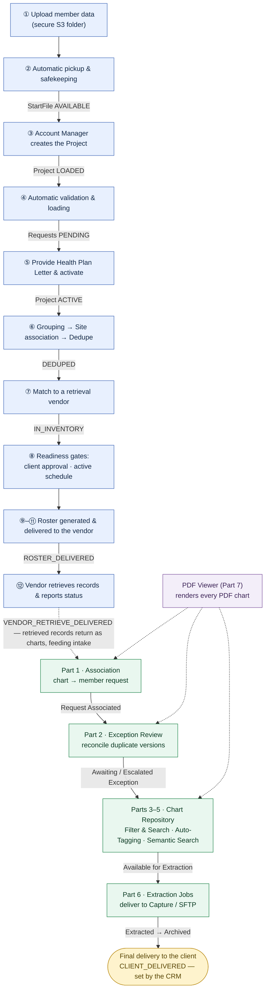

_The flow is continuous from data upload to client delivery. **Volume 1** (request & roster pipeline) steps are shaded blue; **Volume 2** (chart review & repository) steps green; the **dashed edge** is the handoff where retrieved records return as charts; the **PDF Viewer** (purple, Part 7) renders charts throughout Volume 2. Edge labels show the status reached after each step._

> **Two status vocabularies.** Volume 1 reports a **request status** (`pending → … → roster_delivered → vendor_* → client_delivered`); Volume 2 reports a **chart status** (`Request Associated → … → Extracted → Archived`). They describe different but linked things — a *chart* is the medical record retrieved for a *request*, and Association ties the two back together. The full request-status reference is in [Volume 1, Section 16](#16-tracking-progress--what-each-status-means); the chart-status reference is in [Volume 2, Part 3](#part-3-filter-and-search-chart-repository).

---

## Table of Contents

- [About This Guide](#about-this-guide)
- [The End-to-End Flow](#the-end-to-end-flow)

**[Volume 1 — The Request & Roster Pipeline](#volume-1--the-request--roster-pipeline)**

- [1. At a glance](#1-at-a-glance)
- [2. Who does what](#2-who-does-what)
- [3. Stage 1 — Uploading your data](#3-stage-1--uploading-your-data)
- [4. Stage 2 — Automatic file pickup and safekeeping](#4-stage-2--automatic-file-pickup-and-safekeeping)
- [5. Stage 3 — Project creation](#5-stage-3--project-creation)
- [6. Stage 4 — Data validation and loading](#6-stage-4--data-validation-and-loading)
- [7. Stage 5 — Project activation (Health Plan Letter)](#7-stage-5--project-activation-health-plan-letter)
- [8. Stage 6 — Organizing the work](#8-stage-6--organizing-the-work)
- [9. The vendor track — site-map ingestion](#9-the-vendor-track--site-map-ingestion)
- [10. Stage 7 — Matching to retrieval vendors](#10-stage-7--matching-to-retrieval-vendors)
- [11. Stage 8 — Readiness checks (the two gates)](#11-stage-8--readiness-checks-the-two-gates)
- [12. Stage 9 — Defining the roster output and schedule](#12-stage-9--defining-the-roster-output-and-schedule)
- [13. Stage 10 — Roster generation](#13-stage-10--roster-generation)
- [14. Stage 11 — Roster delivery to the vendor](#14-stage-11--roster-delivery-to-the-vendor)
- [15. Stage 12 — Vendor status updates (the status-file flow)](#15-stage-12--vendor-status-updates-the-status-file-flow)
- [16. Tracking progress — what each status means](#16-tracking-progress--what-each-status-means)
- [17. Handling exceptions](#17-handling-exceptions)
- [18. Preparing your file](#18-preparing-your-file)
- [19. SFTP & cloud-storage folder structure](#19-sftp--cloud-storage-folder-structure)
- [20. Security & compliance](#20-security--compliance)
- [21. Operations reference](#21-operations-reference)
- [From the Pipeline to Chart Review — the Handoff](#from-the-pipeline-to-chart-review--the-handoff)

**[Volume 2 — Chart Review & Repository](#volume-2--chart-review--repository)**

- [The Chart Lifecycle (Volume 2 Flow)](#the-chart-lifecycle-the-flow)
- [Part 1: Association Workflow](#part-1-association-workflow)
- [Part 2: Exception Review](#part-2-exception-review)
- [Part 3: Filter and Search (Chart Repository)](#part-3-filter-and-search-chart-repository)
- [Part 4: Auto-Tagging (Chart Repository)](#part-4-auto-tagging-chart-repository)
- [Part 5: Semantic Search (Chart Repository)](#part-5-semantic-search-chart-repository)
- [Part 6: Extraction Jobs](#part-6-extraction-jobs)
- [Part 7: PDF Viewer (Shared Document Reader)](#part-7-pdf-viewer-shared-document-reader)

**Appendices**

- [Appendix A: Combined Glossary](#appendix-a-combined-glossary)
- [Appendix B: Reporting UAT Issues](#appendix-b-reporting-uat-issues)
- [Appendix C: Revision History](#appendix-c-revision-history)

---

## VOLUME 1 — The Request & Roster Pipeline

**A step-by-step guide to the ECLAT.Retrieve workflow.**

This document explains the complete journey of your data through the ECLAT.Retrieve
platform: from the moment you upload a data file, through validation, organization, and
matching, to the point where a finished **roster** is delivered to the retrieval vendor
who will collect the medical records. It also documents the parallel **vendor track**
(site-map ingestion) that builds the directory your records are matched against.

It is written for a business and technical audience. The narrative in each stage explains
*what happens and why* in plain language; the **"Behind the scenes"** and **"System
touchpoint"** call-outs add the operational detail — including the **example
request/response payload for each API step**.

> **Scope.** This guide covers the lifecycle from **data upload** through **roster delivery**
> and on to the **vendor status updates** that carry each request to final delivery, plus the
> parallel **vendor site-map ingestion** flow. The status-file flow is summarized in Stage 12;
> for its full configuration and payloads, see the dedicated
> [Vendor Status-File Flow guide](#15-stage-12--vendor-status-updates-the-status-file-flow).
>
> **How data enters the system today.** Files are submitted by uploading them to a secure
> cloud-storage (Amazon S3) folder using an S3 browser application. A direct SFTP connection
> is not used at this time; the secure S3 folder is your single intake point. The bucket is
> organized in an SFTP-style folder layout — see
> [Section 19](#19-sftp--cloud-storage-folder-structure).


---

## 1. At a glance

You upload a file. The platform automatically picks it up, checks it, and stores a permanent
safe copy. Your ECLAT **Account Manager** creates a **project** around that file and provides the
authorization letter that permits retrieval. From there, the platform runs a fully automated
pipeline that cleans and organizes your records, removes duplicates, and matches each record
to the best retrieval vendor for that location. Once a vendor's schedule comes due, the
platform generates a roster file in the agreed format and delivers it to that vendor.

Separately and continuously, retrieval vendors supply **site-map files** that the platform
ingests into a directory of vendor locations. Your records are matched against that directory
— so the two tracks converge at the matching step. **Because matching runs automatically the
moment a project is activated, the relevant vendor site maps must already be ingested first** —
otherwise your records have nothing to match against and land in `NO_MATCH` (see the
prerequisite note in Stage 5, Section 7).

### End-to-end flowchart

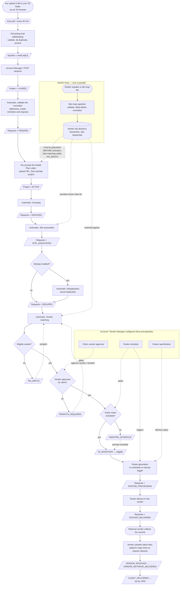

**Your hands-on touchpoints are intentionally few:**

1. **Upload your data file** to your secure S3 folder.
2. **Provide the Health Plan Letter** (the authorization document).
3. **Review reports / request cancellations** as needed.

Everything else — project setup, vendor configuration, the vendor track, matching,
scheduling, and delivery — is performed by ECLAT's **Account Manager** and **Vendor Manager** roles,
or runs **automatically**.

---

## 2. Who does what

| Actor | Role in this workflow |
|---|---|
| **You (Client)** | Upload the data file; provide the Health Plan Letter; review reports. |
| **Account Manager** (ECLAT) | Creates and configures projects; uploads the Health Plan Letter; approves vendors per client; cancels requests; triggers re-matches. |
| **Vendor Manager** (ECLAT) | Manages retrieval vendors and their file specs; defines roster specifications and schedules; uploads vendor **site maps** and retrieved **charts** to the vendor directories (see [Section 19](#19-sftp--cloud-storage-folder-structure)). |
| **Development Team** (ECLAT) | Helps create and configure the technical specifications — vendor **file specifications** and **roster specifications** (column mappings, identity keys, computed columns). |
| **The Platform** | Runs every automated step: file pickup, validation, address normalization, grouping, deduplication, vendor site-map ingestion, matching, roster generation, and delivery. |
| **Retrieval Vendor** | Receives the roster, collects the medical records (returned as charts), and reports progress via **status files** (Stage 12). |

Throughout this guide:

- **"System touchpoint"** describes a platform operation (an API) with its example payload.
  Unless stated otherwise, these are performed by your ECLAT **Account Manager** or **Vendor
  Manager** — you do not call them yourself.
- **"Behind the scenes"** describes work the platform does **automatically**.

A consolidated index of all operations is in [Section 21](#21-operations-reference).

### How responses are shaped — the standard envelope

Every successful response is wrapped in one standard envelope; only the `data` section
changes per operation. The **payload examples in each stage below show the `data` object**
(plus the request body); the full envelope is shown once, at project creation.

```json
{
  "code": "success",
  "messages": { "success": "Human-readable confirmation" },
  "data": { "...": "the operation's result" },
  "errors": {},
  "trace_id": "019cd1f2-7e55-7a10-8c3d-1f2e3d4c5b6a"
}
```

- `code` is one of `success`, `validation_error`, `client_error`, `not_found`,
  `unauthorized`, `server_error`.
- On error, `data` is empty and `errors` carries field-level details; `trace_id` is filled
  automatically — quote it when contacting support.
- All identifiers, names, dates, and addresses in the examples below are **synthetic**.

---

## 3. Stage 1 — Uploading your data

**What happens.** You place your data file into your dedicated folder in the secure S3
storage, using an S3 browser application. Each client has its own isolated folder.

- **Where:** `client/sftp/{your-client}/` — your dedicated folder, assigned during onboarding
- **Accepted formats:** `.csv`, `.tsv`, `.psv`, `.xls`, `.xlsx` (comma-, tab-, or pipe-delimited text, or Excel)
- **File naming:** your Account Manager configures an expected name prefix for your folder
  (for example, `oscar_project_…`).

**What you'll see.** Once the upload completes in your S3 browser, your part of this stage is
done — the platform takes over.

**System touchpoint (one-time setup, by your Account Manager).**
`POST /api/v1/file-transfer/clients/sftp-configuration` registers your upload folder, the
expected file-name prefix, and how duplicate files are handled.

*Request:*
```json
{
  "client_id": "019cd1f2-0001-7000-8000-0000000000c1",
  "naming_convention": "oscar_project",
  "folder_exclusive": true,
  "duplicate_handling": "reject"
}
```
`duplicate_handling` ∈ `reject` · `overwrite` · `archive` · `quarantine`.

*Response `data`:*
```json
{
  "id": "019cd1f2-00f0-7000-8000-0000000000a0",
  "client_id": "019cd1f2-0001-7000-8000-0000000000c1",
  "naming_convention": "oscar_project",
  "folder_exclusive": true,
  "duplicate_handling": "reject",
  "archive_s3_path": null
}
```

---

## 4. Stage 2 — Automatic file pickup and safekeeping

**What happens.** The platform continuously watches your upload folder and ingests new files
on its own.

**Behind the scenes (fully automatic).**

1. **Pickup.** A background job scans your folder on a regular cycle and detects the new file
   — typically **within about 30 minutes** of upload.
2. **Format check.** The file's type is verified (`.csv`, `.tsv`, `.psv`, `.xls`, or `.xlsx`).
3. **Duplicate check.** A content fingerprint (checksum) is computed. If an identical file has
   already been processed successfully, the new copy is rejected.
4. **Transfer & archive.** A valid, unique file is copied to an internal processing area and a
   **permanent, date-stamped archive copy** is saved. The original is then removed from the
   upload folder.
5. **Audit record.** Every pickup attempt — success, rejection, or failure — is written to a
   permanent, tamper-proof transfer log.

**Status after this stage.** Your file exists as a **start file** with status **`AVAILABLE`**
— successfully received and waiting to be turned into a project.

**If something's wrong.**
- *Unsupported file type* → archived and marked **rejected**; re-upload in an accepted format.
- *Duplicate file* → archived and marked **rejected** (expected if you re-sent the same file);
  upload a corrected/changed file instead.

> This stage has no API touchpoint — it is entirely automatic.

---

## 5. Stage 3 — Project creation

**What happens.** Your Account Manager creates a **project** around the received file — the
container that ties your data to a client, an audit type, a date range, and the retrieval
methods to be used.

**System touchpoint.** `POST /api/v1/projects` — creates the project and links it to the
received start file. *(Authorized role: Account Manager.)*

*Request:*
```json
{
  "client_id": "019cd1f2-0001-7000-8000-0000000000c1",
  "file_id": "019cd1f2-0003-7000-8000-0000000000f1",
  "project_name": "HEDIS MY2026 National",
  "audit_type": "hedis",
  "project_types": ["EHR", "HCA"],
  "start_date": "2026-07-01",
  "end_date": "2026-12-31",
  "program_year": 2026,
  "dedupe_enabled": true,
  "contract_number": "CTR-2026-0042"
}
```
- `audit_type` ∈ `mra` · `hedis` · `radv` · `aca`; `project_types` ⊆ `EHR` · `HCA` · `HIH` · `OUTREACH`.
- `program_year` is required (2000–2099). `contract_number` is required when `HCA` is among `project_types`.

*Full response (the complete envelope, shown once — all later examples show only `data`):*
```json
{
  "code": "success",
  "messages": { "success": "Project created successfully" },
  "data": {
    "id": "019cd1f2-0004-7000-8000-0000000000d1",
    "project_number": 100,
    "client_id": "019cd1f2-0001-7000-8000-0000000000c1",
    "start_file": {
      "id": "019cd1f2-0003-7000-8000-0000000000f1",
      "file_name": "members_batch_001.csv",
      "file_path": "client/project_staging/oscar/incoming/members_batch_001.csv",
      "file_hash": "9f2c0b…a1",
      "file_format": "csv",
      "file_size_bytes": 184320,
      "record_count": null,
      "file_status": "available",
      "is_current": true,
      "is_archived": false,
      "received_at": "2026-07-01T14:05:00Z",
      "ingested_at": null,
      "completed_at": null
    },
    "project_name": "HEDIS MY2026 National",
    "status": "loaded",
    "audit_type": "hedis",
    "project_types": ["EHR", "HCA"],
    "program_year": 2026,
    "start_date": "2026-07-01",
    "end_date": "2026-12-31",
    "dedupe_enabled": true,
    "contract_number": "CTR-2026-0042",
    "health_plan_letters": []
  },
  "errors": {},
  "trace_id": "019cd1f2-7e55-7a10-8c3d-1f2e3d4c5b6a"
}
```

**Behind the scenes.** Creating the project immediately starts the automated validation and
loading pipeline (Stage 4).

**Status after this stage.** Project status **`LOADED`** ("file associated, awaiting
authorization"); processing stage **`PENDING`**.

---

## 6. Stage 4 — Data validation and loading

Runs **automatically** as soon as the project is created — no API call. It turns the raw rows
in your file into clean, structured records.

### 6.1 File content validation

Every column and row is checked: required columns present, no duplicate headers; correct data
types, field lengths, valid `MM/DD/YYYY` dates, state codes, gender values, and end date of
service on or after begin date of service.

- *Bad columns* → project/file marked **`error`** with a coded reason.
- *Bad rows* → the platform produces a downloadable **error-report file**: a copy of your
  original rows with an added `Errors` column explaining each failure. Valid rows still
  proceed. **No patient-identifying values appear in error messages or logs.**

### 6.2 Address normalization

Provider addresses are converted to a single canonical postal form (so "123 Main St" and
"123 Main Street" are recognized as the same location). Verified results are cached.
Unverifiable addresses and P.O. boxes are excluded from retrieval.

### 6.3 Record creation

Validated, normalized rows are loaded in batches, creating **Member**, **Provider**, and
**Request** records (one request = one member-at-provider unit of work).

**Status after this stage.** Each **Request** is created with status **`PENDING`**. The
project stays **`LOADED`** — retrieval is not yet authorized (next stage).

---

## 7. Stage 5 — Project activation (Health Plan Letter)

> **⚠️ Prerequisite — vendor site data must be in place *before* this step.**
> Uploading the HPL and activating the project **immediately launches the entire background
> pipeline** (grouping → site association → matching), and it runs to completion on its own.
> Matching compares your records against the **vendor site directory** built by the vendor
> track (Section 9). **If the relevant vendor site maps have not been ingested yet, your
> records have nothing to match against and will be set to `NO_MATCH`.** Confirm the vendor
> directory is populated for the vendors that cover your members' locations before the HPL is
> uploaded.
> *Recoverable:* if a project was activated too early, once the vendor sites are ingested you
> can **re-match** the affected requests — see [Section 17](#17-handling-exceptions). No data
> is lost, but it adds a round-trip.

**What happens.** Retrieval cannot begin until the project is **authorized** by a **Health
Plan Letter (HPL)** — the document granting permission to retrieve records. You provide the
letter; your Account Manager uploads it and launches the project.

**System touchpoint 1 — upload the HPL.**
`POST /api/v1/projects/{project_id}/health-plan-letters` · **multipart/form-data** · must be a
PDF ≤ 10 MB; project must be in `LOADED` status. *(Role: Account Manager.)*

*Request (form fields, not JSON):*
```
letter_name : Oscar HEDIS Authorization 2026
file        : @hpl_oscar_2026.pdf        (application/pdf, ≤ 10 MB)
```
*Response `data`:*
```json
{
  "id": "019cd1f2-0005-7000-8000-0000000000e1",
  "letter_name": "Oscar HEDIS Authorization 2026",
  "file_path": "client/hpl/OSCAR/019cd1f2-0004-7000-8000-0000000000d1/hpl_oscar_2026.pdf",
  "uploaded_at": "2026-07-01T15:20:00Z",
  "created_by": "019cd1f2-00aa-7000-8000-0000000000u1",
  "approved_at": null,
  "approved_by": null,
  "is_active": true,
  "is_registered_with_vendor_api": false
}
```

**System touchpoint 2 — activate the project.**
`POST /api/v1/projects/{project_id}/status` transitions `LOADED → ACTIVE` (only allowed once a
valid HPL is present). *(Role: Account Manager.)*

*Request:*
```json
{ "new_status": "active", "reason": "Health Plan Letter received; launching retrieval" }
```
*Response `data`:* the project object (as in Stage 3) with `"status": "active"`.

**Behind the scenes.** The moment the project becomes **`ACTIVE`**, the platform automatically
launches the organize-the-work pipeline (Stage 6) — the single "go" signal for everything
downstream.

---

## 8. Stage 6 — Organizing the work

Once active, three steps run **automatically, one after another** — no API calls.

### 8.1 Grouping — "contact each location once"

All requests at the **same physical address** are bundled into one **group**, so the platform
reaches out to each provider location a single time. The most common phone/fax for the
location is recorded as the outreach contact.
**Status:** Requests **`PENDING → GROUPED`**.

### 8.2 Site association — "map each location to a known site"

Each address group is matched to a **site** (the location as a retrieval vendor recognizes it)
and a canonical **master site** — these come from the vendor track (Section 9). Locations with
no known site are flagged for manual outreach.
**Status:** Requests **`GROUPED → SITE_ASSOCIATED`**.

### 8.3 Deduplication — "never retrieve the same record twice"

*(Runs only if `dedupe_enabled` was set on the project.)* Within each location group, if the
same member appears more than once, the earliest request is kept and later duplicates are
**cancelled** (never deleted — retained for compliance, reason code `CANDUP`, linked to the
survivor).
**Status:** survivors **`SITE_ASSOCIATED → DEDUPED`**; duplicates **`→ CANCELLED`**.

**System touchpoints (review-only / corrective).**

**Cancellation-rate report** — `GET /api/v1/reports/dedupe/cancellation-rates?project_id={id}`
(filter by `client_id`, `project_id`, and/or `program_year` — at least one required):
```json
{ "total_requests": 12840, "cancelled_duplicates": 742, "cancellation_rate": 5.78 }
```

**Dedupe summary** — `GET /api/v1/reports/dedupe/summary`:
```json
{ "total_cancelled_duplicates": 18211 }
```

**Cancel specific requests** (e.g. members who opted out) —
`POST /api/v1/projects/{project_id}/dedupe/cancel-requests` · **multipart/form-data** ·
*(Role: Account Manager.)*
```
file    : @requests_to_cancel.csv     (one "REQ-<n>" literal per row, e.g. REQ-1042)
comment : Members opted out per client instruction
```
*Response `data`:*
```json
{
  "project_id": "019cd1f2-0004-7000-8000-0000000000d1",
  "total_submitted": 3,
  "total_cancelled": 2,
  "total_failed": 1,
  "cancellation_code": "canclient",
  "cancellation_reason": "Client requested cancellation",
  "cancelled_by": "019cd1f2-00aa-7000-8000-0000000000u1",
  "comment": "Members opted out per client instruction",
  "cancelled_at": "2026-07-10T09:00:00Z",
  "results": [
    { "request_number": 1042, "success": true,  "error": null },
    { "request_number": 1043, "success": true,  "error": null },
    { "request_number": 9999, "success": false, "error": "Request not found" }
  ]
}
```

---

## 9. The vendor track — site-map ingestion

**This is a separate, parallel flow** managed by ECLAT's **Vendor Manager** — **not by you.** It is included here because it builds and maintains the directory of
vendor locations that your records are matched against in Stage 7 (Section 10). You take no
action in this track.

> **Timing matters.** A project's site association and matching run **automatically** the
> moment it is activated (Stage 5) and complete in the background. The vendor directory for the
> vendors covering your members' locations therefore needs to be populated **before** that
> activation. An empty or incomplete directory produces `NO_MATCH` results until a re-match is
> run. In practice, ECLAT keeps vendor site maps current ahead of activating client projects.

**What a vendor supplies.** Each retrieval vendor (e.g. MRO, Sharecare, Verisma) periodically
delivers a **site-map file** (CSV/TSV/PSV/XLS/XLSX) listing every facility location they can service —
site name and code, address, phone/fax, NPI/TIN, and a location type (Clinic, Hospital, etc.).
Your **Vendor Manager** uploads each vendor's site map to the vendor's folder
(`vendor/sftp/{vendor}/` — see [Section 19](#19-sftp--cloud-storage-folder-structure)), and the
platform ingests it automatically on arrival.

### 9.1 Per-vendor configuration — the file specification

Because every vendor formats their file differently, ECLAT configures a **file specification**
per vendor (during vendor onboarding) that tells the platform how to read it. Because these are
technical column mappings, the ECLAT **development team** helps create and configure them. It is
not a client-facing API; conceptually it contains:

- **`column_map`** — maps the vendor's column headers to the platform's canonical field names.
- **`column_specs`** — per-column validation rules (required, type, allowed values, patterns).
- **`identity_columns`** — the columns that, together with the address, uniquely identify a
  site (so the platform can tell "same site" from "new site" across uploads).
- **`computed_columns`** — derived values built by combining columns.

*Example specification (for vendor "MRO"):*
```json
{
  "spec_name": "MRO Facility & Locations",
  "column_map": {
    "Facility Name": "provider_group",
    "Facility Code": "facility_code",
    "Location Name": "site_name",
    "Location Code": "location_code",
    "Location Address Line 1": "address1",
    "Location City": "city",
    "Location State": "state",
    "Location Zip": "zip",
    "Location Type": "location_type"
  },
  "identity_columns": ["Facility Code", "Location Code", "Location Type"],
  "computed_columns": {
    "vendor_site_code": { "columns": ["location_code", "facility_code"], "separator": "_" }
  }
}
```

### 9.2 What happens when a vendor file arrives

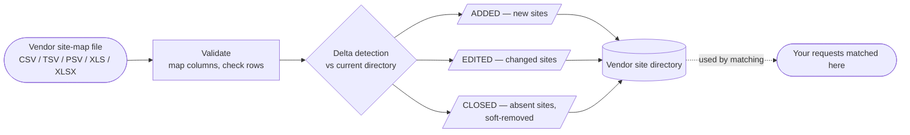

1. **Validation.** The file is read using the vendor's specification: columns are mapped to
   canonical names, computed columns are derived, ZIP+4 is parsed, and every row is checked
   against the rules. Rows that fail produce a downloadable error report; valid rows continue.
   (No patient data — these files describe facilities, not patients.)
2. **Delta detection.** Each valid row is compared against the current directory for that
   vendor and classified:
   - **ADDED** — a site not seen before.
   - **EDITED** — an existing site whose details changed.
   - **CLOSED** — a site present before but absent from this file → soft-removed (retained for
     audit, not hard-deleted).
   - *Unchanged rows are skipped.*
3. **Persist & normalize.** New and changed sites are written to the **vendor site directory**
   (`VendorSite`), their addresses normalized into the shared address/site records (`Site`,
   `MasterSite`) — the very same site records your request groups attach to in Stage 6.2.

**Idempotent.** Re-ingesting the same file produces no changes — safe to retry.

**Status after this stage.**
- Each ingestion run → **`SUCCESS`** (all rows valid), **`PARTIAL`** (some rows rejected), or
  **`FAILED`** (file-level error or all rows rejected).
- Each site row → **`ADDED`** · **`EDITED`** · **`CLOSED`**.

### 9.3 How it connects to your data

The directory built here is exactly what **Stage 7 — Matching** (Section 10) searches: each of
your request groups carries a *site*, and matching finds the best vendor servicing that site.
A richer, more current vendor directory means more of your records match on the first pass.

### 9.4 System touchpoint — ingestion report

`GET /api/v1/vendors/site-ingestion/summary` returns a paginated report of recent vendor
ingestion runs. Filters: `vendor_id`, `ingestion_status` (`success`/`partial`/`failed`),
`order` (`asc`/`desc`), `page`, `page_size`. *(Authenticated user.)*

*Response `data`:*
```json
{
  "items": [
    {
      "log_id": "019cd1f2-00c0-7000-8000-00000000c101",
      "vendor_name": "MRO",
      "source_file_name": "MRO_Facility_and_Locations_2026-07-01.csv",
      "ingestion_timestamp": "2026-07-01T08:15:00Z",
      "ingestion_status": "success",
      "summary_message": "Delta: 412 added, 88 edited, 13 closed",
      "total_rows": 75825,
      "added_rows": 412,
      "edited_rows": 88,
      "deleted_rows": 13,
      "rejected_rows": 0
    }
  ],
  "total": 1,
  "page": 1,
  "page_size": 10,
  "has_next": false
}
```

---

## 10. Stage 7 — Matching to retrieval vendors

**What it does (automatic).** For each location group, the platform selects the single **best
retrieval vendor** by comparing the group's site against the **vendor site directory** (built
by the vendor track — Section 9), then ranking eligible vendors by the retrieval methods
configured on your project (e.g. EHR / HCA / HIH) and vendor priority/ranking.

- Matched → requests become **`IN_INVENTORY`** (ready to be rostered).
- No eligible vendor → requests become **`NO_MATCH`** (can be re-attempted —
  see [Section 17](#17-handling-exceptions)).

After matching, the platform automatically runs the readiness checks (Stage 8).

**System touchpoint — define a vendor.** `POST /api/v1/vendors`
*(Roles: Account Manager, Vendor Manager.)*
*Request:*
```json
{
  "vendor_name": "Acme Medical Retrieval",
  "vendor_code": "ACMV",
  "contact_email": "ops@acme-retrieval.example",
  "contact_phone": "555-0100"
}
```
*Response `data`:*
```json
{
  "id": "019cd1f2-0002-7000-8000-0000000000b1",
  "vendor_name": "Acme Medical Retrieval",
  "vendor_code": "ACMV",
  "contact_email": "ops@acme-retrieval.example",
  "contact_phone": "555-0100",
  "is_active": true
}
```

**System touchpoint — view inventory.** `GET /api/v1/roster/inventory/status` returns a live
count of requests per vendor and status. *(Roles: Account Manager, Vendor Manager.)*
*Response `data`:*
```json
[
  { "vendor_id": "019cd1f2-0002-7000-8000-0000000000b1", "status": "in_inventory",      "count": 4120 },
  { "vendor_id": "019cd1f2-0002-7000-8000-0000000000b1", "status": "awaiting_schedule", "count": 318 },
  { "vendor_id": "019cd1f2-0002-7000-8000-0000000000b1", "status": "roster_delivered",  "count": 9044 }
]
```

---

## 11. Stage 8 — Readiness checks (the two gates)

Before a matched request can be turned into a roster, it must clear **two gates**, applied
automatically. A request that fails a gate **waits** in a clearly labeled status — nothing is
lost.

### Gate 1 — Is the vendor approved for this client?

- **Default is open:** if no approval rule exists for a client–vendor pair, the vendor is
  treated as approved.
- If a client has **explicitly not approved** the vendor, that client's requests move to
  **`REMATCH_REQUIRED`** and can be re-matched to an approved vendor.

**System touchpoint — approve a vendor for a client.** `POST /api/v1/roster/approvals`
*(Role: Account Manager.)*
*Request:*
```json
{
  "client_id": "019cd1f2-0001-7000-8000-0000000000c1",
  "vendor_id": "019cd1f2-0002-7000-8000-0000000000b1",
  "is_approved": true
}
```
*Response `data`:*
```json
{
  "id": "019cd1f2-0006-7000-8000-00000000a001",
  "client_id": "019cd1f2-0001-7000-8000-0000000000c1",
  "vendor_id": "019cd1f2-0002-7000-8000-0000000000b1",
  "is_approved": true,
  "approved_at": "2026-07-02T10:00:00Z",
  "approved_by": "019cd1f2-00aa-7000-8000-0000000000u1"
}
```
Change it later with `PATCH /api/v1/roster/approvals/{id}` and body `{ "is_approved": false }`.

### Gate 2 — Does the vendor have an active schedule?

- If the matched vendor has **no active schedule**, requests are parked at
  **`AWAITING_SCHEDULE`**.
- When a schedule is later activated, the platform **automatically releases** those parked
  requests back to **`IN_INVENTORY`**.

Requests that clear **both** gates remain **`IN_INVENTORY`** and are eligible for the next
roster generation run. *(The schedule itself is configured in Stage 9.)*

---

## 12. Stage 9 — Defining the roster output and schedule

Configuration your Account or Vendor Manager completes (typically once per vendor) so generation knows
**what** to produce and **when**.

### 12.1 Roster specification — *what the file looks like*

Defines the file the vendor receives: format (`csv`/`xlsx`), ordered columns and their data
types, where each column's value comes from, optional computed columns, and which audit
types/vendors it applies to. A specification must be **`active`** to be used. Because the column
mapping points at internal data fields, the ECLAT **development team** helps define and validate
the specification.

**System touchpoint.** `POST /api/v1/roster/specifications`
*(Roles: Account Manager, Vendor Manager.)*
*Request (column names and source paths are illustrative):*
```json
{
  "primary_vendor_id": "019cd1f2-0002-7000-8000-0000000000b1",
  "specification_name": "Acme HEDIS Roster v1",
  "version": 1,
  "file_format": "csv",
  "is_reusable": true,
  "column_specifications": [
    { "column_name": "MemberID",      "column_order": 1, "data_type": "text", "is_required": true },
    { "column_name": "LastName",      "column_order": 2, "data_type": "text", "is_required": true },
    { "column_name": "ProviderNPI",   "column_order": 3, "data_type": "text", "is_required": true },
    { "column_name": "DateOfService", "column_order": 4, "data_type": "date", "is_required": true, "format_pattern": "MM/DD/YYYY" }
  ],
  "column_map": {
    "MemberID": "member.external_member_id",
    "LastName": "member.last_name",
    "ProviderNPI": "provider.npi",
    "DateOfService": "request.date_of_service"
  },
  "computed_columns": null,
  "audit_types": ["hedis"]
}
```
- `file_format` ∈ `csv` · `xlsx`; `data_type` ∈ `text` · `integer` · `date` · `boolean` · `decimal`.
- `column_order` must be sequential from 1; every `column_map` key must be a defined column name.

*Response `data` (abridged):*
```json
{
  "id": "019cd1f2-0008-7000-8000-00000000a003",
  "specification_name": "Acme HEDIS Roster v1",
  "version": 1,
  "file_format": "csv",
  "status": "draft",
  "is_reusable": true,
  "column_specifications": [ "…same 4 columns as submitted…" ],
  "column_map": { "…": "…same mapping as submitted…" },
  "computed_columns": null,
  "vendors": [ { "vendor_id": "019cd1f2-0002-7000-8000-0000000000b1", "is_primary": true } ],
  "audit_types": [ { "audit_type": "hedis" } ],
  "created_at": "2026-07-02T11:00:00Z",
  "updated_at": null,
  "created_by": "019cd1f2-00aa-7000-8000-0000000000u1"
}
```
A new specification starts as `draft`; activate it with
`PATCH /api/v1/roster/specifications/{id}/activate` (`status` → `active`) before it can be used
for generation.

### 12.2 Roster schedule — *when the file is produced*

Sets the cadence for a vendor — **one schedule per vendor** — as a set of weekdays and times
(Monday–Friday, U.S. Eastern Time), not a raw cron expression.

**System touchpoint.** `POST /api/v1/roster/schedules`
*(Roles: Account Manager, Vendor Manager.)*
*Request (weekdays `0`=Mon … `4`=Fri; times in Eastern, `HH:MM`):*
```json
{
  "vendor_id": "019cd1f2-0002-7000-8000-0000000000b1",
  "days": [
    { "weekday": 0, "execution_time": "10:00" },
    { "weekday": 2, "execution_time": "10:00" },
    { "weekday": 4, "execution_time": "10:00" }
  ],
  "job_status": "active"
}
```
*Response `data`:*
```json
{
  "id": "019cd1f2-0007-7000-8000-00000000a002",
  "vendor_id": "019cd1f2-0002-7000-8000-0000000000b1",
  "job_status": "active",
  "schedule_days": [
    { "id": "019cd1f2-00d0-7000-8000-00000000ad01", "weekday": 0, "execution_time": "10:00" },
    { "id": "019cd1f2-00d0-7000-8000-00000000ad02", "weekday": 2, "execution_time": "10:00" },
    { "id": "019cd1f2-00d0-7000-8000-00000000ad03", "weekday": 4, "execution_time": "10:00" }
  ],
  "next_scheduled_run": "2026-07-06T14:00:00Z",
  "next_scheduled_run_est": "2026-07-06 10:00 EDT",
  "last_executed_at": null
}
```
Activating a schedule also releases any requests waiting at `AWAITING_SCHEDULE` for that vendor
(`POST .../activate`).

**Run now** — `POST /api/v1/roster/schedules/{id}/trigger` → `202`:
```json
{
  "schedule_id": "019cd1f2-0007-7000-8000-00000000a002",
  "vendor_id": "019cd1f2-0002-7000-8000-0000000000b1",
  "status": "dispatched"
}
```
`status` is `dispatched`, or `skipped_already_in_progress` if a run for that vendor is already
underway.

---

## 13. Stage 10 — Roster generation

**What happens (automatic, on the schedule or via "run now").** When a vendor's scheduled time
comes due, the platform generates the roster for that vendor.

**Behind the scenes.**
1. **Re-check eligibility** — routing is refreshed so only currently eligible, approved,
   scheduled requests are included.
2. **Claim the work** — eligible `IN_INVENTORY` requests move to **`ROSTER_PROCESSING`** so two
   runs can never pick up the same records.
3. **Build the file** — claimed records are written into a `csv`/`xlsx` roster per the active
   specification and uploaded to secure storage.
4. **Hand off to delivery** (Stage 11) automatically.

**The roster file name** is unambiguous to the vendor:
```
{vendor_code}_{client_code}_{audit_type}_PRJ{project_number}_{YYMMDD}_{HHMMSSmmm}.{csv|xlsx}
example:  ACMV_CLT_BJMT_HEDIS_PRJ100_260706_100015123.csv
```

**Reliability.** Generation is self-healing: if a run is interrupted, an automatic recovery
process reconciles its state shortly after — re-delivering files that were built but not sent,
or safely retrying failed work — without ever duplicating a roster that already went out.

**Status after this stage.** Claimed requests are **`ROSTER_PROCESSING`**.

---

## 14. Stage 11 — Roster delivery to the vendor

**What happens (automatic).** The generated roster file is delivered to the retrieval vendor's
destination (`vendor/sftp/{vendor}/rosters/`), where it becomes visible to that vendor.

- On success: records move **`ROSTER_PROCESSING → ROSTER_DELIVERED`**; the file and run are
  marked delivered.
- On a delivery failure: records are marked **`ROSTER_FAILED`** with a sanitized
  (identifier-only) reason; the built file stays safely in storage.
- Every delivery is captured in the permanent transfer audit log.

**Status after this stage.** Requests are **`ROSTER_DELIVERED`** — the retrieval vendor now has
the work. ✅

---

## 15. Stage 12 — Vendor status updates (the status-file flow)

After a roster is delivered, the retrieval vendor works through the records and periodically reports
progress by uploading a **status file**. The platform picks these up automatically, maps each row's
vendor status value onto a platform request status, and advances each request through the vendor
phase toward final delivery. *(Retrieved records themselves come back as **charts** — ZIP files the
Vendor Manager places in `vendor/sftp/{vendor}/charts/` — which feed the platform's intake phase.)*

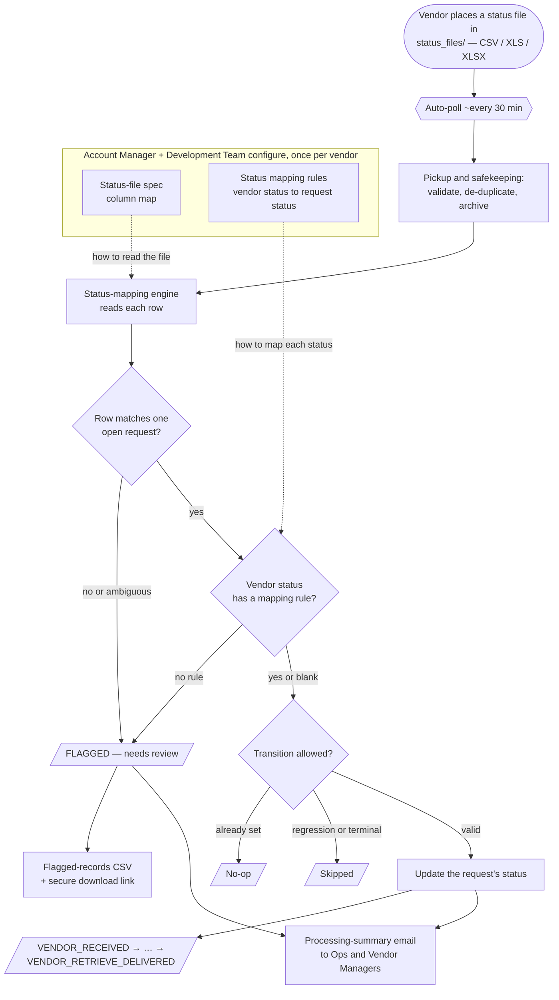

### 15.1 Prerequisite configuration (once per vendor)

Because every vendor names its columns and status values differently, two small configuration files
are registered per vendor **before** their status files can be processed. Both are uploaded by the
**Account Manager**, and the **Development Team** helps author them (they reference the platform's
internal status values). The source of truth is an ops-curated workbook, exported per vendor as
**CSV or XLSX** (≤ 1 MB).

**Status-file spec — *how to read the vendor's file*.** A column map telling the platform which of
the vendor's columns hold the `request_identifier` (identifies the request), the `source_status`
(the vendor's status value), and the `source_reason` (optional free-text reason).

`POST /api/v1/vendors/{vendor_id}/status-file-spec` · **multipart/form-data** · *(Account Manager.)*

*Request (form fields):*
```
spec_file : @mro_status_spec.csv      (CSV or XLSX; columns: vendor_header, canonical_name)
spec_name : MRO status file v1
```
*`spec_file` contents (example):*
```
vendor_header,canonical_name
Request ID,request_identifier
Status,source_status
Notes,source_reason
```
*Response `data`:*
```json
{
  "id": "019cd1f2-00a0-7000-8000-0000000000s1",
  "vendor_id": "019cd1f2-0002-7000-8000-0000000000b1",
  "spec_name": "MRO status file v1",
  "version": 1,
  "is_active": true,
  "column_map": { "Request ID": "request_identifier", "Status": "source_status", "Notes": "source_reason" }
}
```

**Status mapping rules — *how to translate each vendor status*.** A table mapping each vendor raw
status string to a platform request status. A rule may target only the **vendor-assignable**
statuses: `VENDOR_RECEIVED`, `VENDOR_PROCESSING`, `VENDOR_PENDING_CLIENT_ACTION`,
`VENDOR_READY_FOR_RETRIEVAL`, `VENDOR_RETRIEVE_DELIVERED`, `VENDOR_REJECTED`. (Values are matched
case-insensitively.)

`POST /api/v1/vendors/{vendor_id}/status-mapping-rules` · **multipart/form-data** · *(Account Manager.)*

*Request (form fields):*
```
rules_file       : @mro_status_rules.csv   (CSV or XLSX; columns: source_status, target_status, [notes])
replace_existing : true                    (true = full sync: deactivate rules absent from the file; false = additive)
notes            : Initial onboarding import
```
*`rules_file` contents (example):*
```
source_status,target_status,notes
received,vendor_received,
in progress,vendor_processing,
client info needed,vendor_pending_client_action,
ready for pickup,vendor_ready_for_retrieval,
delivered,vendor_retrieve_delivered,
unable to fulfill,vendor_rejected,
```
*Response `data`:*
```json
{
  "created_count": 6,
  "updated_count": 0,
  "deactivated_count": 0,
  "rules": [
    { "id": "019cd1f2-00a1-7000-8000-00000000r001", "vendor_id": "019cd1f2-0002-7000-8000-0000000000b1", "source_status": "received", "target_status": "vendor_received", "is_active": true, "notes": null },
    { "id": "019cd1f2-00a1-7000-8000-00000000r002", "vendor_id": "019cd1f2-0002-7000-8000-0000000000b1", "source_status": "client info needed", "target_status": "vendor_pending_client_action", "is_active": true, "notes": null }
  ]
}
```

**Confirming what's registered.** `GET /api/v1/vendors/{vendor_id}/status-file-spec` and
`GET /api/v1/vendors/{vendor_id}/status-mapping-rules` return the active spec and rules *(Account
Manager).* If a vendor's spec **or** rules are missing when a file arrives, the run halts safely and
the ECLAT team is emailed to complete the configuration — no requests are changed.

### 15.2 The vendor uploads a status file

The retrieval vendor places a status file in `vendor/sftp/{vendor}/status_files/`
(`.csv` / `.xls` / `.xlsx`), one row per record with at least the request identifier and the
vendor's status value (plus an optional reason), as described by that vendor's spec.

### 15.3 Automatic pickup and safekeeping

A dedicated background job scans each vendor's `status_files/` folder about **every 30 minutes**
(separate from site-map pickup, so a status feed is never blocked). It checks the file type, rejects
empty and duplicate files, copies a valid file to internal processing storage and a permanent,
date-stamped archive, then starts the **status-mapping engine** for it. A transfer success (or
failure) email goes to **Ops and the Vendor Managers**.

### 15.4 The status-mapping engine

Runs **automatically** for each transferred file. The engine reads every row using the vendor's spec
and decides, per row, what to do; each row produces exactly one **outcome**:

1. **Match the row to a request** — the row's `request_identifier` is matched to a single open
   request for that vendor (no match, or more than one → **flagged**).
2. **Resolve the target status** — a **blank** vendor status on a matched request is an implicit
   acknowledgement → `VENDOR_RECEIVED`; otherwise the vendor's status value is looked up in that
   vendor's rules (no rule → **flagged**).
3. **Apply the transition** — only if it is a valid forward move (see [15.6](#156-status-progression)):
   already at that status → **no-op**; already terminal or a backwards move → **skipped**; otherwise
   the request's status is **updated**, with the vendor's reason recorded on its history.

| Outcome | Meaning | Counts as |
|---|---|---|
| **Applied** | The request's status was updated. | Progress |
| **No-op (duplicate)** | The request was already at that status. | Expected |
| **Skipped (regression)** | The vendor status would move the request backwards. | Expected |
| **Skipped (terminal)** | The request is already in a terminal state. | Expected |
| **Flagged — unknown request** | No request matched the row's identifier (or it was empty). | **Needs review** |
| **Flagged — ambiguous request** | More than one request matched. | **Needs review** |
| **Flagged — unknown status** | The vendor's status value has no mapping rule. | **Needs review** |
| **Flagged — malformed** | The row could not be parsed. | **Needs review** |

Re-processing the same file produces the same end state — already-applied transitions are skipped,
and one bad row never affects the others. Every update also writes an immutable status-history entry.

### 15.5 Results, flagged records & notifications

When a file finishes, the platform records a **processing result** with roll-up counts (total,
applied, no-op, skipped, flagged) and a status: `completed`; `failed` (e.g. no active spec);
`awaiting_mapping_rules` (spec present, rules missing — halted for review); or
`vendor_not_active` / `vendor_unresolved` (could not tie the file to an active vendor — halted).

If any rows were flagged, the platform builds a **CSV of just the flagged rows** (columns
`row_number, request_identifier, source_status, reason`) and includes a **secure, time-limited
download link** (24 hours) in the email. A processing-summary email goes to **Ops and the Vendor
Managers** — "processed", "flagged" (with the download link), "manual review needed", or "failed".
No patient data appears in any email or log — only counts, identifiers, and category text.

### 15.6 Status progression

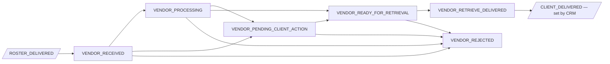

The engine only allows forward moves. **`vendor_pending_client_action`** is the one state that needs
**you**: the vendor needs more information (e.g. corrected member or authorization details) before
proceeding — provide it to your Account Manager and the next status file advances the request.
**`vendor_rejected`**, **`client_delivered`**, and the pre-vendor exits (`cancelled`, `no_match`,
`roster_failed`) are **terminal** — a later status file will not move them (recorded as *skipped*).
`client_delivered` is set by the **CRM process**, not by status files. *(See [Section 16](#16-tracking-progress--what-each-status-means)
for the full status reference.)*

### 15.7 Re-running a status file

If a file was processed before its rules or spec were complete (rows flagged, or the run halted), fix
the configuration and **re-run the same file** — no re-upload from the vendor is needed.

`POST /api/v1/vendor-status/processings/{processing_id}/rerun` · *(Account Manager.)* No request body
— the `processing_id` from the original run is in the path.

*Response `data`:*
```json
{ "processing_id": "019cd1f2-00b0-7000-8000-0000000000p9", "status": "running" }
```
The re-run reads the same stored file and re-applies every row through the full logic; all safety
checks still apply, so a re-run with broken configuration fails safely. (If the file is already being
processed, the re-run returns `409 Conflict` — retry once it finishes.)

---

## 16. Tracking progress — what each status means

Your data's position is always visible through three status values.

### Project status (`status`) — the project's lifecycle

| Status | Plain meaning |
|---|---|
| `available` | File received but not yet attached to a project. |
| `loaded` | File attached and validated; **awaiting Health Plan Letter**. |
| `active` | Authorized — retrieval and all downstream processing can run. |
| `error` | The file failed validation; a corrected file is needed. |
| `closed` | The project is complete/closed. |

### Processing stage (`pipeline_status`) — how far automation has progressed

`pending → grouped → site_associated → deduped → matched`
(Projects with deduplication disabled skip straight past the dedupe step.)

### Request status (`request_status`) — the state of an individual record

| Status | Plain meaning |
|---|---|
| `pending` | Loaded; awaiting organization. |
| `grouped` | Bundled with other records at the same location. |
| `site_associated` | Location mapped to a known site. |
| `deduped` | Confirmed unique (survived deduplication). |
| `cancelled` | Removed — a duplicate, or cancelled on request. |
| `in_inventory` | Matched to a vendor; ready to be rostered. |
| `no_match` | No eligible vendor found yet. |
| `rematch_required` | Held back (e.g. vendor not approved); needs re-matching. |
| `rematch_triggered` | A re-match attempt is in progress. |
| `awaiting_schedule` | Matched, but the vendor has no active schedule yet. |
| `roster_processing` | Being written into a roster file. |
| `roster_delivered` | Delivered to the retrieval vendor. |
| `roster_failed` | Delivery failed; under automatic review/retry. |
| `vendor_received` | The vendor acknowledged the request (Stage 12). |
| `vendor_processing` | The vendor is actively working it. |
| `vendor_pending_client_action` | Blocked pending client/member information — **needs your action**. |
| `vendor_ready_for_retrieval` | Records are ready to retrieve. |
| `vendor_retrieve_delivered` | The vendor delivered the retrieved records. |
| `vendor_rejected` | The vendor could not fulfill the request (terminal). |
| `client_delivered` | Final delivery to you (set by the CRM process). |

### Vendor site-ingestion status (the vendor track)

| Run status | Meaning | Row status | Meaning |
|---|---|---|---|
| `success` | All rows valid and ingested | `added` | A new site |
| `partial` | Some rows rejected, the rest ingested | `edited` | An existing site's details changed |
| `failed` | File-level error or all rows rejected | `closed` | A site no longer in the file (soft-removed) |

*(The vendor-phase statuses are produced by the status-file flow — see
[Section 15](#15-stage-12--vendor-status-updates-the-status-file-flow).)*

---

## 17. Handling exceptions

Nothing is silently lost — work either advances, waits in a clearly named status, or surfaces
a correctable report.

| Situation | What the platform does | What to do |
|---|---|---|
| **Unsupported / duplicate file** | Archived and marked **rejected**. | Re-upload in an accepted format, or a corrected (non-identical) file. |
| **Column errors** | Project/file marked **`error`** with a coded reason. | Fix the columns and re-upload. |
| **Row errors** | A downloadable **error report** lists each failing row and reason (no patient data). Valid rows still proceed. | Correct the flagged rows and re-submit. |
| **No vendor match** (`no_match`) | Request waits. | Confirm the covering vendor's site map has been ingested (Section 9), then trigger a **re-match** (below); or adjust vendor coverage/approvals. |
| **Vendor not approved** (`rematch_required`) | Request held back from that vendor. | Approve the vendor, or re-match to an approved one. |
| **No active schedule** (`awaiting_schedule`) | Request parked. | Activate the vendor's schedule — parked requests are released automatically. |
| **Generation/delivery interruption** | Automatic recovery reconciles the run shortly after. | No action needed in normal cases. |
| **Vendor site-map rows rejected** (`partial`/`failed` run) | An error report is generated; valid rows still ingest. | The vendor corrects and re-sends the file. |

### Re-matching

For requests in `no_match` or `rematch_required`, your Account Manager can re-attempt matching by
uploading a list of request IDs.

**System touchpoint.** `POST /api/v1/rematch` → `202` · **multipart/form-data** ·
*(Role: Account Manager.)*
*Request:*
```
file : @rematch_request_ids.csv     (single "request_id" column; one UUID per row; ≤ 5 MB)
```
*Response `data`:*
```json
{
  "request_ids_submitted": 50,
  "requests_triggered": 47,
  "ineligible_requests": [
    { "request_id": "019cd1f2-0009-7000-8000-00000000a004", "reason": "status_not_eligible" },
    { "request_id": "019cd1f2-0009-7000-8000-00000000a005", "reason": "not_found" }
  ],
  "message": null
}
```
`reason` ∈ `not_found` · `missing_site_id` · `status_not_eligible`. Eligible requests flip to
`rematch_triggered`, then settle at `in_inventory` or `no_match`.

---

## 18. Preparing your file

- **Format:** `.csv`, `.tsv`, `.psv`, `.xls`, or `.xlsx` (delimited text or Excel).
- **Name:** follow the prefix your Account Manager configured for your folder.
- **Don't re-send identical files:** exact duplicates are rejected by design — upload a
  corrected/changed file instead.
- **Columns:** include the columns required for your audit type and retrieval methods; avoid
  duplicate column headers.
- **Row data:** use `MM/DD/YYYY` dates, valid two-letter state codes, and ensure the end date
  of service is on or after the begin date of service.
- **Addresses:** provide complete provider addresses; P.O. boxes and unverifiable addresses
  are excluded from retrieval.

---

## 19. SFTP & cloud-storage folder structure

All files live in a single secure S3 bucket organized in an **SFTP-style folder layout**. You
upload to the `client/sftp/{your-client}/` prefix (via your S3 browser); vendors upload their
site maps to `vendor/sftp/{vendor}/`; the platform manages the rest. Finished rosters are
delivered to the vendor's `vendor/sftp/{vendor}/rosters/` prefix.

> `{client}` / `{vendor}` are assigned lowercase identifiers. An SFTP gateway (e.g. AWS
> Transfer Family) maps each party's home directory onto its `…/sftp/{name}/` prefix, so files
> placed there are visible over SFTP without any extra step.

### Complete bucket layout

```
{S3_BUCKET}/
│
├── client/
│   ├── sftp/{client}/                         ← INTAKE — you upload data files here
│   │       └── members_batch_001.csv             (auto-picked-up, then removed)
│   │
│   ├── project_staging/{client}/
│   │   ├── incoming/                          ← received copy, being processed
│   │   │     └── members_batch_001.csv
│   │   ├── validated/                         ← reserved (future stage)
│   │   └── errors/                            ← row-level error reports land here
│   │         └── members_batch_001_errors.csv
│   │
│   ├── hpl/{client}/{project_id}/             ← Health Plan Letter PDFs
│   │       └── hpl_oscar_2026.pdf
│   │
│   └── archive/{client}/
│           └── dt=YYYY-MM-DD/                  ← permanent, date-stamped safe copy
│                 └── members_batch_001.csv
│
└── vendor/
    ├── sftp/{vendor}/                         ← vendor folder (Vendor Manager uploads here)
    │   ├── MRO_Facility_and_Locations.csv        ← site map (auto-ingested into the directory)
    │   ├── rosters/                           ← OUTPUT — finished rosters delivered here
    │   │     └── ACMV_CLT_HEDIS_PRJ100_260706_100015123.csv
    │   ├── charts/                            ← Vendor Manager uploads retrieved charts (.zip)
    │   │     └── ACMV_charts_2026-07-10.zip
    │   └── status_files/                      ← vendor status updates (.csv/.xls/.xlsx)
    │         └── ACMV_status_2026-07-10.csv
    │
    ├── project_staging/{vendor}/
    │   ├── incoming/                          ← received vendor site-map copy
    │   ├── validated/
    │   └── errors/                            ← vendor row-level error reports
    │
    └── archive/{vendor}/
            └── dt=YYYY-MM-DD/                  ← date-stamped vendor archive
```

### Path pattern reference

| Purpose | Pattern | Notes |
|---|---|---|
| **Client intake** (you upload here) | `client/sftp/{client}/{file}` | Polled ~every 30 min |
| Received / being processed | `client/project_staging/{client}/incoming/{file}` | Internal |
| Row-error report | `client/project_staging/{client}/errors/{file}_errors.csv` | Downloadable |
| Validated (reserved) | `client/project_staging/{client}/validated/{file}` | Future stage |
| Health Plan Letter | `client/hpl/{client}/{project_id}/{file}.pdf` | Authorization PDFs |
| Client archive | `client/archive/{client}/dt=YYYY-MM-DD/{file}` | Permanent, date-partitioned |
| **Vendor site-map intake** | `vendor/sftp/{vendor}/{file}` | Vendor Manager uploads; auto-ingested |
| **Vendor charts** (retrieved records) | `vendor/sftp/{vendor}/charts/{file}.zip` | Vendor Manager uploads charts (ZIP) |
| Vendor status files | `vendor/sftp/{vendor}/status_files/{file}` | Vendor status updates (`.csv`/`.xls`/`.xlsx`) |
| Vendor site-map received | `vendor/project_staging/{vendor}/incoming/{file}` | Internal |
| **Roster delivery** (vendor receives here) | `vendor/sftp/{vendor}/rosters/{roster_file}` | The output |
| Vendor archive | `vendor/archive/{vendor}/dt=YYYY-MM-DD/{file}` | Permanent, date-partitioned |

### Example — the journey of one uploaded file

| Stage | S3 key |
|---|---|
| You upload | `client/sftp/oscar/members_batch_001.csv` |
| Received | `client/project_staging/oscar/incoming/members_batch_001.csv` |
| Archived (safe copy) | `client/archive/oscar/dt=2026-07-01/members_batch_001.csv` |
| (if rows fail) Error report | `client/project_staging/oscar/errors/members_batch_001_errors.csv` |
| Roster delivered to vendor | `vendor/sftp/acme/rosters/ACMV_CLT_HEDIS_PRJ100_260706_100015123.csv` |

> **Date partitioning.** Archive folders use `dt=YYYY-MM-DD` so old files can be located,
> retained, and replayed by date.

---

## 20. Security & compliance

Built to HIPAA expectations throughout:

- **No patient data in logs or error messages** — diagnostics reference internal identifiers
  and coded reasons only. (Vendor site-map files describe facilities, not patients.)
- **Records are never hard-deleted** — duplicates/cancellations and closed vendor sites are
  retained (marked cancelled/closed) for retention requirements.
- **Permanent audit trails** — file transfers, dedupe decisions, status changes, vendor
  ingestion runs, and deliveries are written to tamper-proof, identifier-only logs.
- **Permanent archive copy** — every received file is archived (date-stamped) before the upload
  copy is removed, enabling safe replay.
- **Access control** — every platform operation requires an authenticated user with the
  appropriate role.

---

## 21. Operations reference

Every operation referenced in this guide. Unless noted, these are performed by ECLAT's **Account
Manager** or **Vendor Manager**; you upload data and provide the Health Plan Letter. Example payloads are shown
inline at each stage above.

| Stage | Operation | Purpose | Role |
|---|---|---|---|
| Setup | `POST /api/v1/file-transfer/clients/sftp-configuration` | Configure your upload folder & duplicate handling | Account Manager |
| 3 | `POST /api/v1/projects` | Create the project from the received file | Account Manager |
| 3 | `GET /api/v1/projects` · `GET /api/v1/projects/{id}` | List / view projects | Account Manager |
| 3 | `PATCH /api/v1/projects/{id}` | Update project details | Account Manager |
| 5 | `POST /api/v1/projects/{id}/health-plan-letters` | Upload the authorization letter (PDF) | Account Manager |
| 5 | `POST /api/v1/projects/{id}/status` | Activate the project (`loaded → active`) | Account Manager |
| 6 | `GET /api/v1/reports/dedupe/cancellation-rates` | Review duplicate-removal metrics | Authenticated user |
| 6 | `GET /api/v1/reports/dedupe/summary` | Review total duplicates cancelled | Authenticated user |
| 6 | `POST /api/v1/projects/{id}/dedupe/cancel-requests` | Cancel specific requests (uploaded list) | Account Manager |
| 9 | `GET /api/v1/vendors/site-ingestion/summary` | Review vendor site-map ingestion runs (added/edited/closed) | Authenticated user |
| 10 | `POST /api/v1/vendors` · `GET` · `PATCH /api/v1/vendors/{id}` | Manage retrieval vendors | Acct / Vendor Manager |
| 10 | `GET /api/v1/roster/inventory/status` | Live view of matched work per vendor | Acct / Vendor Manager |
| 11 | `POST /api/v1/roster/approvals` · `PATCH /api/v1/roster/approvals/{id}` | Approve vendors per client | Account Manager |
| 12 | `POST /api/v1/roster/specifications` (+ get/update/activate/deactivate/delete/vendors) | Define the roster file layout | Acct / Vendor Manager |
| 12 | `POST /api/v1/roster/schedules` (+ activate/deactivate/trigger) | Set when rosters are produced | Acct / Vendor Manager |
| 17 | `POST /api/v1/rematch` | Re-attempt matching for `no_match` / `rematch_required` | Account Manager |
| 12 | `POST /api/v1/vendors/{id}/status-file-spec` · `…/status-mapping-rules` (+ `GET`) | Configure how a vendor's status file is read and mapped | Account Manager |
| 12 | `POST /api/v1/vendor-status/processings/{id}/rerun` | Re-process a vendor status file after a config fix | Account Manager |


_(Glossary terms from this volume are merged into [Appendix A: Combined Glossary](#appendix-a-combined-glossary).)_

---

## From the Pipeline to Chart Review — the Handoff

In Volume 1, once a roster reaches the retrieval vendor (**`ROSTER_DELIVERED`**), the vendor collects the medical records and reports progress through status files (Stage 12). **Those retrieved records come back to ECLAT.Retrieve as _charts_** — the ZIP files the Vendor Manager places in `vendor/sftp/{vendor}/charts/` (see [Section 19](#19-sftp--cloud-storage-folder-structure)). Charts entering that intake phase are exactly where **Volume 2** begins: the **Association workflow** (Part 1) picks each chart from the work queue and matches it back to the **request** that originated it in Volume 1. From there the chart is reconciled, organized in the Chart Repository, and finally extracted downstream — after which the originating request reaches its terminal **`CLIENT_DELIVERED`** status (set by the CRM process).

> **In short:** Volume 1 tracks the **request** (data → roster → vendor). Volume 2 tracks the **chart** (the returned record → association → repository → extraction). Every chart is tied back to the request it fulfils.

---

## VOLUME 2 — Chart Review & Repository

This volume documents the user-facing screens that reviewers use once the retrieval vendor returns the medical records as charts. It is written for client reviewers and testers who will validate ECLAT.Retrieve during UAT; each Part ends with a "What to Verify" checklist (report issues via [Appendix B](#appendix-b-reporting-uat-issues)).

## The Chart Lifecycle (The Flow)

Charts arrive from vendors and travel through ECLAT.Retrieve along a single, mostly linear path. Each Part of this guide documents one stop on that path:

```
                        Vendor chart documents arrive
                                     │
                                     ▼
                    ┌────────────────────────────────────┐
            Part 1  │        Association Workflow         │  match chart → member request
                    │   (review · trim · split · decide)  │  Associate or Escalate
                    └──────────────────┬─────────────────┘
                                       │  two versions of a chart
                                       │  can't be merged automatically
                                       ▼
                    ┌────────────────────────────────────┐
            Part 2  │          Exception Review           │  reconcile Document 1 vs Document 2
                    │     (classify pages · merge)        │  Submit or Escalate
                    └──────────────────┬─────────────────┘
                                       │  chart now lives in the repository
                                       ▼
        ┌───────────────────────────────────────────────────────────────┐
        │                     Chart Repository                           │
 Part 3 │   Filter & Search   — find · preview · select · export         │
 Part 4 │   Auto-Tagging      — rule-based tags (HCC / ICD / YOS)         │
 Part 5 │   Semantic Search   — natural-language search across charts     │
        └──────────────────────────────┬────────────────────────────────┘
                                        │  charts available for extraction
                                        ▼
                    ┌────────────────────────────────────┐
            Part 6  │           Extraction Jobs           │  deliver to Capture / SFTP
                    │      (scheduled or Run Now)         │  on a schedule or on demand
                    └────────────────────────────────────┘

   Throughout every step, PDF charts are displayed in the PDF Viewer (Part 7).
```

### Following the Chart Status

As a chart moves through the flow, its **Chart Status** changes. You can see and filter on these statuses on the Filter & Search page (Part 3). The progression mirrors the flow above:

| Chart Status | Badge color | Where it sits in the flow |
|---|---|---|
| **Request Associated** | 🟠 Orange | A retrieval request has been associated with the chart (end of Part 1). |
| **Awaiting Exception Resolution** | 🟣 Purple | The chart has a duplicate-version exception that must be resolved (entering Part 2). |
| **Escalated Exception** | 🟡 Yellow | An exception on the chart has been escalated for review (Part 2). |
| **Available for Extraction** | 🔵 Blue | The chart is reconciled and ready for data extraction (entering Part 6). |
| **Extracted** | 🟢 Green | Data extraction for the chart is complete (end of Part 6). |
| **Archived** | 🔴 Red | The chart has been archived. |


---

## Part 1: Association Workflow

> **Where this fits in the flow:** This is the first stop. Charts arrive from vendors and must be tied to the retrieval **request** they fulfil. The application hands you one chart at a time from a shared work queue; for each chart you review the document, optionally refine it (trim pages or split a combined file), and then either **Associate** it to the right member's request or **Escalate** it for follow-up.

## 1.1 What the Association Workflow Does

For each chart, the Association workflow lets you:

1. **Review** the document.
2. **Refine** it if needed — **Trim** out pages that aren't clinical content, or **Split** a file that actually contains several charts.
3. **Decide** what happens to it — **Associate** it to a member's request, or **Escalate** it when it can't be associated.
4. **Submit** your decision, which commits any trims/splits and moves the chart out of your queue.

## 1.2 Getting Started

### Before You Begin

- You are signed in to the application.
- A **Client** and **Project** are selected (shown at the top of the application).
- There is at least one chart in the work queue for that Project.

### Opening the Association Page

1. Sign in to the application.
2. Click **Association** in the main navigation.
3. The application automatically picks up the next chart from the queue and opens it for review. A brief loading indicator appears while the chart is fetched.

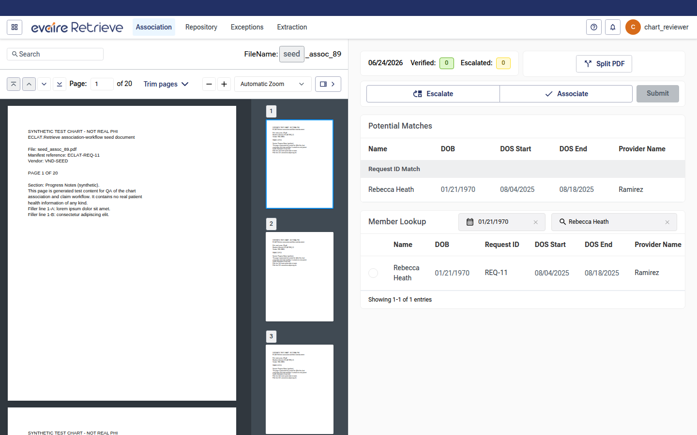
_Figure 1 — The Association page: document viewer (left) and review panel (right)._

### Understanding the Page Layout

| Area | Location | What it is for |
|---|---|---|
| **Document viewer** | Left | Displays the chart document (PDF or C-CDA). For PDFs, this is the built-in PDF Viewer (Part 7), with a **Trim pages** panel available from its toolbar. |
| **Review panel** | Right | Contains the **action header** (progress, split control, Associate/Escalate, Submit), the **Potential Matches** card, and the **Member Lookup** card. |

## 1.3 The Work Queue and Your Session

### How Charts Are Assigned

The Association workflow draws from a shared **work queue**. When you open the page, the application **claims** the next available chart and assigns it to you so that no two reviewers work the same chart at the same time. You always review one chart at a time.

### Keeping Your Claim Active

While you have a chart open, the application quietly renews your claim in the background (about once a minute, and again whenever you return to the tab). You don't need to do anything to keep it.

If your claim lapses — for example, if the chart sits open untouched for too long, or it was reassigned — the application treats the session as expired, lets the message from the system surface, and automatically brings up a fresh chart for you. Any decision you hadn't yet submitted for the expired chart will need to be redone on its replacement.

### Moving to the Next Chart

After you **Submit** a chart, it leaves your queue and the next chart loads automatically. You do not navigate away or refresh the page.

### Empty Queue and Error States

| Situation | What you see |
|---|---|
| **Queue is empty** | A message: **"No charts to review — The work queue is empty. Check back later or pick a project."** |
| **A chart can't be loaded** | A message: **"Unable to load chart document — We couldn't load this chart document. Please refresh or pick another from the queue."** |
| **Loading** | A spinner while the chart is being fetched. |


_Figure 2 — The empty-queue state when there is nothing left to review._

## 1.4 The Action Header

The top of the review panel is the **action header**. It stays visible as you work and contains three groups:

| Element | What it shows / does |
|---|---|
| **Progress strip** | Today's date, plus **Verified:** and **Escalated:** counts — how many charts you have associated and escalated today. |
| **Split control** | When the chart is whole, a **Split PDF** button (disabled for C-CDA charts). When the chart has been split, a chart selector — **Edit Split** plus a **Chart _n_ of _N_** dropdown — for choosing which split to act on. |
| **Associate / Escalate + Submit** | A two-way **Escalate / Associate** switch, an optional **Reason for escalation** field, and the **Submit** button. |


_Figure 3 — The action header with the progress strip, split control, and Associate/Escalate/Submit._

- **Escalate** and **Associate** work as a toggle: clicking the selected one again clears it.
- Choosing **Escalate** reveals a **Reason for escalation** dropdown (required to submit).
- **Submit** is enabled only when your decision is complete — an **Associate** decision needs a selected member; an **Escalate** decision needs a reason. For a split document, every chart must have a decision ready before Submit is enabled.

## 1.5 Reviewing the Document

### PDF and C-CDA Documents

- **PDF charts** open in the built-in **PDF Viewer** (search, zoom, page navigation, and thumbnails — see [Part 7: PDF Viewer](#part-7-pdf-viewer-shared-document-reader)).
- **C-CDA (XML) charts** open in the **C-CDA viewer**.
- **Trimming** and **splitting** are page operations, so they are available for **PDF charts only**, never for C-CDA.

### Trimming Pages

Trimming flags pages that should not be part of the final chart — for example cover sheets, fax logs, or blank pages. Open the **Trim pages** panel from the PDF Viewer toolbar.

1. Click **Trim pages** in the document toolbar. A trimming panel opens beneath the toolbar with one empty row.
2. For each row, choose the **Start** and **End** pages of the range to trim, then pick a **Reason for trim** (**Non-Clinical**, **Redundant**, or **Empty**).
3. As soon as a row has a page range and a reason, the trim is saved and those pages are flagged with a **Page trimmed** chip in the document (and tinted in the thumbnail rail).
4. Use **Add trim** (the **+** icon) to add another range. Selecting a reason automatically ticks that row's checkbox.
5. To remove trims, tick one or more rows and click **Clear Trims**, or use the trash icon on a single row.

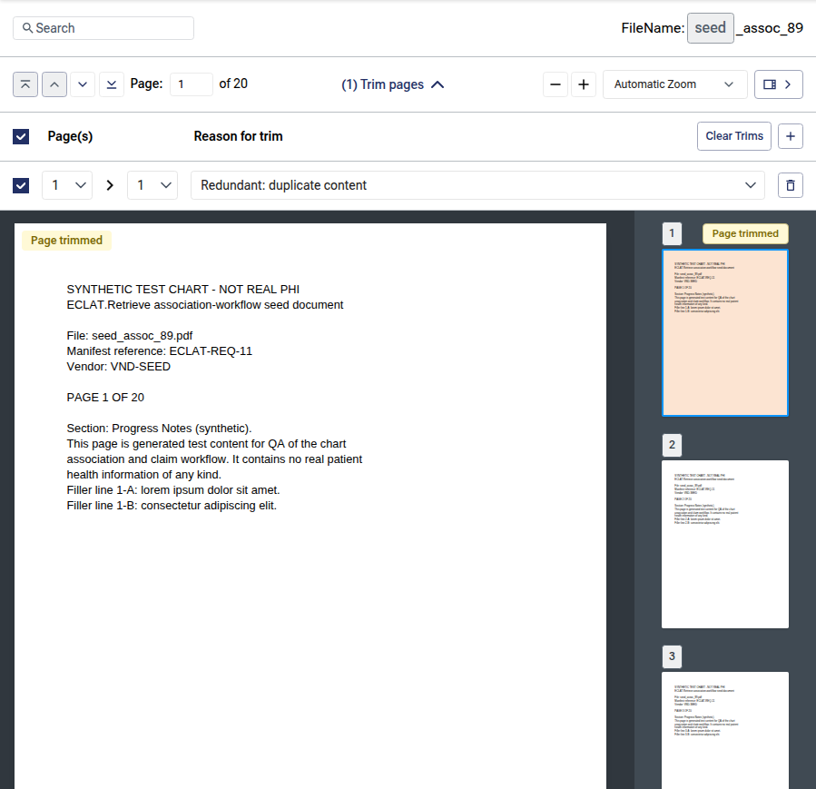
_Figure 4 — The Trim pages panel; completed ranges flag their pages as "Page trimmed"._

> **Note:** Trims are remembered for the chart — if you reopen it, your staged trims are still there. Trimming the *entire* chart (or a whole split) is not allowed at submission time; see **Warnings That Block Submission** (Section 1.7).

### Splitting the Document

Some vendor files actually contain several charts back-to-back. **Splitting** breaks one PDF into multiple charts, each of which you then associate or escalate independently.

1. In the action header, click **Split PDF**. The **Split Document** dialog opens.
2. For each split, choose the page it should break **before** — each value is the last page of one chart, so the next chart starts on the following page. The **preview row** shows the resulting charts (for example, _Chart 1: pg 1-3, Chart 2: pg 4-8_).
3. Click **+ Add another document split** to add more break points; use a row's delete icon to remove one.
4. Click **Split PDF** to confirm. To undo all splits and return to a single chart, click **Delete Split**. **Cancel** closes the dialog without changes.


_Figure 5 — The Split Document dialog: choose break points and preview the resulting charts._

Rules and feedback:

- Each split must come **after** the previous one. If not, you'll see **"Page split must be after Chart _n_."** and confirmation is blocked.
- The last page of the document cannot be a break point (that would leave an empty chart).
- Confirming without changing anything shows **"No changes to apply — The split is unchanged."**
- After a successful split, a green banner confirms **"Chart successfully split. Select chart from dropdown above to take action on it."**, and a blue banner reminds you which chart your actions apply to: **"Actions will apply to Chart _n_ of _N_."**

Once split, use the **Chart _n_ of _N_** dropdown in the header to move between the resulting charts; **Edit Split** reopens the dialog.

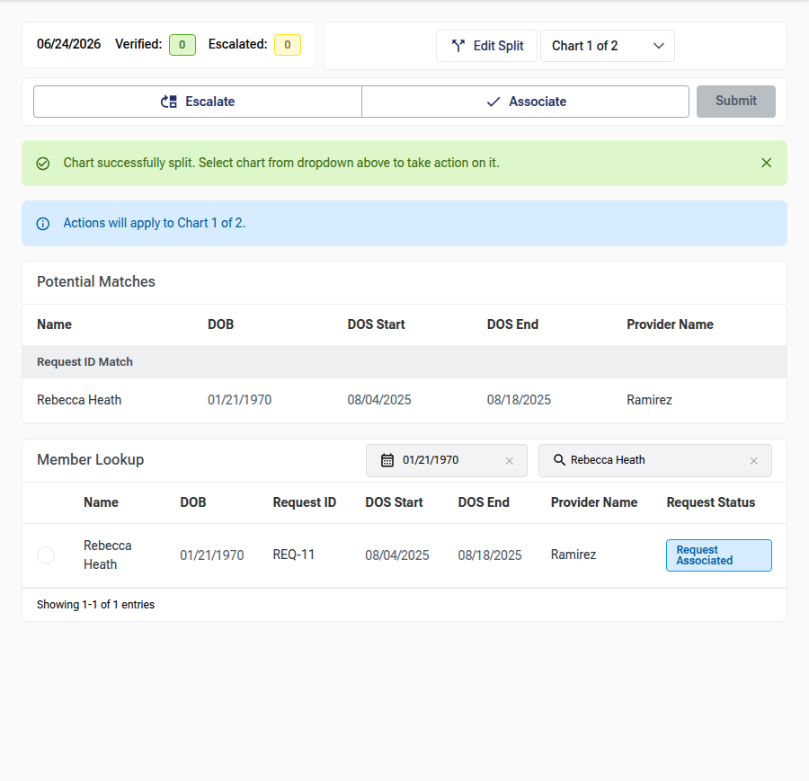
_Figure 6 — After splitting: the chart selector and the success/progress banners._

## 1.6 Choosing an Action: Associate or Escalate

For each chart (or each split), you either **Associate** it to a member's request or **Escalate** it. You pick the request to associate from one of two places: the **Potential Matches** card (system suggestions) or the **Member Lookup** card (your own search).

### Potential Matches

The **Potential Matches** card lists the requests the system already suggests for this chart, grouped by how they were matched:

- **Request ID Match** — matched on a request identifier.
- **Filename Match** — matched on the document's file name.

| Column | Description |
|---|---|
| **Name** | Member/patient name. |
| **DOB** | Date of birth. |
| **DOS Start** | Date of service — start. |
| **DOS End** | Date of service — end. |
| **Provider Name** | Provider on the request. |

Click a row to select it for association (click again to deselect). If there are no suggestions, the card shows **"Request ID did not match any Request ID in the database. Utilize the member lookup table."**

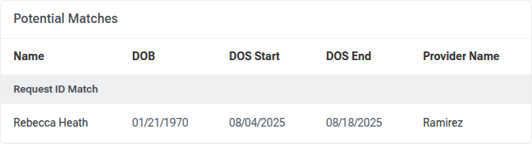
_Figure 7 — The Potential Matches card, grouped by Request ID Match / Filename Match._

### Member Lookup

When no suggestion fits, search for the right request in the **Member Lookup** card.

- Search by **Member Name** (type to filter; the field is clearable) and/or **DOB** (using the **MM/DD/YYYY** date picker). Future dates are not allowed, and an invalid date shows an **"Invalid date"** tooltip.
- On load, the filters are pre-filled from the top potential match, so the most likely request appears first.

| Column | Description |
|---|---|
| **(Select)** | A radio control to choose this request. |
| **Name** | Member/patient name. |
| **DOB** | Date of birth. |
| **Request ID** | The request's display ID, or "—". |
| **DOS Start / DOS End** | Date-of-service range. |
| **Provider Name** | Provider on the request. |
| **Request Status** | The request's status, shown as a colored pill (see **Request Statuses**, Section 1.8). |

The footer shows **"Showing _X-Y_ of _N_ entries"** and, when there is more than one page, pagination controls (five results per page). If nothing matches, you'll see **"No members match the current filters."**


_Figure 8 — The Member Lookup card: filter by name and DOB, then select a request._

> **Note:** The lookup runs only when you've entered a name or a date — it won't list every member with no filter.

### Associating a Chart to a Request

1. Select a request from **Potential Matches** or **Member Lookup**. The **Associate** action is selected automatically and the chosen request is highlighted.
2. Confirm your selection is correct.
3. Click **Submit** (see Section 1.7).

Selecting a different request replaces your choice; clicking the selected one again clears it.

### Escalating a Chart

Escalate a chart when it cannot be associated — for example, the request can't be found or the document isn't usable.

1. Click **Escalate** in the action header.
2. Choose a **Reason for escalation** (see **Escalation Reasons**, Section 1.8).
3. Click **Submit**.

Choosing **Escalate** clears any selected member, and a reason is required before you can submit.

### Acting on a Split Document

When a chart has been split, each resulting chart carries its **own** Associate/Escalate decision:

- Use the **Chart _n_ of _N_** dropdown to switch between charts; the banner reminds you which chart your current action applies to.
- Make a decision for each chart (associate it to a request, or escalate it with a reason).
- **Submit** becomes available only once **every** chart has a decision ready. You'll confirm them all together in the Submit Summary.

## 1.7 Submitting

### The Submit Summary

Clicking **Submit** does one of two things:

- If you **trimmed or split** the chart, a **Submit Summary** dialog opens so you can review everything before committing.
- If you made a **simple decision** with no trims or splits, the chart is submitted directly.

The Submit Summary shows:

- The **FileName** of the chart.
- One section per chart/split, each with its **Associate / Escalate** choice (you can still switch here, and pick an escalation reason).
- For an associate decision, the **selected member** row (Name, DOB, Request ID, DOS, Provider, Request Status, and — for splits — the page range).
- A **Trim Summary** listing the trimmed **Page(s)** and the **Reason for trim**.


_Figure 9 — The Submit Summary: review each chart's action and trims before confirming._

Click **Submit** to confirm, or **Cancel** to go back and make changes.

### Warnings That Block Submission

The Submit Summary won't let you confirm until every issue is resolved. You may see:

| Warning | Meaning |
|---|---|
| **"A split has all its pages trimmed — adjust the trims or split."** | A chart/split would have no pages left after trimming. Remove some trims or change the split. |
| **"Select a member to associate, or escalate the split."** | A chart set to **Associate** has no member selected. |
| **"Select a reason for escalation to continue."** | A chart set to **Escalate** has no reason chosen. |
| **"All pages trimmed"** (on a section) | Flags the specific split whose pages are all trimmed. |

### After You Submit

When the submission succeeds, your trims and splits are committed, the chart leaves your queue, and the next chart loads automatically. Your **Verified** / **Escalated** counts in the progress strip update to reflect the action.

## 1.8 Reference Tables

### Request Statuses

The **Request Status** pill in Member Lookup (and the Submit Summary) can show:

| Status | Meaning |
|---|---|
| **Available** | The request is open and available for association. |
| **Received** | The request has been received. |
| **Pending Association** | The request is awaiting association. |
| **Request Associated** | A chart has already been associated to this request. |
| **Failed Association** | A previous association attempt failed. |

### Escalation Reasons

When you escalate a chart, choose one of:

| Reason | Use when… |
|---|---|
| **Request Not Found** | No matching request exists for the chart. |
| **Multiple Requests Identified** | More than one request could match and it can't be resolved here. |
| **Non-Medical Context** | The document isn't a medical chart. |
| **Not Readable** | The document can't be read or is corrupted. |

### Trim Reasons

When you trim pages, choose one of:

| Reason | Use for… |
|---|---|
| **Non-Clinical** | Cover sheets, separators, fax logs, billing/insurance, disclaimers. |
| **Redundant** | Duplicate or repeated pages. |
| **Empty** | Blank, noise, or corrupted pages. |

## 1.9 Tips and Best Practices

- Start from **Potential Matches** — the system's suggestion is often correct. Fall back to **Member Lookup** when it isn't.
- In **Member Lookup**, combine **Member Name** and **DOB** to narrow a large result set quickly.
- **Trim** before you submit so the final chart contains only clinical pages; trimmed pages are clearly flagged in the document.
- Only **Split** when a file genuinely contains multiple charts — and remember each split needs its own decision.
- Review the **Submit Summary** carefully when you've trimmed or split; it's your last check before the chart is committed.
- Don't leave a chart open and idle for long — your claim can expire and the chart may be reassigned.

## 1.10 UAT — What to Verify

- [ ] Opening **Association** picks up a chart and shows the document and review panel.
- [ ] The **Verified** and **Escalated** counts and today's date display in the progress strip.
- [ ] The document renders correctly for both **PDF** and **C-CDA** charts.
- [ ] **Trim pages** flags the chosen pages, saves them, and shows the **Page trimmed** chip; **Clear Trims** and per-row delete work.
- [ ] **Split PDF** previews the resulting charts, enforces ordering ("Page split must be after Chart _n_"), and creates the charts; **Delete Split** restores a single chart.
- [ ] **Potential Matches** lists suggestions grouped by source, and selecting one sets up an association.
- [ ] **Member Lookup** filters by name and DOB, paginates, shows statuses, and rejects future/invalid dates.
- [ ] **Associate** requires a selected member; **Escalate** requires a reason; **Submit** enables only when the decision is complete.
- [ ] For a split chart, each chart needs its own decision before **Submit** is available.
- [ ] The **Submit Summary** shows the decisions and trim summary, blocks on the documented warnings, and commits on confirm.
- [ ] After submit, the next chart loads automatically and the counts update.
- [ ] The **empty-queue** and **load-error** messages appear in the right situations.

---

## Part 2: Exception Review

> **Where this fits in the flow:** When the system receives two versions of the same chart and cannot merge them automatically, it raises an **exception**. The Exception Review page (part of the Chart Repository) is where a reviewer reconciles **Document 1** and **Document 2** — telling the system which pages are the **same** across the two and which are **unique** to each — then either **submits** the classification (so the documents can be merged) or **escalates** the pair for senior review.

## 2.1 Getting Started

### Before You Begin

- You are signed in to the application.
- You have permission to review exceptions.
- There are exceptions waiting in the queue. If the queue is empty, the page tells you so (see Section 2.7).

### Opening the Exception Review Page

1. Sign in to the application.
2. Open the **Chart Repository** from the main navigation.
3. Select the **Exceptions** page.

### How Exceptions Are Assigned

Unlike the Filter and Search page, there is **no search box and no result list** here. You work on **one exception at a time**:

- When the page opens, the system **automatically assigns you the next exception** from the queue and displays it.
- The exception is **locked to you** for a short period (see Section 2.6) so that no one else edits the same pair while you work.
- When you **Submit** or **Escalate**, the system finishes that exception and **automatically loads the next one** in its place. You do not navigate anywhere.
- When there are no more exceptions, you see a message confirming you are caught up.

### Understanding the Page Layout

| Area | Location | What it is for |
|---|---|---|
| **Document area** | Left | View **Document 1** and **Document 2** side by side, each in its own PDF viewer, with a page-thumbnail rail and classification badges. |
| **Review panel** | Right | A vertical stack of three panels: your session counters (**header**), the patient/request details, and the **Delta Table** where you classify the pages and submit or escalate. |

The two PDF viewers are separated by a vertical divider. **Document 1** sits on the left with its thumbnail rail on the right edge; **Document 2** sits on the right with its thumbnail rail on the left edge, so the two thumbnail rails face each other in the middle.

## 2.2 Reading the Exception

### The Header (Your Session Counters)

At the top of the right-hand panel, a header shows today's date (in **MM/DD/YYYY** format) and two running counters for your current session:

| Counter | Label on screen | Badge color | Meaning |
|---|---|---|---|
| Reviewed | **Exceptions Reviewed:** | 🟢 Green | How many exceptions you have submitted (merged) so far. |
| Escalated | **Escalated:** | 🟡 Yellow | How many exceptions you have escalated so far. |

These counts go up as you complete exceptions during your session.

### Request Details

Below the header, a read-only panel summarizes the patient and request tied to this exception:

| Field | Label on screen | Notes |
|---|---|---|
| Member name | _(shown as a heading)_ | The member/patient name. |
| Date of birth | **DOB:** | Formatted **MM/DD/YYYY**, or **—** if not available. |
| Date of service (start) | **DOS Start:** | Formatted **MM/DD/YYYY**, or **—** if not available. |
| Date of service (end) | **DOS End:** | Formatted **MM/DD/YYYY**, or **—** if not available. |
| Provider | **Provider Name:** | The healthcare provider's name. |

> **Note:** A dash (**—**) means the value is not available for this exception.

### The Two Documents

Each document opens in its own PDF viewer:

- The left viewer's toolbar is titled **Document 1**.
- The right viewer's toolbar is titled **Document 2**.

Use each viewer to scroll, page through, and read the document. Your job is to compare the two and decide, page by page, what is shared and what is unique.

### Page Thumbnails and Badges

Each viewer has a **thumbnail rail** that shows a small image of every page. You can:

- **Click a thumbnail** to jump the main viewer to that page.
- **Resize the rail** by dragging the inner edge that faces the PDF. A thin blue line appears while you drag. (The rail width is limited to a sensible minimum and maximum.)

As you classify pages in the Delta Table, each thumbnail gets a colored **badge** so you can see your classification at a glance:

| Badge | Color | Meaning |
|---|---|---|
| **Same \| N** | 🔵 Blue | This page is part of an "equal" classification. The number **N** pairs up the matching chunk across the two documents (group 1, group 2, and so on). |
| **Unique** | 🟢 Green | This page exists in only this document. |

The whole thumbnail is also highlighted in the matching color (blue for "same", green for "unique").

## 2.3 Classifying the Documents (The Delta Table)

The **Delta Table** (right-hand panel, titled **Delta Table**) is where you record your decisions. You build a list of **rows**, where each row describes a chunk of pages and how it relates across the two documents.

### What a Delta Row Means

Every row is one of three kinds:

| Row kind | Toggle button | What it says |
|---|---|---|
| **Same on both documents** | **=** (center button) | A range of pages in Document 1 matches the same number of pages in Document 2. |
| **Unique to Document 1** | **Unique** (left button) | A range of pages exists only in Document 1. |
| **Unique to Document 2** | **Unique** (right button) | A range of pages exists only in Document 2. |

Your goal is to add rows until **every page** of both documents is accounted for exactly once.

### Delta Table Columns

| Column | Header on screen | What it shows / does |
|---|---|---|
| Row number | **#** | The row's position in the list (1, 2, 3 …). |
| Document 1 pages | **Doc 1** | A **Start** and **End** page picker for Document 1. Disabled for a row that is unique to Document 2. |
| Classification | **Delta** | A three-way toggle: **Unique** (Doc 1) / **=** / **Unique** (Doc 2). |
| Document 2 pages | **Doc 2** | A **Start** and **End** page picker for Document 2. Disabled for a row that is unique to Document 1. |
| Remove | _(no label)_ | A trash icon that deletes the row. |

### Adding a Row

Click **Add row** (with the **+** icon) at the bottom of the table. A new row appears, ready for you to set its classification and page ranges.

### Setting the Classification

In the **Delta** column, click one of the three toggle buttons:

- **Unique** (left) — the pages belong only to Document 1. The **Doc 2** range becomes empty and disabled.
- **=** (center) — the pages are the same in both documents. Both **Doc 1** and **Doc 2** ranges are active.
- **Unique** (right) — the pages belong only to Document 2. The **Doc 1** range becomes empty and disabled.

### Setting the Page Ranges

In the **Doc 1** and **Doc 2** columns, use the **Start** and **End** dropdowns to choose the first and last page of the chunk. Only the pages that exist in that document are offered. For a single page, set **Start** and **End** to the same number.

> **Remember:** For an **=** (equal) row, the number of pages selected on each side must match — for example, pages 1–3 in Document 1 with pages 1–3 in Document 2. See **Equal Page-Count Mismatch** (Section 2.4).

### Selecting a Row to Navigate the Documents

Click anywhere on a row (other than its dropdowns or the classification toggle) to **select** it. The selected row is highlighted, and both PDF viewers jump to that row's starting page on each side, so you can quickly check your work. (For a unique row, only the relevant document scrolls.) You can also select a focused row with **Enter** or the **Space** bar.

### Deleting a Row

Click the **trash icon** at the end of a row to remove just that row.

### Clearing the Table

To start the classification over, open the **More actions** menu (the **⋮** button next to **Submit**) and choose **Clear Table**. This removes all rows at once. You can then add new rows from scratch.

## 2.4 Validation Rules and Messages

The page checks your classification continuously and will not let you submit until it is valid. The **Submit** button stays disabled while any of the following problems exist. Messages appear inline (in red) in the Delta Table.

### Page Overlap (Conflict)

Each page may be classified in only one row. If two rows cover the same page, the affected rows are highlighted in red and you see:

> _"Each page can be classified in only one row. Adjust the highlighted rows so their page ranges don't overlap before submitting."_

### Uncovered Pages (Coverage)

Every page in both documents must be classified before you can submit. If any pages are left out, you see:

> _"All pages must be classified before submitting."_

When pages are missing, the message also lists exactly which ones — for example:

> _"All pages must be classified before submitting. Doc 1 missing: 5-7, 10. Doc 2 missing: 3."_

### Equal Page-Count Mismatch

For an **=** (equal) row, the number of pages on each side must be the same. If they differ, that row shows:

> _"Page count needs to be equal between documents."_

### Duplicate Row

Two rows must not be identical. If a row repeats another row's classification and ranges, it shows:

> _"This row is a duplicate of another row. Remove or modify it before submitting."_

## 2.5 Submitting and Escalating an Exception

### Submitting an Exception

When your classification is complete and valid:

1. Review the Delta Table one last time — confirm there are no red messages and every page is accounted for.
2. Click **Submit** (the navy button at the top-right of the Delta Table).
3. The system records your classification and merges the two documents.
4. On success, the page **automatically loads the next exception** from the queue, and your **Exceptions Reviewed** counter goes up by one.

While the submission is processing, the **Submit** button shows a loading state and stays disabled to prevent a double-submit. The button is also disabled whenever the table is empty or any validation message is showing.

### Escalating an Exception

If the pair cannot be classified — for example, the two documents are clearly not the same request, or a document is not readable — escalate it instead of submitting:

1. Open the **More actions** menu (the **⋮** button) and choose **Escalate**. The Delta Table switches to escalation mode and the validation messages are set aside.
2. In the **Reason for escalation** field (required), choose one of:
   - **Requests Not Matching**
   - **Not Readable**
3. Click **Submit** to send the escalation. (Submit stays disabled until you choose a reason.)
4. On success, the page **automatically loads the next exception**, and your **Escalated** counter goes up by one.

To back out of escalation mode without escalating, click **Cancel Escalation**. This returns you to the normal classification view with your rows intact.

## 2.6 Session and Lock Behavior

- When you open an exception, it is **locked to you for 15 minutes** so no one else can edit the same pair.
- While you are actively working on the page, the application **keeps the lock alive automatically** in the background — you do not need to do anything.
- If you leave the exception open and step away for a long time, the lock can expire and the exception may return to the queue for someone else.
- Your in-progress rows are kept while you work; a routine background refresh of the same exception will **not** wipe your edits.

## 2.7 Page States You May See

| State | What you see | What it means |
|---|---|---|
| **Loading** | A large spinner in the center of the page. | The system is fetching your next exception. |
| **Queue empty** | A blue panel titled **"No exceptions to review"** with the text _"No exceptions to review at the moment. Check again later for new items."_ | You are caught up — there is nothing to review right now. |
| **Load error** | A red panel titled **"Unable to load exception"** with an explanation (for example, _"We couldn't load this exception. Please refresh or pick another from the queue."_). | The exception could not be loaded. Refresh the page or try again. |
| **Working** | The two documents and the Delta Table. | An exception is assigned and ready for you to classify. |

## 2.8 Tips and Best Practices

- Work through the documents **in page order** and add a row for each chunk as you go — it is the easiest way to be sure every page is covered.
- Use the thumbnail **badges** (**Same | N** in blue, **Unique** in green) as a running map of what you have already classified.
- **Click a row** to jump both viewers to its pages — a quick way to double-check a classification before submitting.
- For **=** rows, make sure both sides cover the **same number of pages**.
- Read the inline red messages: they tell you exactly which pages overlap or are still missing.
- If a pair genuinely cannot be reconciled, **escalate** with the correct reason rather than guessing.

## 2.9 UAT — What to Verify

- [ ] Open the Exceptions page; an exception loads automatically, showing both documents and the review panel.
- [ ] The header shows today's date and the **Exceptions Reviewed** and **Escalated** counters.
- [ ] The Request Details panel shows the member name, **DOB**, **DOS Start**, **DOS End**, and **Provider Name** (with **—** where a value is missing).
- [ ] Both PDF viewers (**Document 1** and **Document 2**) load and can be scrolled.
- [ ] Thumbnail rails display, can be clicked to jump pages, and can be resized.
- [ ] **Add row** adds a row; the **#**, **Doc 1**, **Delta**, and **Doc 2** columns behave as described.
- [ ] The **Delta** toggle switches a row between **Unique** (Doc 1), **=**, and **Unique** (Doc 2), enabling/disabling the correct page pickers.
- [ ] The **Start** / **End** pickers only offer pages that exist in that document.
- [ ] Selecting a row highlights it and scrolls the viewer(s) to the row's pages.
- [ ] Thumbnail badges show **Same | N** (blue) and **Unique** (green) as rows are classified.
- [ ] The **trash icon** removes a single row; **Clear Table** removes all rows.
- [ ] Validation works: overlap, uncovered pages (with the missing-page list), equal page-count mismatch, and duplicate-row messages all appear, and **Submit** is disabled while any are showing.
- [ ] **Submit** merges a valid classification, increments **Exceptions Reviewed**, and loads the next exception.
- [ ] **Escalate** shows the **Reason for escalation** field; submitting with **Requests Not Matching** or **Not Readable** increments **Escalated** and loads the next exception.
- [ ] **Cancel Escalation** returns to the normal view with rows intact.
- [ ] When the queue is empty, the **"No exceptions to review"** message appears.

---

## Part 3: Filter and Search (Chart Repository)

> **Where this fits in the flow:** Once charts have been associated and reconciled, they live in the **Chart Repository**. The Filter and Search page is where you locate charts using a rich set of filters, review each chart's details, preview the source document, save the searches you use most often, and export selected charts for download.

## 3.1 Getting Started

### Before You Begin

- You are signed in to the application.
- A **Client** and **Project** are selected. The filter panel shows the active Client and Project at the top, and all results are limited to that Project.

### Opening the Filter and Search Page

1. Sign in to the application.
2. Open the **Chart Repository** from the main navigation.
3. Select the **Filter and Search** page.

### Understanding the Page Layout

| Area | Location | What it is for |
|---|---|---|
| **Filter panel** | Left | Enter your search criteria, apply chart-status and date filters, clear filters, and manage saved searches. |
| **Results area** | Right | View the charts that match your filters, sort and page through them, select charts, open a chart preview, and export selected charts. |

## 3.2 Searching for Charts

There is no single search box on this page. Instead, you build a search by filling in one or more filter fields in the left panel. As you change the filters, the results list refreshes automatically a moment after you stop typing — you do not need to press a search button.

Two short instructions appear at the top of the filter panel:

- _"Use the fields below to search."_
- _"Use a comma to add multiple inputs."_

### Client and Project

At the top of the filter panel, a read-only card shows the active **Client** and **Project**. These values are set elsewhere in the application and cannot be edited here. All search results belong to the selected Project.

### Filter Reference

The table below lists every filter available in the panel.

| Filter | How to enter a value | What it searches |
|---|---|---|
| **HCC Search** | Type one or more HCC codes; press Enter or a comma to add each as a chip (placeholder: "Enter Code(s)"). | Charts associated with the HCC code(s) you enter. |
| **ICD Search** | Type one or more ICD codes, separated by commas (placeholder: "Enter Code(s)"). | Charts associated with the ICD diagnosis code(s). |
| **Provider NPI** | Type one or more NPIs, separated by commas (placeholder: "Enter NPI"). | Charts for the provider National Provider Identifier(s). |
| **Provider TIN** | Type one or more TINs, separated by commas (placeholder: "Enter TIN"). | Charts for the provider Tax Identification Number(s). |
| **Provider Name** | Start typing in the dropdown ("Select Provider"); matching providers appear as you type. Selected providers are shown as removable chips. If none match, you see "No providers found". | Charts for the selected provider(s). |
| **Member Name** | Type one or more member names, separated by commas (placeholder: "Enter Member Name"). | Charts for the member/patient name(s). |
| **Client Request ID** | Type one or more IDs, separated by commas (placeholder: "Enter Client Request ID"). | Charts matching the request ID(s) supplied by the client. |
| **Request ID (evaire-generated)** | Type one or more IDs, separated by commas (placeholder: "Enter evaire Request ID"). | Charts matching the system-generated request ID(s). |
| **Chart Status** | Click a status chip to include it; click again to remove it. You may select several. | Charts in the selected workflow status(es). See the [Chart Status Reference](#chart-status-reference). |
| **Year of Service Start** | Choose a year from the dropdown ("Choose a Year"). Selected years appear as "YOS &lt;year&gt;" chips. If none match, you see "No years found". | Charts whose service year matches your selection. |
| **Date of Service** | Pick a date range (format MM/DD/YYYY - MM/DD/YYYY); quick-range shortcuts are available. Click "+ Add another date range" to add more ranges; remove a range with the ✕ icon. | Charts with a date of service that falls within the chosen range(s). |

> **Tip:** The code and identifier fields — **HCC Search, ICD Search, Provider NPI, Provider TIN, Member Name, Client Request ID,** and **Request ID** — accept multiple values. Separate them with commas, and each value becomes its own chip that you can remove individually.

### Selecting Chart Statuses

The **Chart Status** filter shows six status chips. Click a chip to include that status in your search; click it again to remove it. A selected chip appears in its status color, while unselected chips are gray. The six selectable statuses are:

- **Request Associated**
- **Awaiting Exception Resolution**
- **Escalated Exception**
- **Available for Extraction**
- **Extracted**
- **Archived**

Each status and its meaning are described in the [Chart Status Reference](#chart-status-reference).

### Combining Filters

You can use several filters together to narrow a large set of charts — for example, a provider together with a chart status and a date range. The more filters you add, the more specific your results become. You can also enter multiple values in a single field and add more than one date range. Results refresh automatically as you make changes.

### Clearing Filters

To start over, click **Clear Filters** at the bottom-left of the panel. This resets every filter and clears any saved search you have applied. The button is available only when at least one filter is active.

## 3.3 Working with Results

Charts that match your filters appear in the table on the right, under the heading **Results (N)**, where _N_ is the total number of matching charts.

### Results Columns

| Column | Description |
|---|---|
| **Chart ID** | The unique identifier of the chart. |
| **Request ID** | The system-generated request ID, or "-" if none. |
| **Client Request ID** | The client-supplied request ID, or "-" if none. |
| **Member Name** | The member/patient name. |
| **Provider Name** | The healthcare provider's name. |
| **DOS (Start - End Date)** | The date-of-service range, shown as a start and end date, or "-" if none. |
| **Chart Status** | The current workflow status, shown as a colored badge. |
| **Tags** | Labels applied to the chart (rule tags first, then semantic tags); "-" if the chart has no tags. |
| **Audit Type** | The audit type in uppercase (for example, MRA, HEDIS, RADV, or ACA), or "-" if none. |
| **Action** | Contains the **View** button, which opens a preview of the chart. |

### Sorting

Click a column header to sort by that column; click it again to reverse the order. Please note:

- You can sort by one column at a time.
- Sorting applies to the charts on the current page.
- The **Tags** column cannot be sorted.

### Pagination

Use the pagination controls below the table to move between pages and to change how many charts appear per page (the default is 10). The total number of matching charts is always shown in the **Results (N)** heading.

### Chart Status Reference

A chart's status reflects where it is in the retrieval and extraction workflow (see also [The Chart Lifecycle](#the-chart-lifecycle-the-flow)). Each status below can be used in the **Chart Status** filter and appears as a colored badge in the results.

| Status (as shown on screen) | Badge color | Meaning |
|---|---|---|
| **Request Associated** | 🟠 Orange | A retrieval request has been associated with the chart. |
| **Awaiting Exception Resolution** | 🟣 Purple | The chart has an exception that must be resolved before it can proceed. |
| **Escalated Exception** | 🟡 Yellow | An exception on the chart has been escalated for review. |
| **Available for Extraction** | 🔵 Blue | The chart is ready for data extraction. |
| **Extracted** | 🟢 Green | Data extraction for the chart is complete. |
| **Archived** | 🔴 Red | The chart has been archived. |

### Tags

Charts can carry two kinds of tags, shown as small colored pills:

- **Rule tags** — shown in neutral gray, and listed first. (These come from the rules you define in [Part 4: Auto-Tagging](#part-4-auto-tagging-chart-repository).)
- **Semantic tags** — shown in purple, and listed after the rule tags.

When a chart has many tags, they wrap onto multiple lines. A chart with no tags shows "-".

## 3.4 Previewing a Chart

1. In the results table, find the chart you want to review and click **View** (the eye icon) in the **Action** column.
2. A preview window opens, showing the chart document and a details panel.

### Chart Details

The **Chart Details** panel beside the document summarizes the chart in two columns:

| Left column | Right column |
|---|---|
| **Chart ID** | **Request ID** |
| **Client Request ID** | **Member Name** |
| **Provider Name** | **DOS Start - End** |
| **Chart Status** | **Existing Tags** |
| **Audit Type** | |

- Any value that is not available is shown as "-".
- Under **Existing Tags**, up to two tags are shown; any additional tags are collapsed into a "+N" pill. Hover over that pill to see the remaining tags.

### Viewing the Document

- **PDF charts** open in a built-in PDF viewer (see [Part 7: PDF Viewer](#part-7-pdf-viewer-shared-document-reader)).
- **C-CDA (XML) charts** open in a C-CDA viewer.

Close the preview to return to the results list.

## 3.5 Selecting and Exporting Charts

### Selecting Charts

- Use the checkbox at the start of each row to select one or more charts.
- When at least one chart is selected, a **"N chart(s) selected"** indicator appears above the table.
- Your selection is kept as you move between pages.
- Changing your filters clears the current selection.

### Exporting Charts

1. Select the charts you want to export.
2. Click **Export Selected Charts** at the top-right of the results area. (This button is enabled only when at least one chart is selected.)
3. In the **Export Selected Charts** dialog, review the **Chart Selections** table, which lists the **Chart ID**, **Member**, **Provider**, and **Chart Status** of each selected chart.
4. Click **Export Charts as ZIP** to start the export, or **Cancel** to go back.

> **Note:** _"Charts will be packaged into a ZIP file and available to download from your notifications once ready."_ After the export starts, the dialog closes and your selection is cleared.

## 3.6 Saving and Reusing Searches

You can save filter combinations you use often and reapply them in a single click. The **Saved Searches** section is at the bottom of the filter panel; click its heading to expand or collapse it.

### Saving a Search

1. Set up the filters you want to save.
2. Click **Save Search** at the bottom-right of the panel (enabled when at least one filter is active).
3. Enter a name in the **Save your search** field (a name is required), then click **Save**. You can also press **Enter** to save or **Esc** to cancel.

### Applying a Saved Search

Expand the **Saved Searches** section and click a saved search's name to apply its filters. The selected search is highlighted.

### Viewing a Saved Search's Filters

Click **Expand** on a saved search to see its filters listed as chips. Click **Collapse** to hide them again.

### Renaming a Saved Search

1. Expand the saved search, then click the **edit (pencil)** icon.
2. Type the new name and confirm with the **check** icon or by pressing **Enter**. To cancel, press **Esc** or click the **✕** icon.

### Updating a Saved Search

With a saved search applied, adjust the filters and then click **Update Saved Search** to overwrite it with the current filters. Alternatively, click **Save New Search** to save the current filters as a new search instead.

### Deleting a Saved Search

1. Click the **delete (trash)** icon on the saved search you want to remove.
2. In the **Delete Saved Search** dialog ("Are you sure you want to delete ...? This action cannot be undone."), click **Delete** to confirm, or **Cancel** to keep it.

## 3.7 Tips and Best Practices

- Use commas to add several values to one field quickly.
- Combine filters to narrow down large result sets.
- Save searches you run regularly so you can reapply them in one click.
- The page address (URL) reflects your current filters and page. You can bookmark or share it to return to exactly the same view later.
- Sorting affects only the current page — use filters to bring the charts you want onto the page.

## 3.8 UAT — What to Verify

- [ ] Open the Filter and Search page; the filter panel and results area both load.
- [ ] The Client and Project shown at the top match your selection.
- [ ] Each filter (HCC, ICD, NPI, TIN, Provider Name, Member Name, request IDs) returns the expected charts.
- [ ] Comma-separated values create separate chips in the text fields.
- [ ] Chart Status chips can be selected and cleared, and they filter the results.
- [ ] A date range filters the results; adding a second range works as expected.
- [ ] **Clear Filters** resets all filters and results.
- [ ] Result columns, the **Results (N)** count, sorting, and pagination behave correctly.
- [ ] **View** opens the chart preview; the Chart Details panel and document viewer display correctly for both PDF and C-CDA charts.
- [ ] Tags display correctly in the results and in the preview.
- [ ] Selecting charts works, and the selection persists across pages.
- [ ] **Export Selected Charts** produces a ZIP that becomes available in notifications.
- [ ] Saving, applying, renaming, updating, and deleting a saved search all work.
- [ ] Bookmarking the page URL reopens the same filters and page.

---

## Part 4: Auto-Tagging (Chart Repository)

> **Where this fits in the flow:** The Auto-Tagging page (the **Tagging** tab of the Chart Repository, alongside Filter & Search and Semantic Search) lets you set up **tagging rules** that automatically apply a tag to charts. Each rule maps a single coding value — an **HCC** code, an **ICD** diagnosis code, or a **Year of Service Start** — to the charts that match it, across the whole Client and Project you have selected. The rule tags it produces show up in the **Tags** column on the Filter & Search page (Part 3).

## 4.1 How Auto-Tagging Works

Rules are **priority-ordered**, so when a chart could match more than one rule, the highest-priority rule decides the tag. The left panel states the three governing principles:

- _"Tagging applies to all charts within the Client and Project(s) selection."_
- _"A single chart can only have a maximum of one HCC or one ICD or one Year of Service Start tag."_
- _"Tags are applied based on the priority order of tagging rules. e.g. if a chart qualifies for HCC 15 and YOS Start 2026, and HCC 15 is the #1 priority, it will be tagged with HCC 15 and not with YOS Start 2026."_

Charts are re-tagged automatically whenever you create, delete, or reorder rules.

## 4.2 Getting Started

### Before You Begin

- You are signed in to the application.
- A **Client** and **Project** are selected. The page only opens once both are chosen, and the left panel shows the active Client and Project. Until they resolve, each shows a dash (**—**).

### Opening the Tagging Page

1. Sign in to the application.
2. Open the **Chart Repository** from the main navigation.
3. Select the **Tagging** tab (shown alongside **Filter & Search** and **Semantic Search**).

### Understanding the Page Layout

The page is divided into two areas:

| Area | Location | What it is for |
|---|---|---|
| **Create-rule panel** | Left | Shows the active Client and Project, lets you pick a tag type (**HCC**, **ICD**, or **YOS**), choose a code or year, and create a rule. |
| **Rules table** | Right | Lists all existing rules in priority order, lets you reorder them by dragging, and lets you delete them. |

## 4.3 Creating a Tagging Rule

You build a rule in the left panel, under the heading **Create a Tagging Rule**.

### Client and Project

At the top of the panel, a read-only card shows the active **Client** and **Project**. These values are set elsewhere in the application and cannot be edited here. Every rule you create is scoped to this Client and Project.

### Choosing a Tag Type

Use the tag-type selector (a three-way toggle) to choose what the rule matches on:

| Tab | What it matches | Tooltip |
|---|---|---|
| **HCC** | A specific HCC (Hierarchical Condition Category) code. | _"Hierarchical Condition Categories — map a specific HCC code to a tag."_ |
| **ICD** | A specific ICD-10 diagnosis code. | _"ICD-10 diagnosis codes — map a specific diagnosis code to a tag."_ |
| **YOS** | A specific Year of Service Start. | _"Year of Service Start — map a service year to a tag."_ |

Switching tabs changes the picker below and clears any value you had entered.

### Choosing a Code or Year

The picker below the tabs changes with the tag type. In every case the field is required (marked with an asterisk) and can be cleared.

| Tab | Field label | Placeholder | How to enter a value |
|---|---|---|---|
| **HCC** | **HCC Code** | _"Search HCC code (e.g. HCC 92)"_ | Start typing to filter the Project's HCC codes, or open the list to browse them. Each option shows as "HCC <code>". |
| **ICD** | **ICD Code** | _"Search ICD code (e.g. A02.1)"_ | Type at least **2 characters** to search. Each option shows the code with its short description, e.g. "A02.1 (Salmonella…)". |
| **YOS** | **Year of Service** | _"Select year"_ | Pick a year from the dropdown (you can type to filter). |

> **Picker messages:** For **ICD**, before you have typed two characters the list shows _"Type at least 2 characters"_. For **HCC** and **YOS**, when nothing matches, the list shows _"No matches"_.

### Creating the Rule

Click **Create New Rule** (the navy button with the **+** icon) to save the rule.

- The button is **disabled** until you have selected a value.
- While the rule is being created, the button shows a loading state.
- On success, the new rule is added to the **bottom** of the rules table (the lowest priority), the picker is cleared, and a confirmation message appears. The tag type stays selected so you can create another rule of the same type.

> **Note:** Rules cannot be edited after they are created. To change a rule's value, delete it and create a new one.

## 4.4 Working with the Rules Table

Existing rules appear on the right, under the heading **Tagging Rules**, listed from highest priority (**1**) downward.

### Table Columns

| Column | Header | What it shows |
|---|---|---|
| Reorder | _(no label)_ | A drag handle used to change the rule's priority. |
| Priority | **#** | The rule's priority number (1 = highest). Shows a small spinner while a reorder is saving. |
| Tag type | **Tag Type** | **HCC**, **ICD**, or **Year of Service**. |
| Value | **Code/YOS** | The matched value as a pill — e.g. "HCC 92", "A02.1", or "YOS 2024". |
| Created | **Date Created** | The date the rule was created. |
| Client | **Client** | The Client the rule belongs to. |
| Project | **Project** | The Project the rule belongs to. |
| Actions | _(no label)_ | A delete (trash) button. |

There is no pagination — all rules for the Project are listed, and the list scrolls within its panel if it is long. There is no row selection, bulk action, or detail/preview view; each rule is managed on its own row.

### How Priority Decides the Tag

A chart can carry at most **one** HCC, **one** ICD, and **one** Year of Service Start tag. When a chart qualifies for more than one rule, the rule with the **higher priority** (closer to **#1**) wins and applies its tag. Ordering your rules therefore controls which tags charts receive.

### Reordering Rules (Changing Priority)

Drag a rule by its **drag handle** (the left-most column) and drop it where you want it. A line shows where the rule will land. When you release, the priorities renumber automatically and the change is saved (the **#** column briefly shows a spinner). A confirmation message appears when it completes.

You can also reorder with the keyboard, following the on-screen instruction:

> _"To pick up a draggable row, press Space or Enter. While dragging, use the arrow keys to move the row. Press Space or Enter again to drop, or Escape to cancel."_

### Deleting a Rule

1. Click the **trash icon** in the **Actions** column of the rule you want to remove.
2. A confirmation dialog titled **"Delete Tagging Rule?"** opens.
3. Click **Delete** to remove the rule, or **Cancel** to keep it. (Both buttons are disabled while the deletion is in progress, and a brief overlay covers the table.)

When a rule is deleted, the remaining rules renumber automatically and charts are re-tagged. A confirmation message appears when it completes.

## 4.5 Page States You May See

| State | What you see | What it means |
|---|---|---|
| **Loading** | A spinner in the rules table. | The list of rules is loading. |
| **No rules yet** | A tag icon, the heading **"No tagging rules yet"**, and the line **"Select a tag type and create your first rule."** | No rules exist yet for this Project. Create one from the left panel. |
| **Rules listed** | The rules table with one row per rule. | One or more rules exist. |
| **Deleting** | A brief overlay across the table. | A rule deletion is being processed. |

> Confirmations and errors for creating, reordering, and deleting rules appear as brief on-screen notifications (toasts) with the message returned by the system.

## 4.6 Tag Type Reference

| Tag type | Shown in **Tag Type** as | Value pill example | Source of values |
|---|---|---|---|
| **HCC** | HCC | HCC 92 | The Project's HCC code set (searchable). |
| **ICD** | ICD | A02.1 | ICD-10 diagnosis codes (searchable, 2+ characters). |
| **YOS** | Year of Service | YOS 2024 | The Project's available service years. |

## 4.7 Tips and Best Practices

- Decide your **priority order** deliberately — when a chart qualifies for several rules, the top-most rule wins.
- Remember a chart can hold only **one HCC, one ICD, and one Year of Service Start** tag at a time.
- For **ICD**, type at least two characters to start searching; use the short description in each option to confirm you have the right code.
- New rules always start at the **bottom** (lowest priority); drag them up if they should take precedence.
- To change a rule, **delete and recreate** it — rules cannot be edited in place.
- Reordering and deleting **re-tag charts**, so make these changes intentionally.

## 4.8 UAT — What to Verify

- [ ] Open the **Tagging** tab; the create-rule panel and rules table both load.
- [ ] The **Client** and **Project** shown in the left panel match your selection.
- [ ] The **HCC**, **ICD**, and **YOS** tabs each switch the picker and clear the previous value.
- [ ] The **HCC Code** picker searches/browses HCC codes and shows "No matches" when appropriate.
- [ ] The **ICD Code** picker requires 2+ characters ("Type at least 2 characters") and returns codes with descriptions.
- [ ] The **Year of Service** picker lists the Project's years.
- [ ] **Create New Rule** is disabled until a value is chosen, and a created rule appears at the bottom of the table.
- [ ] The table shows the correct **#**, **Tag Type**, **Code/YOS** pill, **Date Created**, **Client**, and **Project** for each rule.
- [ ] Dragging a rule reorders it, the **#** values renumber, and the change is saved.
- [ ] Keyboard reordering works per the on-screen instructions.
- [ ] The delete icon opens the **"Delete Tagging Rule?"** dialog; **Delete** removes the rule and **Cancel** keeps it.
- [ ] After deleting, the remaining rules renumber correctly.
- [ ] The **"No tagging rules yet"** empty state appears when no rules exist.
- [ ] Priority behaves as described — a chart that qualifies for multiple rules is tagged by the highest-priority rule.

---

## Part 5: Semantic Search (Chart Repository)

> **Where this fits in the flow:** Semantic Search is the third tab of the Chart Repository (alongside Filter & Search and Tagging). It lets authorized users find clinically relevant information across a project's charts by typing a natural-language question or phrase — for example, *"uncontrolled type 2 diabetes with neuropathy"* — instead of matching exact keywords. It returns the most relevant passages (snippets) from patient charts, ranked by how closely they match the query.

The actual matching and ranking are **performed by an AI search service provided by the AI team**. ECLAT.Retrieve sends the search request to that service and returns the results to the user.

## 5.1 How It Works (Overview)

1. A user submits a search for a specific project, providing their query and a few search options.
2. ECLAT.Retrieve passes the request to the **AI team's search API**, which finds the matching passages across the project's charts.
3. The results are returned to the user — grouped by chart, with the relevant snippets and the patient/member each chart belongs to.

Charts must already be processed and made available to the AI service (handled by the chart ingestion process) before they can be searched.

## 5.2 Who Can Use It

Semantic search is available to authorized roles only:

- **Client Relationship Manager**
- **Client**

Because results contain patient information, access is restricted and every search is recorded for audit purposes.

## 5.3 What the User Provides

A search is always tied to a single **project**. Within that project, the user provides a query and an allowed set of filters.

### Filters Allowed

| Filter | Required? | Allowed values | Description |
|---|---|---|---|
| **Query** | Yes | Text, 1–1,000 characters | The natural-language phrase to search for. |
| **Minimum confidence** | Yes | A number from `0` to `1` | Only matches at or above this confidence are counted as results. |
| **Encounters per chart** | No | A whole number, or `"All"` (default) | The most matching encounters to return per chart. `"All"` returns every match. |
| **Year of service (start)** | No | A year from `1900` to `2100` | Only includes encounters on or after this year. |

The project itself is not entered as a filter — it is taken from the project the user is currently working in.

## 5.4 What the Search Returns

The response is a summary plus the matching charts.

| Field | Description |
|---|---|
| **Total charts** | The number of charts available to search in the project. |
| **Total matches** | How many charts had matches at or above the chosen confidence. |
| **Charts** | The list of matching charts (see below). |

Each **chart** in the list contains:

| Field | Description |
|---|---|
| **Chart ID** | Identifier of the matching chart. |
| **Member name** | The patient the chart belongs to (may be empty if not known locally). |
| **Snippets** | The matching passages within that chart (see below). |

Each **snippet** contains:

| Field | Description |
|---|---|
| **Section** | The part of the document the passage came from. |
| **Text** | The matching passage of clinical text. |
| **Page number** | The page the passage appears on. |
| **Confidence** | How strong the match is (rounded to two decimals). |
| **Provider name** | The provider associated with the passage, when available. |
| **Date of service** | The start and end date(s) of service for the passage, when available. |
| **Highlight location** | Position information used to highlight the passage in the document (PDF charts open in the PDF Viewer, Part 7). |

Charts are listed with their strongest matches first.

## 5.5 Saved Semantic Searches

A semantic search and its filters can be **saved** under a name and re-run later, so users don't have to re-enter the same query and options each time. Saved searches are **private to the user** and **tied to the project** they were created in — one user's saved searches are never visible to another, and they only appear in the project they belong to.

A saved semantic search stores the **filters only** (the query, minimum confidence, encounters per chart, and year of service) — never any results, charts, member names, or snippets. Running a saved search simply replays those stored filters as a new search and returns fresh results.

### What a User Can Do

| Action | Description |
|---|---|
| **Create** | Save the current query and filters under a name (1–255 characters). |
| **List** | View all of the user's saved searches for the current screen in this project, most recently updated first. |
| **Update** | Rename a saved search and/or replace its stored filters. |
| **Delete** | Remove a saved search the user owns. |

### What Is Stored / Returned for a Saved Search

| Field | Description |
|---|---|
| **ID** | Identifier of the saved search. |
| **Name** | The name the user gave it. |
| **Filters** | The saved query and filter values, ready to be replayed. |

> Saved searches are available to a slightly broader set of roles than running a search, since they hold only filter criteria and no patient information: **Intake Manager, Client Relationship Manager, Vendor Manager,** and **Client**.

## 5.6 Important Notes

- **Patient privacy.** Search results contain protected health information (PHI). Access is limited to authorized roles, and the patient information in queries and results is never written to system logs. Each search is recorded in the audit trail.
- **Project boundaries.** A search only ever returns charts that belong to the project the user is searching in.
- **Availability.** If the AI search service is temporarily unavailable, the search returns a clear "service unavailable" message and can be retried.

---

## Part 6: Extraction Jobs

> **Where this fits in the flow:** Extraction Jobs are the exit point. Once charts are reconciled and **Available for Extraction**, an Extraction Job sends them to downstream destinations — **Capture**, **SFTP**, or both — either on a schedule or on demand. Completing an extraction is what moves a chart to **Extracted** status (see [The Chart Lifecycle](#the-chart-lifecycle-the-flow)).

An Extraction Job can be configured to:

- Run once at a specified date and time.
- Run automatically on a recurring schedule.
- Be executed manually at any time using **Run Now**.

## 6.1 Creating an Extraction Job

### Step 1: Open the Extraction Jobs Page

Navigate to **Extraction Jobs** and select **New Job**.

### Step 2: Configure the Job

#### Job Type

Choose one of the following:

| Type | Description |
|---|---|
| **One-Time** | Runs once on the specified date and time. |
| **Recurring** | Runs automatically on the selected weekdays and time. |

> **Note:** All scheduled times are based on EST.

#### Destination

Select where the charts should be delivered:

- Capture
- SFTP
- Capture + SFTP

#### Chart Filter

Select the chart status(es) to include in the extraction:

- Available for Extraction
- Extracted
- Archived

> **Note:** Recurring jobs always process charts that are **Available for Extraction**.

#### Recipient

Depending on the selected destination:

| Destination | Required Recipient |
|---|---|
| Capture | Downstream Capture Project |
| SFTP | Client or Coding Vendor |
| Capture + SFTP | Both recipient types |

### Step 3: Save the Job

Click **Save**. The job will:

- Be created in **Active** status.
- Be added to the extraction schedule.
- Display the next scheduled run time.

## 6.2 Managing Extraction Jobs

### Run a Job Immediately

Use **Run Now** when you need to execute a job without waiting for its scheduled run time.

**Steps**

1. Locate the job in the Extraction Jobs list.
2. Select the job.
3. Click **Run Now**.

**Expected Result**

- The extraction starts immediately.
- Scheduled settings remain unchanged.
- Archived jobs can also be executed using Run Now and will remain archived afterward.

### Archive a Job

Archive a job to temporarily stop scheduled executions.

**Steps**

1. Select the job.
2. Click **Archive**.

**Expected Result**

- The job is removed from the active schedule.
- No future scheduled runs occur.
- Historical run information is preserved.

### Reactivate a Job

Reactivate an archived job to resume its scheduled executions.

**Steps**

1. Select the job.
2. Click **Reactivate**.

**Expected Result**

- The job returns to **Active** status.
- Future scheduled executions resume.

## 6.3 What Happens During an Extraction Run

Whenever an Extraction Job executes (either scheduled or manual), the system performs the following steps:

### 1. Prevent Duplicate Execution

The system acquires a lock to ensure the same job cannot run simultaneously.

### 2. Select Eligible Charts

- Charts matching the configured filter are selected.
- A 48-hour cooling period is applied, meaning recently updated charts are not immediately eligible for extraction.

### 3. Generate a Manifest

A manifest CSV file is created containing chart metadata and indexing information.

### 4. Create the ZIP Package

The system:

- Retrieves all selected chart files.
- Applies the configured file naming convention.
- Bundles the chart files and manifest into a ZIP file.

### 5. Deliver the Package

The ZIP file is delivered to the configured destination(s):

- Capture
- SFTP

### 6. Update Chart Statuses

- **If all deliveries succeed:** Charts are marked as **Extraction Completed**.
- **If any delivery fails:** Charts remain available for future retries.

## 6.4 Where Files Are Stored

Every ZIP is named the same way regardless of where it's delivered:

```
{ProjectName}_{ExtractType}_{JobId}_{YYYYMMDDHHMMSS}.zip
```

Example: `Acme HCC_one_time_019eb6e4-…_20260611093500.zip`

Only the **folder** differs by destination.

### Delivery Paths

When an extraction job completes, the generated ZIP file is delivered to the configured destination using the following folder structure:

| Destination | Delivery Path |
|---|---|
| Client (SFTP) | `client/sftp/{client_name}/extraction/` |
| Coding Vendor (SFTP) | `coding_vendor/sftp/{coding_vendor_name}/extraction/` |
| Capture Project | `{retrieve_client_id}/{retrieve_project_id}/Chart/{zip_file_name}.zip` |

---

## Part 7: PDF Viewer (Shared Document Reader)

> **Where this fits in the flow:** The PDF Viewer is not a step in the flow — it is the shared component every other Part relies on to display PDF chart documents. Whenever you preview or open a chart that is stored as a PDF — in the Association workflow (Part 1), Exception Review (Part 2), the Chart Repository preview (Part 3), or Semantic Search (Part 5) — it opens in this viewer. The controls behave the same way everywhere; only the surrounding screen differs.

> **Note:** Because the PDF Viewer is shared, some controls (such as the **search** bar, the **thumbnail** sidebar, or the **Trim pages** button) may be hidden depending on where it is used. This Part describes the full set of controls; test only those that are present in the screen you are reviewing.

## 7.1 Getting Started

### Where the PDF Viewer Appears

The PDF Viewer is used wherever a PDF chart document is displayed, including:

- The **chart preview** opened from the Chart Repository results (Part 3).
- The **chart document viewer** used while reviewing a chart (Part 1).
- **Exception review** screens that show the source documents (Part 2).
- **Semantic search** chart previews (Part 5).

### Opening a Document

1. Locate the chart you want to review (for example, click **View** in a results table).
2. The PDF Viewer opens and begins loading the document. A spinner appears while the document is being prepared.
3. When loading finishes, the first page is shown and the toolbar becomes active.

If the viewer was opened to a specific page (for example, deep-linked to a result), it scrolls to that page automatically once the document has loaded.

### Understanding the Viewer Layout

| Area | Location | What it is for |
|---|---|---|
| **Toolbar** | Top | Search the document, navigate pages, change the zoom, and toggle the thumbnail sidebar. |
| **Document area** | Center | Displays the PDF pages in a single, continuously scrollable column. |
| **Thumbnail sidebar** | Left or right (when available) | Shows a small preview of every page; click a thumbnail to jump to that page. |

The sidebar may sit on the **left** or the **right**, and it may run the full height of the viewer or sit just below the toolbar, depending on the screen.


_Figure 10 — The PDF Viewer layout: toolbar (top), document area (center), and thumbnail sidebar (side)._

## 7.2 The Toolbar

The toolbar sits at the top of the viewer and is organized into two rows:

- **Top row** — the **Search** box (with match navigation) and the **document name**.
- **Bottom row** — page-navigation buttons, the **Page** field, the **Trim pages** button (where available), the zoom controls, and the **thumbnail sidebar** toggle.

> **Note:** On some screens the top row (search and file name) is hidden, leaving only the page and zoom controls.

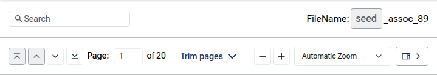
_Figure 11 — The two toolbar rows and their controls._

### Toolbar Reference

| Control | Location | What it does |
|---|---|---|
| **Search** box | Top-left | Type text to find and highlight matches in the document. See [Searching the Document](#74-searching-the-document). |
| **Match counter** (e.g., "3 / 12") | Beside the search box | Shows the active match number and the total number of matches. |
| **Previous match** / **Next match** | Beside the match counter | Move to the previous or next highlighted match. |
| **Document name** | Top-right | Shows the name of the open document as a pill (labeled **FileName:**), or a screen-supplied title. |
| **First page** | Bottom-left | Jumps to the first page. |
| **Previous page** | Bottom-left | Moves up one page. |
| **Next page** | Bottom-left | Moves down one page. |
| **Last page** | Bottom-left | Jumps to the last page. |
| **Page** field ("Page: _n_ of _N_") | Bottom-left | Shows the current page and lets you type a page number to jump to. |
| **Trim pages** | Bottom-center (where available) | Opens the page-trimming controls; a count (e.g., "(2)") shows how many pages are currently trimmed. |
| **Zoom out** / **Zoom in** | Bottom-right | Decrease or increase the zoom in steps. |
| **Zoom level** dropdown | Bottom-right | Choose a preset zoom (see [Zoom Presets](#zoom-presets)). |
| **Thumbnail sidebar** toggle | Bottom-right (where available) | Shows or hides the thumbnail rail. |

### The Document Name

When a document name is available, it appears at the top-right of the toolbar next to the label **FileName:**, shown as a rounded pill. If the screen supplies its own title instead, that title is shown in place of the file name. The first and last pages are also reflected by the **Page** field on the bottom row.

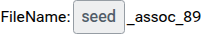
_Figure 12 — The document name shown as a pill at the top-right of the toolbar._

## 7.3 Navigating Pages and Zooming

The document is displayed as a single, continuous column of pages. You can move through it with the toolbar buttons, by typing a page number, or simply by scrolling.

### Page Navigation Buttons

Four buttons on the bottom-left of the toolbar control page movement:

| Button | Action |
|---|---|
| **First page** | Jump to the first page. Disabled when you are already on the first page. |
| **Previous page** | Move up one page. Disabled on the first page. |
| **Next page** | Move down one page. Disabled on the last page. |
| **Last page** | Jump to the last page. Disabled when you are already on the last page. |

As you move or scroll, the **Page** field updates to show the page you are currently viewing.


_Figure 13 — The page-navigation buttons and the **Page** field._

### Jumping to a Specific Page

1. Click the **Page** field (it shows the current page number).
2. Type the page number you want.
3. Press **Enter** (or click elsewhere) to jump to that page.

If you type a number that is out of range, it is adjusted to the nearest valid page; if you type something that is not a number, the field is reset to the current page.

### Scrolling

You can scroll the document area directly with your mouse wheel, trackpad, or touch. The **Page** field and the thumbnail sidebar keep up automatically, always reflecting the page that is most visible on screen.

### Zooming


_Figure 14 — The zoom controls: the **−** / **+** buttons and the zoom-level dropdown._

The viewer offers both step zoom (the **+** / **−** buttons) and preset zoom levels (the dropdown). Zoom ranges from **25%** to **400%**.

- Click **Zoom in** (the **+** button) to enlarge the pages by one step.
- Click **Zoom out** (the **−** button) to shrink the pages by one step.

Each click changes the zoom by 25%. The viewer will not zoom out below 25% or in above 400%.

#### Zoom Presets

Open the zoom dropdown to choose a preset. The available options are:

| Option | What it does |
|---|---|
| **Automatic Zoom** | Fits the page to the available width (the default). |
| **Actual Size** | Shows the page at 100% of its true size. |
| **Page Fit** | Scales the page so the whole page fits within the viewer. |
| **Page Width** | Scales the page so its width fills the viewer. |
| **50%, 75%, 100%, 125%, 150%, 200%, 300%, 400%** | Fixed zoom percentages. |


_Figure 15 — The zoom-level dropdown with its preset options._

Using the **+** / **−** buttons after choosing **Automatic Zoom**, **Page Fit**, or **Page Width** continues from the zoom level currently being displayed.

## 7.4 Searching the Document

If the **Search** box is available, you can find and highlight any text in the document.

### Running a Search

1. Click the **Search** box at the top-left of the toolbar.
2. Type the word or phrase you want to find. The search is not case-sensitive.
3. As you type, every match in the document is highlighted, and the viewer scrolls to the first match automatically.
4. A counter beside the box shows the active match and the total (for example, **"1 / 8"**).

The active match is highlighted more strongly than the others so you can see where you are.


_Figure 16 — A search highlighting matches, with the active match and the match counter (e.g., "1 / 20")._

### Navigating Between Matches

Once a search returns matches, you can step through them:

- Click the **Next match** (down) or **Previous match** (up) button beside the counter.
- Or, with the cursor in the **Search** box, press **Enter** for the next match and **Shift + Enter** for the previous match.

Navigation wraps around — moving past the last match returns to the first, and vice versa. The counter and the current page update as you move, and the thumbnail sidebar (if shown) follows along.

### When There Are No Matches

If your search text is not found anywhere in the document, the counter is replaced by the message **"No matches"**. Clear or change the search text to try again.

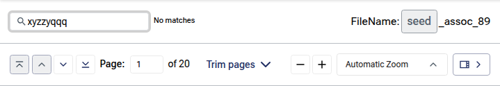
_Figure 17 — The "No matches" message when the search text is not found._

## 7.5 The Thumbnail Sidebar

Where it is enabled, the thumbnail sidebar shows a small preview of every page in a scrollable rail. It makes it easy to scan a long document and jump to a specific page.

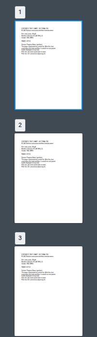
_Figure 18 — The thumbnail sidebar; the active page is highlighted._

### Showing and Hiding the Sidebar

Use the **thumbnail sidebar** toggle button (at the right of the bottom toolbar row) to show or hide the rail. The arrow on the button points toward the side the sidebar will collapse to. Hiding the sidebar gives the document more room; showing it again restores the thumbnails without reloading them.

### Navigating with Thumbnails

- Each thumbnail shows its **page number** as a pill in the corner.
- The thumbnail for the page you are currently viewing is highlighted, and the rail scrolls to keep it in view.
- Click any thumbnail to jump straight to that page in the document area.

Some screens add extra labels to the thumbnails (for example, a **Page trimmed** badge or a colored highlight) to flag pages of interest.

## 7.6 Trimmed Pages

In screens that support page trimming (notably the Association workflow, Part 1), a **Trim pages** button appears in the center of the bottom toolbar row. When pages have been trimmed:

- The button shows a count of trimmed pages (for example, **"(2) Trim pages"**).
- Any trimmed page is flagged in the document area with a **Page trimmed** chip.
- The matching thumbnail in the sidebar carries the same **Page trimmed** label and a tint, so the rail mirrors the document.

Click **Trim pages** to open or close the trimming controls for the screen you are on.


_Figure 19 — The **Trim pages** button and the **Page trimmed** flags in the document and the rail._

> **Note:** Trimming is only available where the screen enables it. If you do not see the **Trim pages** button, the feature is not part of that screen.

## 7.7 Loading and Error States

- **While the document loads,** a spinner is shown in the document area. The toolbar controls become fully usable once the document is ready.
- **If a document cannot be loaded,** the viewer shows an **"Unable to load PDF"** message in place of the pages. If you see this, confirm that the chart is available and try reopening it; if the problem persists, report it (see [Appendix B](#appendix-b-reporting-uat-issues)).

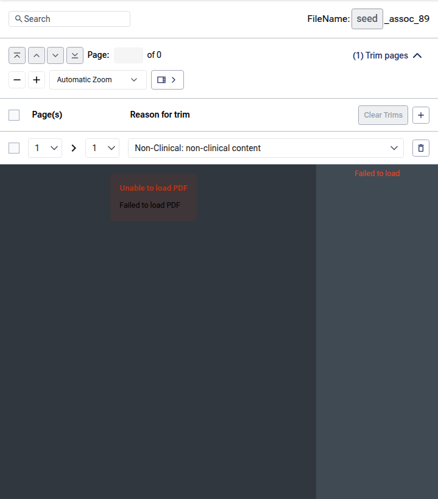
_Figure 20 — The "Unable to load PDF" error state; the thumbnail rail shows "Failed to load"._

## 7.8 Tips and Best Practices

- Use **Automatic Zoom** for everyday reading; switch to **Page Width** or a fixed percentage when you need to read fine print.
- Use the **Search** box plus **Enter** / **Shift + Enter** to move quickly between every mention of a term.
- For long documents, open the **thumbnail sidebar** to scan pages visually, then click to jump.
- The **Page** field is the fastest way to reach a known page number — type it and press **Enter**.
- Hide the **thumbnail sidebar** when you want the largest possible reading area.

## 7.9 UAT — What to Verify

(Skip any item whose control is not present on the screen you are reviewing.)

- [ ] A PDF chart opens in the viewer and the first page renders; the loading spinner clears.
- [ ] The document name (or screen title) appears in the toolbar.
- [ ] **First**, **Previous**, **Next**, and **Last** page buttons move as expected and disable correctly at the document ends.
- [ ] Typing a page number in the **Page** field and pressing **Enter** jumps to that page; out-of-range and invalid entries are handled gracefully.
- [ ] Scrolling updates the **Page** field to the page most in view.
- [ ] **Zoom in** / **Zoom out** change the zoom in steps and stop at the 25%–400% limits.
- [ ] Each zoom preset (**Automatic Zoom**, **Actual Size**, **Page Fit**, **Page Width**, and the fixed percentages) renders the page correctly.
- [ ] Searching highlights all matches, shows the **"_n_ / _N_"** counter, and jumps to the first match.
- [ ] **Next match** / **Previous match** (and **Enter** / **Shift + Enter**) cycle through matches and wrap around.
- [ ] A search with no results shows **"No matches"**.
- [ ] The **thumbnail sidebar** toggle shows and hides the rail; thumbnails render with page numbers.
- [ ] Clicking a thumbnail jumps to that page, and the active thumbnail stays highlighted and in view.
- [ ] Where applicable, the **Trim pages** button, its count, and **Page trimmed** flags display correctly in both the document and the sidebar.
- [ ] A document that fails to load shows the **"Unable to load PDF"** message.


---

## Appendix A: Combined Glossary

Terms from both volumes. Volume references point to the relevant pipeline stage/section or screen Part.

| Term | Meaning |
|---|---|
| **ACA / HEDIS / MRA / RADV** | Audit types a project (and chart) can use. |
| **Association** | Linking a chart to the correct retrieval request (Volume 2, Part 1). |
| **Audit type** | The program a project runs under: MRA, HEDIS, RADV, or ACA (Volume 1, Stage 3). |
| **Auto-tagging** | Automatically applying tags to charts based on rules you define (Part 4). |
| **C-CDA** | Consolidated Clinical Document Architecture — a standard clinical document (XML) format. |
| **Chart / Chart document** | A medical record document. Charts are what the retrieval vendor returns for a request (Volume 1, Stage 12) and what reviewers process in Volume 2. |
| **Claim** | The temporary hold the application places on the chart you're reviewing in the Association workflow. |
| **Client / Project** | The container/scope tying data to a client, audit type, dates, and retrieval methods; most screens are scoped to one Client and Project. |
| **Confidence** | In Semantic Search, how strong a passage match is (0–1). |
| **Deduplication (dedupe)** | Removing repeat requests for the same member at the same location (Volume 1, Stage 6); duplicates are cancelled, never deleted. |
| **Delta** | In an exception, the difference between the two chart documents, expressed as a set of rows (Volume 2, Part 2). |
| **Delta detection** | In the vendor track, classifying each vendor site-map row as added / edited / closed versus the current directory (Volume 1, Section 9). |
| **Delta Table / Delta row** | The panel where you record, row by row, which pages are the same and which are unique (Part 2). |
| **DOB** | Date of Birth. |
| **DOS** | Date of Service. |
| **Document 1 / Document 2** | The two versions of a chart compared in an exception, shown side by side. |
| **Equal (=)** | An exception classification meaning the selected pages are identical in both documents. |
| **Escalation / Escalate** | Flagging an item that can't be handled normally (a chart that can't be associated, or an exception that can't be reconciled), with a stated reason. |
| **Exception** | A pair of chart documents the system could not merge automatically and that needs manual review. |
| **Extraction Job** | A scheduled or on-demand job that delivers charts to downstream destinations (Capture, SFTP) (Part 6). |
| **File specification** | Per-vendor configuration (column mapping, identity keys, computed columns) telling the platform how to read a vendor's site-map file (Volume 1, Section 9). |
| **Group / Grouping** | Bundling all requests at the same physical address so a location is contacted once (Volume 1, Stage 6). |
| **HCC** | Hierarchical Condition Category. |
| **Health Plan Letter (HPL)** | The PDF authorization that permits retrieval; required to activate a project (Volume 1, Stage 5). |
| **ICD** | International Classification of Diseases (ICD-10 diagnosis coding). |
| **Inventory** | The pool of matched requests (`IN_INVENTORY`) ready to be rostered (Volume 1). |
| **Lock** | A temporary hold that assigns an exception to you so others cannot edit it at the same time. |
| **Manifest** | The CSV of chart metadata and indexing bundled into an extraction ZIP (Part 6). |
| **Match** | A single occurrence of your search text within a document (PDF Viewer). |
| **Matching** | Selecting the best retrieval vendor for each request group by comparing it against the vendor site directory (Volume 1, Stage 7). |
| **Member** | The patient the chart/request belongs to. |
| **NPI** | National Provider Identifier. |
| **PDF** | Portable Document Format — the file format the PDF Viewer displays. |
| **Priority** | A tagging rule's rank in the list (1 = highest); higher-priority rules win when a chart qualifies for more than one. |
| **Project** | The container tying your data to a client, audit type, dates, and retrieval methods (Volume 1, Stage 3). |
| **Provider** | The healthcare provider associated with the chart/request. |
| **Request** | One unit of retrieval work — a member at a provider location. The chart the vendor returns is matched back to its request in Association (Part 1). |
| **Request ID** | A request identifier — system-generated (evaire) or client-supplied — used to match charts. |
| **Retrieval vendor** | The organization that receives the roster, collects the medical records, and returns them as charts (e.g. MRO, Sharecare, Verisma). |
| **Roster** | The output file of records delivered to a retrieval vendor (Volume 1, Stages 10–11). |
| **Roster schedule** | The weekday/time cadence on which a vendor's roster is produced. |
| **Roster specification** | The agreed layout/format of the roster file a vendor receives. |
| **Rule tag / Semantic tag** | Labels applied to a chart. Rule tags come from coding rules (HCC/ICD/YOS); semantic tags are model-derived. |
| **Same \| N** | A page badge for an equal exception classification; **N** pairs the matching chunk across the two documents. |
| **Sidebar / Thumbnail rail** | The optional panel of page thumbnails beside the document. |
| **Site / Master site** | A provider location as a retrieval vendor recognizes it, and its canonical version; built by the vendor track and matched against in Stage 7. |
| **Site map** | A vendor's file listing the facility locations they can service (Volume 1, Section 9). |
| **Snippet** | A matching passage of clinical text returned by Semantic Search. |
| **Split** | Breaking one chart document into several charts (Part 1). |
| **Standard envelope** | The common response wrapper (`code`, `messages`, `data`, `errors`, `trace_id`) around every pipeline API response (Volume 1, Section 2). |
| **Start file** | The data file you upload; the input for a project (Volume 1, Stage 1). |
| **Status file** | A vendor's periodic file reporting the current status of each requested record (Volume 1, Stage 12). |
| **Status mapping** | Translating each vendor status value into a platform request status, via per-vendor rules. |
| **Tag** | A label applied to a chart so it can be found and acted on in the Repository. |
| **Tagging rule** | A mapping from a single value (HCC code, ICD code, or service year) to a tag, scoped to a Client and Project. |
| **Thumbnail** | A small preview image of a page, shown in the sidebar rail. |
| **TIN** | Tax Identification Number. |
| **Toolbar** | The bar of controls at the top of the PDF Viewer. |
| **Trim / Trimmed page** | Marking pages to exclude from the final chart; flagged with a **Page trimmed** label. |
| **Unique** | An exception classification meaning the selected pages exist in only one of the two documents. |
| **Vendor track** | The parallel flow in which retrieval vendors supply site-map files that build the site directory (Volume 1, Section 9). |
| **Work queue** | The shared pool of charts awaiting review in the Association workflow. |
| **YOS / Year of Service (Start)** | The service year a chart, request, or rule refers to. |
| **Zoom preset** | A predefined zoom level, such as **Page Width** or **150%**. |
| **ZIP** | A compressed file that bundles charts for download or delivery (export, extraction, or vendor-returned records). |

---

## Appendix B: Reporting UAT Issues

Each Part in Volume 2 ends with a "What to Verify" checklist. If something does not work as described in any of them, please report it with the following details so it can be reproduced quickly:

- The **screen / Part** you were testing and the steps you followed.
- The relevant context for that screen, for example:
  - **Association / Exception:** the chart or member/request you were reviewing (file name, member name, dates), the rows/classifications or the action you attempted.
  - **Filter & Search:** the filters you used (or the page URL, which captures them).
  - **Auto-Tagging:** the Client and Project, the tag type and value, and the priority order of the rules at the time.
  - **PDF Viewer:** the chart or document you opened and the screen it was opened from.
- What you **expected** to happen.
- What **actually** happened.
- A **screenshot**, if possible.

> **Action:** Record issues in your project's UAT issue tracker: _[ Insert your UAT issue-tracking link or contact here ]_

> **Volume 1 (pipeline) issues** are operational rather than UAT screen checks; raise those with your ECLAT Account Manager, quoting the `trace_id` from the relevant API response.

---

## Appendix C: Revision History

| Version | Date | Description | Author |
|---|---|---|---|
| 1.0 | June 2026 | Initial combined release for client UAT. Merged the Association Workflow, Exception Review, Filter & Search, Auto-Tagging, Semantic Search, Extraction Jobs, and PDF Viewer guides into a single flow-ordered document (now Volume 2). | Product Team |
| 1.1 | June 2026 | Incorporated the data-upload-to-roster-delivery pipeline (including the vendor site-map track and vendor status-file flow) as Volume 1, added the end-to-end flow overview and pipeline-to-chart-review handoff, and merged the glossaries. | Product Team |

---

_Proprietary & Confidential_
