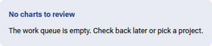
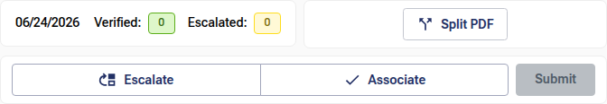
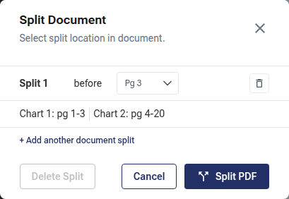
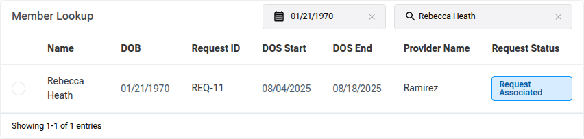
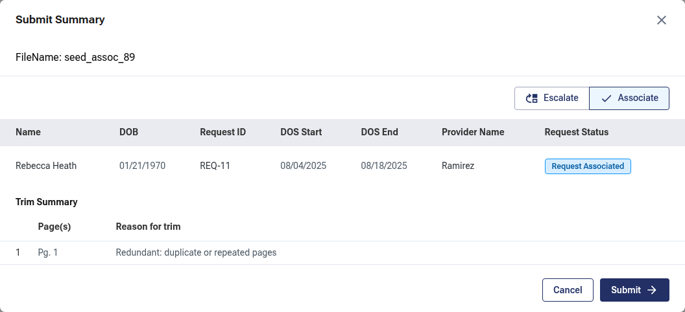

# Association Workflow — User Guide

**Document:** Association Workflow User Guide
**Prepared for:** Client User Acceptance Testing (UAT)
**Version:** 1.0
**Last updated:** June 2026
**Classification:** Proprietary & Confidential

---

## Table of Contents

- [1. Introduction](#1-introduction)
  - [1.1 Purpose of This Guide](#11-purpose-of-this-guide)
  - [1.2 Intended Audience](#12-intended-audience)
  - [1.3 How to Use This Guide](#13-how-to-use-this-guide)
- [2. Getting Started](#2-getting-started)
  - [2.1 What the Association Workflow Does](#21-what-the-association-workflow-does)
  - [2.2 Before You Begin](#22-before-you-begin)
  - [2.3 Opening the Association Page](#23-opening-the-association-page)
  - [2.4 Understanding the Page Layout](#24-understanding-the-page-layout)
- [3. The Work Queue and Your Session](#3-the-work-queue-and-your-session)
  - [3.1 How Charts Are Assigned](#31-how-charts-are-assigned)
  - [3.2 Keeping Your Claim Active](#32-keeping-your-claim-active)
  - [3.3 Moving to the Next Chart](#33-moving-to-the-next-chart)
  - [3.4 Empty Queue and Error States](#34-empty-queue-and-error-states)
- [4. The Action Header](#4-the-action-header)
- [5. Reviewing the Document](#5-reviewing-the-document)
  - [5.1 PDF and C-CDA Documents](#51-pdf-and-c-cda-documents)
  - [5.2 Trimming Pages](#52-trimming-pages)
  - [5.3 Splitting the Document](#53-splitting-the-document)
- [6. Choosing an Action: Associate or Escalate](#6-choosing-an-action-associate-or-escalate)
  - [6.1 Potential Matches](#61-potential-matches)
  - [6.2 Member Lookup](#62-member-lookup)
  - [6.3 Associating a Chart to a Request](#63-associating-a-chart-to-a-request)
  - [6.4 Escalating a Chart](#64-escalating-a-chart)
  - [6.5 Acting on a Split Document](#65-acting-on-a-split-document)
- [7. Submitting](#7-submitting)
  - [7.1 The Submit Summary](#71-the-submit-summary)
  - [7.2 Warnings That Block Submission](#72-warnings-that-block-submission)
  - [7.3 After You Submit](#73-after-you-submit)
- [8. Reference Tables](#8-reference-tables)
  - [8.1 Request Statuses](#81-request-statuses)
  - [8.2 Escalation Reasons](#82-escalation-reasons)
  - [8.3 Trim Reasons](#83-trim-reasons)
- [9. Tips and Best Practices](#9-tips-and-best-practices)
- [10. User Acceptance Testing (UAT)](#10-user-acceptance-testing-uat)
  - [10.1 What to Verify](#101-what-to-verify)
  - [10.2 Reporting Issues](#102-reporting-issues)
- [11. Glossary](#11-glossary)
- [Appendix A. Revision History](#appendix-a-revision-history)

---

## 1. Introduction

The Association workflow is where reviewers match incoming chart documents to the correct retrieval **request**. The application hands you one chart at a time from a shared work queue. For each chart you review the document, optionally refine it (remove unneeded pages or split a combined file into separate charts), and then either **Associate** it to the right member's request or **Escalate** it for follow-up. This guide explains every part of the page so that you can complete User Acceptance Testing (UAT) with confidence.

### 1.1 Purpose of This Guide

This guide is a step-by-step reference for the Association page. It describes what each control does, how to perform common tasks, and what you should expect to see, so you can verify that the application behaves correctly during UAT.

### 1.2 Intended Audience

This guide is written for client reviewers and testers who will validate the Association workflow during UAT. It assumes that you:

- Have valid sign-in credentials for the application.
- Have permission to review and associate charts.
- Have a Client and Project selected (the work queue is scoped to that selection).

### 1.3 How to Use This Guide

- **Sections follow the real task flow** — pick up a chart, review it, refine it, choose an action, and submit.
- **On-screen labels, buttons, and field names** appear in **bold**, exactly as they read in the application.
- **Reference tables** in Section 8 list the statuses and reasons you will encounter.
- **A UAT checklist** is provided in Section 10 to help you record your test results.
- **Figures** are referenced throughout and live in the `images/` folder beside this document. They were captured from the Association workflow against a synthetic test chart (no real PHI).
- The document on the left is shown in the built-in **PDF Viewer** (or the **C-CDA viewer** for XML charts). For full details on the document viewer's own controls — search, zoom, page navigation, thumbnails — see the separate **PDF Viewer User Guide**.

---

## 2. Getting Started

### 2.1 What the Association Workflow Does

Charts arrive from vendors and must be tied to the request they fulfil. The Association workflow lets you, for each chart:

1. **Review** the document.
2. **Refine** it if needed — **Trim** out pages that aren't clinical content, or **Split** a file that actually contains several charts.
3. **Decide** what happens to it — **Associate** it to a member's request, or **Escalate** it when it can't be associated.
4. **Submit** your decision, which commits any trims/splits and moves the chart out of your queue.

### 2.2 Before You Begin

Make sure the following are in place before you start testing:

- You are signed in to the application.
- A **Client** and **Project** are selected (shown at the top of the application).
- There is at least one chart in the work queue for that Project.

### 2.3 Opening the Association Page

1. Sign in to the application.
2. Click **Association** in the main navigation.
3. The application automatically picks up the next chart from the queue and opens it for review. A brief loading indicator appears while the chart is fetched.

_Figure 1 — The Association page: document viewer (left) and review panel (right)._

### 2.4 Understanding the Page Layout

The page is divided into two columns:

| Area | Location | What it is for |
|---|---|---|
| **Document viewer** | Left | Displays the chart document (PDF or C-CDA). For PDFs, this is the built-in PDF Viewer, with a **Trim pages** panel available from its toolbar. |
| **Review panel** | Right | Contains the **action header** (progress, split control, Associate/Escalate, Submit), the **Potential Matches** card, and the **Member Lookup** card. |

---

## 3. The Work Queue and Your Session

### 3.1 How Charts Are Assigned

The Association workflow draws from a shared **work queue**. When you open the page, the application **claims** the next available chart and assigns it to you so that no two reviewers work the same chart at the same time. You always review one chart at a time.

### 3.2 Keeping Your Claim Active

While you have a chart open, the application quietly renews your claim in the background (about once a minute, and again whenever you return to the tab). You don't need to do anything to keep it.

If your claim lapses — for example, if the chart sits open untouched for too long, or it was reassigned — the application treats the session as expired, lets the message from the system surface, and automatically brings up a fresh chart for you. Any decision you hadn't yet submitted for the expired chart will need to be redone on its replacement.

### 3.3 Moving to the Next Chart

After you **Submit** a chart, it leaves your queue and the next chart loads automatically. You do not navigate away or refresh the page.

### 3.4 Empty Queue and Error States

| Situation | What you see |
|---|---|
| **Queue is empty** | A message: **"No charts to review — The work queue is empty. Check back later or pick a project."** |
| **A chart can't be loaded** | A message: **"Unable to load chart document — We couldn't load this chart document. Please refresh or pick another from the queue."** |
| **Loading** | A spinner while the chart is being fetched. |

_Figure 2 — The empty-queue state when there is nothing left to review._

---

## 4. The Action Header

The top of the review panel is the **action header**. It stays visible as you work and contains three groups:

| Element | What it shows / does |
|---|---|
| **Progress strip** | Today's date, plus **Verified:** and **Escalated:** counts — how many charts you have associated and escalated today. |
| **Split control** | When the chart is whole, a **Split PDF** button (disabled for C-CDA charts). When the chart has been split, a chart selector — **Edit Split** plus a **Chart _n_ of _N_** dropdown — for choosing which split to act on. |
| **Associate / Escalate + Submit** | A two-way **Escalate / Associate** switch, an optional **Reason for escalation** field, and the **Submit** button. |

_Figure 3 — The action header with the progress strip, split control, and Associate/Escalate/Submit._

- **Escalate** and **Associate** work as a toggle: clicking the selected one again clears it.
- Choosing **Escalate** reveals a **Reason for escalation** dropdown (required to submit).
- **Submit** is enabled only when your decision is complete — an **Associate** decision needs a selected member; an **Escalate** decision needs a reason. For a split document, every chart must have a decision ready before Submit is enabled.

---

## 5. Reviewing the Document

### 5.1 PDF and C-CDA Documents

- **PDF charts** open in the built-in **PDF Viewer** (search, zoom, page navigation, and thumbnails — see the PDF Viewer User Guide).
- **C-CDA (XML) charts** open in the **C-CDA viewer**.
- **Trimming** and **splitting** are page operations, so they are available for **PDF charts only**, never for C-CDA.

### 5.2 Trimming Pages

Trimming flags pages that should not be part of the final chart — for example cover sheets, fax logs, or blank pages. Open the **Trim pages** panel from the PDF Viewer toolbar.

1. Click **Trim pages** in the document toolbar. A trimming panel opens beneath the toolbar with one empty row.
2. For each row, choose the **Start** and **End** pages of the range to trim, then pick a **Reason for trim** (**Non-Clinical**, **Redundant**, or **Empty**).
3. As soon as a row has a page range and a reason, the trim is saved and those pages are flagged with a **Page trimmed** chip in the document (and tinted in the thumbnail rail).
4. Use **Add trim** (the **+** icon) to add another range. Selecting a reason automatically ticks that row's checkbox.
5. To remove trims, tick one or more rows and click **Clear Trims**, or use the trash icon on a single row.

_Figure 4 — The Trim pages panel; completed ranges flag their pages as "Page trimmed"._

> **Note:** Trims are remembered for the chart — if you reopen it, your staged trims are still there. Trimming the *entire* chart (or a whole split) is not allowed at submission time; see [Warnings That Block Submission](#72-warnings-that-block-submission).

### 5.3 Splitting the Document

Some vendor files actually contain several charts back-to-back. **Splitting** breaks one PDF into multiple charts, each of which you then associate or escalate independently.

1. In the action header, click **Split PDF**. The **Split Document** dialog opens.
2. For each split, choose the page it should break **before** — each value is the last page of one chart, so the next chart starts on the following page. The **preview row** shows the resulting charts (for example, _Chart 1: pg 1-3, Chart 2: pg 4-8_).
3. Click **+ Add another document split** to add more break points; use a row's delete icon to remove one.
4. Click **Split PDF** to confirm. To undo all splits and return to a single chart, click **Delete Split**. **Cancel** closes the dialog without changes.

_Figure 5 — The Split Document dialog: choose break points and preview the resulting charts._

Rules and feedback:

- Each split must come **after** the previous one. If not, you'll see **"Page split must be after Chart _n_."** and confirmation is blocked.
- The last page of the document cannot be a break point (that would leave an empty chart).
- Confirming without changing anything shows **"No changes to apply — The split is unchanged."**
- After a successful split, a green banner confirms **"Chart successfully split. Select chart from dropdown above to take action on it."**, and a blue banner reminds you which chart your actions apply to: **"Actions will apply to Chart _n_ of _N_."**

Once split, use the **Chart _n_ of _N_** dropdown in the header to move between the resulting charts; **Edit Split** reopens the dialog.

_Figure 6 — After splitting: the chart selector and the success/progress banners._

---

## 6. Choosing an Action: Associate or Escalate

For each chart (or each split), you either **Associate** it to a member's request or **Escalate** it. You pick the request to associate from one of two places: the **Potential Matches** card (system suggestions) or the **Member Lookup** card (your own search).

### 6.1 Potential Matches

The **Potential Matches** card lists the requests the system already suggests for this chart, grouped by how they were matched:

- **Request ID Match** — matched on a request identifier.
- **Filename Match** — matched on the document's file name.

| Column | Description |
|---|---|
| **Name** | Member/patient name. |
| **DOB** | Date of birth. |
| **DOS Start** | Date of service — start. |
| **DOS End** | Date of service — end. |
| **Provider Name** | Provider on the request. |

Click a row to select it for association (click again to deselect). If there are no suggestions, the card shows **"Request ID did not match any Request ID in the database. Utilize the member lookup table."**

_Figure 7 — The Potential Matches card, grouped by Request ID Match / Filename Match._

### 6.2 Member Lookup

When no suggestion fits, search for the right request in the **Member Lookup** card.

- Search by **Member Name** (type to filter; the field is clearable) and/or **DOB** (using the **MM/DD/YYYY** date picker). Future dates are not allowed, and an invalid date shows an **"Invalid date"** tooltip.
- On load, the filters are pre-filled from the top potential match, so the most likely request appears first.

| Column | Description |
|---|---|
| **(Select)** | A radio control to choose this request. |
| **Name** | Member/patient name. |
| **DOB** | Date of birth. |
| **Request ID** | The request's display ID, or "—". |
| **DOS Start / DOS End** | Date-of-service range. |
| **Provider Name** | Provider on the request. |
| **Request Status** | The request's status, shown as a colored pill (see [Request Statuses](#81-request-statuses)). |

The footer shows **"Showing _X-Y_ of _N_ entries"** and, when there is more than one page, pagination controls (five results per page). If nothing matches, you'll see **"No members match the current filters."**

_Figure 8 — The Member Lookup card: filter by name and DOB, then select a request._

> **Note:** The lookup runs only when you've entered a name or a date — it won't list every member with no filter.

### 6.3 Associating a Chart to a Request

1. Select a request from **Potential Matches** or **Member Lookup**. The **Associate** action is selected automatically and the chosen request is highlighted.
2. Confirm your selection is correct.
3. Click **Submit** (see [Submitting](#7-submitting)).

Selecting a different request replaces your choice; clicking the selected one again clears it.

### 6.4 Escalating a Chart

Escalate a chart when it cannot be associated — for example, the request can't be found or the document isn't usable.

1. Click **Escalate** in the action header.
2. Choose a **Reason for escalation** (see [Escalation Reasons](#82-escalation-reasons)).
3. Click **Submit**.

Choosing **Escalate** clears any selected member, and a reason is required before you can submit.

### 6.5 Acting on a Split Document

When a chart has been split, each resulting chart carries its **own** Associate/Escalate decision:

- Use the **Chart _n_ of _N_** dropdown to switch between charts; the banner reminds you which chart your current action applies to.
- Make a decision for each chart (associate it to a request, or escalate it with a reason).
- **Submit** becomes available only once **every** chart has a decision ready. You'll confirm them all together in the Submit Summary.

---

## 7. Submitting

### 7.1 The Submit Summary

Clicking **Submit** does one of two things:

- If you **trimmed or split** the chart, a **Submit Summary** dialog opens so you can review everything before committing.
- If you made a **simple decision** with no trims or splits, the chart is submitted directly.

The Submit Summary shows:

- The **FileName** of the chart.
- One section per chart/split, each with its **Associate / Escalate** choice (you can still switch here, and pick an escalation reason).
- For an associate decision, the **selected member** row (Name, DOB, Request ID, DOS, Provider, Request Status, and — for splits — the page range).
- A **Trim Summary** listing the trimmed **Page(s)** and the **Reason for trim**.

_Figure 9 — The Submit Summary: review each chart's action and trims before confirming._

Click **Submit** to confirm, or **Cancel** to go back and make changes.

### 7.2 Warnings That Block Submission

The Submit Summary won't let you confirm until every issue is resolved. You may see:

| Warning | Meaning |
|---|---|
| **"A split has all its pages trimmed — adjust the trims or split."** | A chart/split would have no pages left after trimming. Remove some trims or change the split. |
| **"Select a member to associate, or escalate the split."** | A chart set to **Associate** has no member selected. |
| **"Select a reason for escalation to continue."** | A chart set to **Escalate** has no reason chosen. |
| **"All pages trimmed"** (on a section) | Flags the specific split whose pages are all trimmed. |

### 7.3 After You Submit

When the submission succeeds, your trims and splits are committed, the chart leaves your queue, and the next chart loads automatically. Your **Verified** / **Escalated** counts in the progress strip update to reflect the action.

---

## 8. Reference Tables

### 8.1 Request Statuses

The **Request Status** pill in Member Lookup (and the Submit Summary) can show:

| Status | Meaning |
|---|---|
| **Available** | The request is open and available for association. |
| **Received** | The request has been received. |
| **Pending Association** | The request is awaiting association. |
| **Request Associated** | A chart has already been associated to this request. |
| **Failed Association** | A previous association attempt failed. |

### 8.2 Escalation Reasons

When you escalate a chart, choose one of:

| Reason | Use when… |
|---|---|
| **Request Not Found** | No matching request exists for the chart. |
| **Multiple Requests Identified** | More than one request could match and it can't be resolved here. |
| **Non-Medical Context** | The document isn't a medical chart. |
| **Not Readable** | The document can't be read or is corrupted. |

### 8.3 Trim Reasons

When you trim pages, choose one of:

| Reason | Use for… |
|---|---|
| **Non-Clinical** | Cover sheets, separators, fax logs, billing/insurance, disclaimers. |
| **Redundant** | Duplicate or repeated pages. |
| **Empty** | Blank, noise, or corrupted pages. |

---

## 9. Tips and Best Practices

- Start from **Potential Matches** — the system's suggestion is often correct. Fall back to **Member Lookup** when it isn't.
- In **Member Lookup**, combine **Member Name** and **DOB** to narrow a large result set quickly.
- **Trim** before you submit so the final chart contains only clinical pages; trimmed pages are clearly flagged in the document.
- Only **Split** when a file genuinely contains multiple charts — and remember each split needs its own decision.
- Review the **Submit Summary** carefully when you've trimmed or split; it's your last check before the chart is committed.
- Don't leave a chart open and idle for long — your claim can expire and the chart may be reassigned.

---

## 10. User Acceptance Testing (UAT)

Use this section to plan and record your testing of the Association workflow.

### 10.1 What to Verify

Tick each item as you test.

- [ ] Opening **Association** picks up a chart and shows the document and review panel.
- [ ] The **Verified** and **Escalated** counts and today's date display in the progress strip.
- [ ] The document renders correctly for both **PDF** and **C-CDA** charts.
- [ ] **Trim pages** flags the chosen pages, saves them, and shows the **Page trimmed** chip; **Clear Trims** and per-row delete work.
- [ ] **Split PDF** previews the resulting charts, enforces ordering ("Page split must be after Chart _n_"), and creates the charts; **Delete Split** restores a single chart.
- [ ] **Potential Matches** lists suggestions grouped by source, and selecting one sets up an association.
- [ ] **Member Lookup** filters by name and DOB, paginates, shows statuses, and rejects future/invalid dates.
- [ ] **Associate** requires a selected member; **Escalate** requires a reason; **Submit** enables only when the decision is complete.
- [ ] For a split chart, each chart needs its own decision before **Submit** is available.
- [ ] The **Submit Summary** shows the decisions and trim summary, blocks on the documented warnings, and commits on confirm.
- [ ] After submit, the next chart loads automatically and the counts update.
- [ ] The **empty-queue** and **load-error** messages appear in the right situations.

### 10.2 Reporting Issues

If something does not work as described, please report it with the following details so it can be reproduced quickly:

- The steps you followed.
- The chart you were reviewing (file name) and the action you attempted.
- What you expected to happen.
- What actually happened.
- A screenshot, if possible.

> **Action:** Record issues in your project's UAT issue tracker: _[ Insert your UAT issue-tracking link or contact here ]_

---

## 11. Glossary

| Term | Meaning |
|---|---|
| **Chart / Chart document** | A medical record document delivered by a vendor, awaiting association. |
| **Request** | A retrieval request the chart should be matched to. |
| **Association** | Linking a chart to the correct request. |
| **Escalation** | Flagging a chart that can't be associated, with a reason. |
| **Work queue** | The shared pool of charts awaiting review. |
| **Claim** | The temporary hold the application places on the chart you're reviewing. |
| **Trim** | Marking pages to exclude from the final chart. |
| **Split** | Breaking one document into several charts. |
| **DOB** | Date of Birth. |
| **DOS** | Date of Service. |
| **C-CDA** | Consolidated Clinical Document Architecture — a clinical document (XML) format. |
| **NPI / Request ID** | Provider and request identifiers used to match charts. |

---

## Appendix A. Revision History

| Version | Date | Description | Author |
|---|---|---|---|
| 1.0 | June 2026 | Initial release for client UAT. | Product Team |

---

_Proprietary & Confidential_
