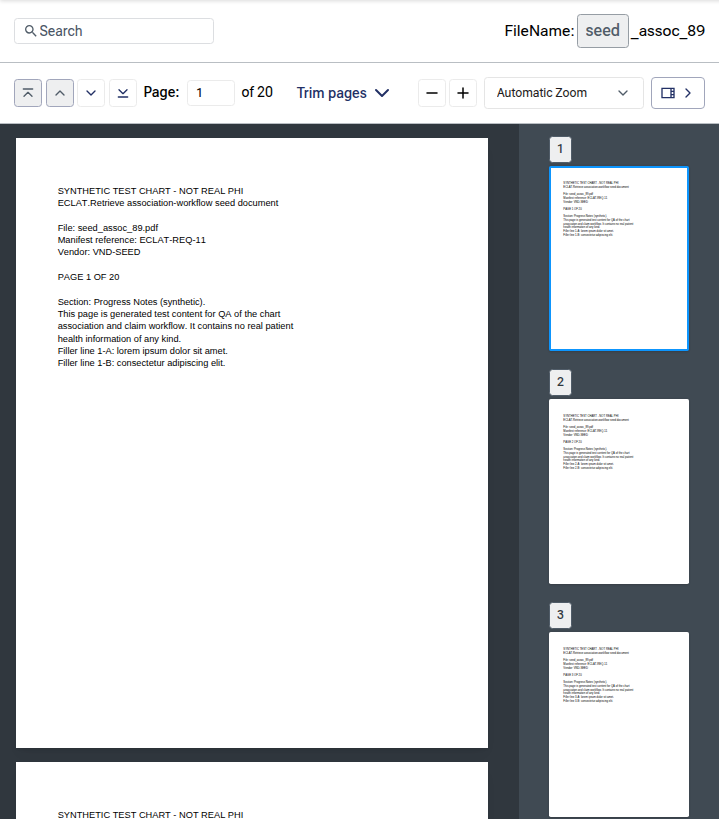
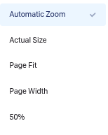
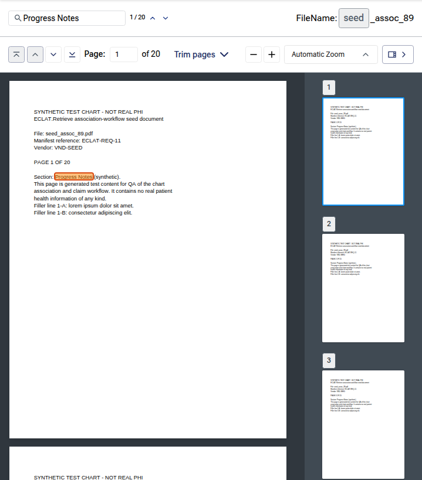
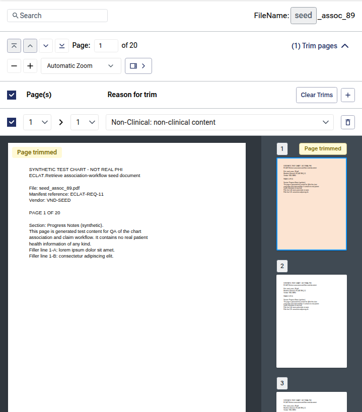

# PDF Viewer — User Guide

**Document:** PDF Viewer User Guide
**Prepared for:** Client User Acceptance Testing (UAT)
**Version:** 1.0
**Last updated:** June 2026
**Classification:** Proprietary & Confidential

---

## Table of Contents

- [1. Introduction](#1-introduction)
  - [1.1 Purpose of This Guide](#11-purpose-of-this-guide)
  - [1.2 Intended Audience](#12-intended-audience)
  - [1.3 How to Use This Guide](#13-how-to-use-this-guide)
- [2. Getting Started](#2-getting-started)
  - [2.1 Where the PDF Viewer Appears](#21-where-the-pdf-viewer-appears)
  - [2.2 Opening a Document](#22-opening-a-document)
  - [2.3 Understanding the Viewer Layout](#23-understanding-the-viewer-layout)
- [3. The Toolbar](#3-the-toolbar)
  - [3.1 Toolbar Reference](#31-toolbar-reference)
  - [3.2 The Document Name](#32-the-document-name)
- [4. Navigating Pages](#4-navigating-pages)
  - [4.1 Page Navigation Buttons](#41-page-navigation-buttons)
  - [4.2 Jumping to a Specific Page](#42-jumping-to-a-specific-page)
  - [4.3 Scrolling](#43-scrolling)
- [5. Zooming](#5-zooming)
  - [5.1 Zoom In and Zoom Out](#51-zoom-in-and-zoom-out)
  - [5.2 Zoom Presets](#52-zoom-presets)
- [6. Searching the Document](#6-searching-the-document)
  - [6.1 Running a Search](#61-running-a-search)
  - [6.2 Navigating Between Matches](#62-navigating-between-matches)
  - [6.3 When There Are No Matches](#63-when-there-are-no-matches)
- [7. The Thumbnail Sidebar](#7-the-thumbnail-sidebar)
  - [7.1 Showing and Hiding the Sidebar](#71-showing-and-hiding-the-sidebar)
  - [7.2 Navigating with Thumbnails](#72-navigating-with-thumbnails)
- [8. Trimmed Pages](#8-trimmed-pages)
- [9. Loading and Error States](#9-loading-and-error-states)
- [10. Tips and Best Practices](#10-tips-and-best-practices)
- [11. User Acceptance Testing (UAT)](#11-user-acceptance-testing-uat)
  - [11.1 What to Verify](#111-what-to-verify)
  - [11.2 Reporting Issues](#112-reporting-issues)
- [12. Glossary](#12-glossary)
- [Appendix A. Revision History](#appendix-a-revision-history)

---

## 1. Introduction

The PDF Viewer is the built-in document reader used throughout the application to display PDF chart documents. Whenever you preview or open a chart that is stored as a PDF, it opens in this viewer. The viewer lets you read the document page by page, jump to any page, zoom in and out, search the text, and — where available — navigate using a thumbnail rail. This guide explains every control so that you can complete User Acceptance Testing (UAT) with confidence.

### 1.1 Purpose of This Guide

This guide is a step-by-step reference for the PDF Viewer. It describes what each control does, how to perform common tasks, and what you should expect to see, so you can verify that the viewer behaves correctly during UAT.

### 1.2 Intended Audience

This guide is written for client reviewers and testers who will validate the PDF Viewer during UAT. It assumes that you:

- Have valid sign-in credentials for the application.
- Have permission to access the area where the viewer appears (for example, the Chart Repository).
- Can open at least one PDF chart document to test against.

### 1.3 How to Use This Guide

- **Sections follow real tasks** — opening a document, turning pages, zooming, searching, and using thumbnails.
- **On-screen labels, buttons, and field names** appear in **bold**, exactly as they read in the application.
- **Reference tables** list every toolbar control so nothing is left to guesswork.
- **A UAT checklist** is provided in Section 11 to help you record your test results.
- **Figures** are referenced throughout and are stored in the `images/` folder beside this document. They were captured from the application's association workflow, which embeds the PDF Viewer.

> **Note:** The PDF Viewer is a shared component that appears in several places. Depending on where it is used, some controls (such as the **search** bar, the **thumbnail** sidebar, or the **Trim pages** button) may be hidden. This guide describes the full set of controls; test only those that are present in the screen you are reviewing.

---

## 2. Getting Started

### 2.1 Where the PDF Viewer Appears

The PDF Viewer is used wherever a PDF chart document is displayed, including:

- The **chart preview** opened from the Chart Repository results.
- The **chart document viewer** used while reviewing a chart.
- **Exception review** screens that show the source document.
- **Semantic search** chart previews.

In every case the controls behave the same way; only the surrounding screen differs.

### 2.2 Opening a Document

1. Locate the chart you want to review (for example, click **View** in a results table).
2. The PDF Viewer opens and begins loading the document. A spinner appears while the document is being prepared.
3. When loading finishes, the first page is shown and the toolbar becomes active.

If the viewer was opened to a specific page (for example, deep-linked to a result), it scrolls to that page automatically once the document has loaded.

### 2.3 Understanding the Viewer Layout

The viewer is made up of the following areas:

| Area | Location | What it is for |
|---|---|---|
| **Toolbar** | Top | Search the document, navigate pages, change the zoom, and toggle the thumbnail sidebar. |
| **Document area** | Center | Displays the PDF pages in a single, continuously scrollable column. |
| **Thumbnail sidebar** | Left or right (when available) | Shows a small preview of every page; click a thumbnail to jump to that page. |

The sidebar may sit on the **left** or the **right**, and it may run the full height of the viewer or sit just below the toolbar, depending on the screen.

_Figure 1 — The PDF Viewer layout: toolbar (top), document area (center), and thumbnail sidebar (side)._

---

## 3. The Toolbar

The toolbar sits at the top of the viewer and is organized into two rows:

- **Top row** — the **Search** box (with match navigation) and the **document name**.
- **Bottom row** — page-navigation buttons, the **Page** field, the **Trim pages** button (where available), the zoom controls, and the **thumbnail sidebar** toggle.

> **Note:** On some screens the top row (search and file name) is hidden, leaving only the page and zoom controls.

_Figure 2 — The two toolbar rows and their controls._

### 3.1 Toolbar Reference

| Control | Location | What it does |
|---|---|---|
| **Search** box | Top-left | Type text to find and highlight matches in the document. See [Searching the Document](#6-searching-the-document). |
| **Match counter** (e.g., "3 / 12") | Beside the search box | Shows the active match number and the total number of matches. |
| **Previous match** / **Next match** | Beside the match counter | Move to the previous or next highlighted match. |
| **Document name** | Top-right | Shows the name of the open document as a pill (labeled **FileName:**), or a screen-supplied title. |
| **First page** | Bottom-left | Jumps to the first page. |
| **Previous page** | Bottom-left | Moves up one page. |
| **Next page** | Bottom-left | Moves down one page. |
| **Last page** | Bottom-left | Jumps to the last page. |
| **Page** field ("Page: _n_ of _N_") | Bottom-left | Shows the current page and lets you type a page number to jump to. |
| **Trim pages** | Bottom-center (where available) | Opens the page-trimming controls; a count (e.g., "(2)") shows how many pages are currently trimmed. |
| **Zoom out** / **Zoom in** | Bottom-right | Decrease or increase the zoom in steps. |
| **Zoom level** dropdown | Bottom-right | Choose a preset zoom (see [Zoom Presets](#52-zoom-presets)). |
| **Thumbnail sidebar** toggle | Bottom-right (where available) | Shows or hides the thumbnail rail. |

### 3.2 The Document Name

When a document name is available, it appears at the top-right of the toolbar next to the label **FileName:**, shown as a rounded pill. If the screen supplies its own title instead, that title is shown in place of the file name. The first and last pages are also reflected by the **Page** field on the bottom row.

_Figure 3 — The document name shown as a pill at the top-right of the toolbar._

---

## 4. Navigating Pages

The document is displayed as a single, continuous column of pages. You can move through it with the toolbar buttons, by typing a page number, or simply by scrolling.

### 4.1 Page Navigation Buttons

Four buttons on the bottom-left of the toolbar control page movement:

| Button | Action |
|---|---|
| **First page** | Jump to the first page. Disabled when you are already on the first page. |
| **Previous page** | Move up one page. Disabled on the first page. |
| **Next page** | Move down one page. Disabled on the last page. |
| **Last page** | Jump to the last page. Disabled when you are already on the last page. |

As you move or scroll, the **Page** field updates to show the page you are currently viewing.

_Figure 4 — The page-navigation buttons and the **Page** field._

### 4.2 Jumping to a Specific Page

1. Click the **Page** field (it shows the current page number).
2. Type the page number you want.
3. Press **Enter** (or click elsewhere) to jump to that page.

If you type a number that is out of range, it is adjusted to the nearest valid page; if you type something that is not a number, the field is reset to the current page.

### 4.3 Scrolling

You can scroll the document area directly with your mouse wheel, trackpad, or touch. The **Page** field and the thumbnail sidebar keep up automatically, always reflecting the page that is most visible on screen.

---

## 5. Zooming

_Figure 5 — The zoom controls: the **−** / **+** buttons and the zoom-level dropdown._

The viewer offers both step zoom (the **+** / **−** buttons) and preset zoom levels (the dropdown). Zoom ranges from **25%** to **400%**.

### 5.1 Zoom In and Zoom Out

- Click **Zoom in** (the **+** button) to enlarge the pages by one step.
- Click **Zoom out** (the **−** button) to shrink the pages by one step.

Each click changes the zoom by 25%. The viewer will not zoom out below 25% or in above 400%.

### 5.2 Zoom Presets

Open the zoom dropdown to choose a preset. The available options are:

| Option | What it does |
|---|---|
| **Automatic Zoom** | Fits the page to the available width (the default). |
| **Actual Size** | Shows the page at 100% of its true size. |
| **Page Fit** | Scales the page so the whole page fits within the viewer. |
| **Page Width** | Scales the page so its width fills the viewer. |
| **50%, 75%, 100%, 125%, 150%, 200%, 300%, 400%** | Fixed zoom percentages. |

_Figure 6 — The zoom-level dropdown with its preset options._

Using the **+** / **−** buttons after choosing **Automatic Zoom**, **Page Fit**, or **Page Width** continues from the zoom level currently being displayed.

---

## 6. Searching the Document

If the **Search** box is available, you can find and highlight any text in the document.

### 6.1 Running a Search

1. Click the **Search** box at the top-left of the toolbar.
2. Type the word or phrase you want to find. The search is not case-sensitive.
3. As you type, every match in the document is highlighted, and the viewer scrolls to the first match automatically.
4. A counter beside the box shows the active match and the total (for example, **"1 / 8"**).

The active match is highlighted more strongly than the others so you can see where you are.

_Figure 7 — A search highlighting matches, with the active match and the match counter (e.g., "1 / 20")._

### 6.2 Navigating Between Matches

Once a search returns matches, you can step through them:

- Click the **Next match** (down) or **Previous match** (up) button beside the counter.
- Or, with the cursor in the **Search** box, press **Enter** for the next match and **Shift + Enter** for the previous match.

Navigation wraps around — moving past the last match returns to the first, and vice versa. The counter and the current page update as you move, and the thumbnail sidebar (if shown) follows along.

### 6.3 When There Are No Matches

If your search text is not found anywhere in the document, the counter is replaced by the message **"No matches"**. Clear or change the search text to try again.

_Figure 8 — The "No matches" message when the search text is not found._

---

## 7. The Thumbnail Sidebar

Where it is enabled, the thumbnail sidebar shows a small preview of every page in a scrollable rail. It makes it easy to scan a long document and jump to a specific page.

_Figure 9 — The thumbnail sidebar; the active page is highlighted._

### 7.1 Showing and Hiding the Sidebar

Use the **thumbnail sidebar** toggle button (at the right of the bottom toolbar row) to show or hide the rail. The arrow on the button points toward the side the sidebar will collapse to. Hiding the sidebar gives the document more room; showing it again restores the thumbnails without reloading them.

### 7.2 Navigating with Thumbnails

- Each thumbnail shows its **page number** as a pill in the corner.
- The thumbnail for the page you are currently viewing is highlighted, and the rail scrolls to keep it in view.
- Click any thumbnail to jump straight to that page in the document area.

Some screens add extra labels to the thumbnails (for example, a **Page trimmed** badge or a colored highlight) to flag pages of interest.

---

## 8. Trimmed Pages

In screens that support page trimming, a **Trim pages** button appears in the center of the bottom toolbar row. When pages have been trimmed:

- The button shows a count of trimmed pages (for example, **"(2) Trim pages"**).
- Any trimmed page is flagged in the document area with a **Page trimmed** chip.
- The matching thumbnail in the sidebar carries the same **Page trimmed** label and a tint, so the rail mirrors the document.

Click **Trim pages** to open or close the trimming controls for the screen you are on.

_Figure 10 — The **Trim pages** button and the **Page trimmed** flags in the document and the rail._

> **Note:** Trimming is only available where the screen enables it. If you do not see the **Trim pages** button, the feature is not part of that screen.

---

## 9. Loading and Error States

- **While the document loads,** a spinner is shown in the document area. The toolbar controls become fully usable once the document is ready.
- **If a document cannot be loaded,** the viewer shows an **"Unable to load PDF"** message in place of the pages. If you see this, confirm that the chart is available and try reopening it; if the problem persists, report it (see [Reporting Issues](#112-reporting-issues)).

_Figure 11 — The "Unable to load PDF" error state; the thumbnail rail shows "Failed to load"._

---

## 10. Tips and Best Practices

- Use **Automatic Zoom** for everyday reading; switch to **Page Width** or a fixed percentage when you need to read fine print.
- Use the **Search** box plus **Enter** / **Shift + Enter** to move quickly between every mention of a term.
- For long documents, open the **thumbnail sidebar** to scan pages visually, then click to jump.
- The **Page** field is the fastest way to reach a known page number — type it and press **Enter**.
- Hide the **thumbnail sidebar** when you want the largest possible reading area.

---

## 11. User Acceptance Testing (UAT)

Use this section to plan and record your testing of the PDF Viewer.

### 11.1 What to Verify

The checklist below covers the key behaviors to confirm. Tick each item as you test. (Skip any item whose control is not present on the screen you are reviewing.)

- [ ] A PDF chart opens in the viewer and the first page renders; the loading spinner clears.
- [ ] The document name (or screen title) appears in the toolbar.
- [ ] **First**, **Previous**, **Next**, and **Last** page buttons move as expected and disable correctly at the document ends.
- [ ] Typing a page number in the **Page** field and pressing **Enter** jumps to that page; out-of-range and invalid entries are handled gracefully.
- [ ] Scrolling updates the **Page** field to the page most in view.
- [ ] **Zoom in** / **Zoom out** change the zoom in steps and stop at the 25%–400% limits.
- [ ] Each zoom preset (**Automatic Zoom**, **Actual Size**, **Page Fit**, **Page Width**, and the fixed percentages) renders the page correctly.
- [ ] Searching highlights all matches, shows the **"_n_ / _N_"** counter, and jumps to the first match.
- [ ] **Next match** / **Previous match** (and **Enter** / **Shift + Enter**) cycle through matches and wrap around.
- [ ] A search with no results shows **"No matches"**.
- [ ] The **thumbnail sidebar** toggle shows and hides the rail; thumbnails render with page numbers.
- [ ] Clicking a thumbnail jumps to that page, and the active thumbnail stays highlighted and in view.
- [ ] Where applicable, the **Trim pages** button, its count, and **Page trimmed** flags display correctly in both the document and the sidebar.
- [ ] A document that fails to load shows the **"Unable to load PDF"** message.

### 11.2 Reporting Issues

If something does not work as described, please report it with the following details so it can be reproduced quickly:

- The steps you followed.
- The chart or document you opened, and the screen it was opened from.
- What you expected to happen.
- What actually happened.
- A screenshot, if possible.

> **Action:** Record issues in your project's UAT issue tracker: _[ Insert your UAT issue-tracking link or contact here ]_

---

## 12. Glossary

| Term | Meaning |
|---|---|
| **Chart** | A medical record document stored in the repository. |
| **PDF** | Portable Document Format — the file format the viewer displays. |
| **Match** | A single occurrence of your search text within the document. |
| **Thumbnail** | A small preview image of a page, shown in the sidebar rail. |
| **Sidebar / Thumbnail rail** | The optional panel of page thumbnails beside the document. |
| **Trimmed page** | A page that has been marked to be removed/excluded; flagged with a **Page trimmed** label. |
| **Zoom preset** | A predefined zoom level, such as **Page Width** or **150%**. |
| **Toolbar** | The bar of controls at the top of the viewer. |

---

## Appendix A. Revision History

| Version | Date | Description | Author |
|---|---|---|---|
| 1.0 | June 2026 | Initial release for client UAT. | Product Team |

---

_Proprietary & Confidential_
