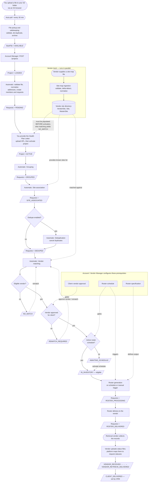
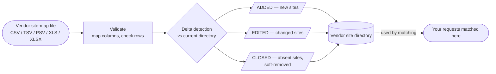
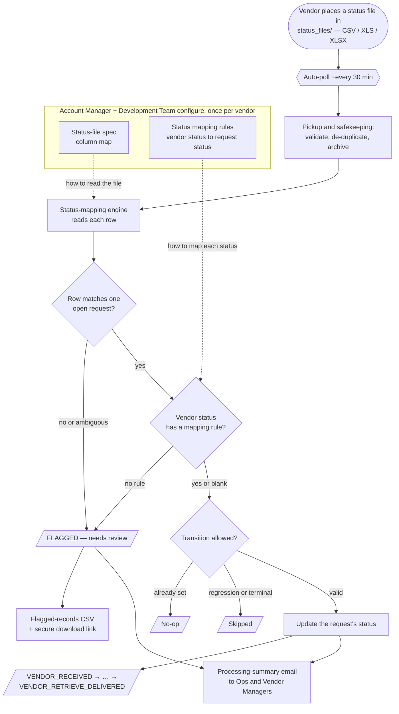
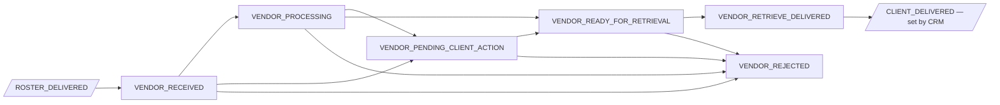

# How Your Project Is Processed — From Data Upload to Vendor Roster

**A step-by-step guide to the ECLAT.Retrieve workflow.**

This document explains the complete journey of your data through the ECLAT.Retrieve
platform: from the moment you upload a data file, through validation, organization, and
matching, to the point where a finished **roster** is delivered to the retrieval vendor
who will collect the medical records. It also documents the parallel **vendor track**
(site-map ingestion) that builds the directory your records are matched against.

It is written for a business and technical audience. The narrative in each stage explains
*what happens and why* in plain language; the **"Behind the scenes"** and **"System
touchpoint"** call-outs add the operational detail — including the **example
request/response payload for each API step**.

> **Scope.** This guide covers the lifecycle from **data upload** through **roster delivery**
> and on to the **vendor status updates** that carry each request to final delivery, plus the
> parallel **vendor site-map ingestion** flow. The status-file flow is summarized in Stage 12;
> for its full configuration and payloads, see the dedicated
> [Vendor Status-File Flow guide](#15-stage-12--vendor-status-updates-the-status-file-flow).
>
> **How data enters the system today.** Files are submitted by uploading them to a secure
> cloud-storage (Amazon S3) folder using an S3 browser application. A direct SFTP connection
> is not used at this time; the secure S3 folder is your single intake point. The bucket is
> organized in an SFTP-style folder layout — see
> [Section 19](#19-sftp--cloud-storage-folder-structure).

---

## 1. At a glance

You upload a file. The platform automatically picks it up, checks it, and stores a permanent
safe copy. Your ECLAT **Account Manager** creates a **project** around that file and provides the
authorization letter that permits retrieval. From there, the platform runs a fully automated
pipeline that cleans and organizes your records, removes duplicates, and matches each record
to the best retrieval vendor for that location. Once a vendor's schedule comes due, the
platform generates a roster file in the agreed format and delivers it to that vendor.

Separately and continuously, retrieval vendors supply **site-map files** that the platform
ingests into a directory of vendor locations. Your records are matched against that directory
— so the two tracks converge at the matching step. **Because matching runs automatically the
moment a project is activated, the relevant vendor site maps must already be ingested first** —
otherwise your records have nothing to match against and land in `NO_MATCH` (see the
prerequisite note in Stage 5, Section 7).

### End-to-end flowchart



**Your hands-on touchpoints are intentionally few:**

1. **Upload your data file** to your secure S3 folder.
2. **Provide the Health Plan Letter** (the authorization document).
3. **Review reports / request cancellations** as needed.

Everything else — project setup, vendor configuration, the vendor track, matching,
scheduling, and delivery — is performed by ECLAT's **Account Manager** and **Vendor Manager** roles,
or runs **automatically**.

---

## 2. Who does what

| Actor | Role in this workflow |
|---|---|
| **You (Client)** | Upload the data file; provide the Health Plan Letter; review reports. |
| **Account Manager** (ECLAT) | Creates and configures projects; uploads the Health Plan Letter; approves vendors per client; cancels requests; triggers re-matches. |
| **Vendor Manager** (ECLAT) | Manages retrieval vendors and their file specs; defines roster specifications and schedules; uploads vendor **site maps** and retrieved **charts** to the vendor directories (see [Section 19](#19-sftp--cloud-storage-folder-structure)). |
| **Development Team** (ECLAT) | Helps create and configure the technical specifications — vendor **file specifications** and **roster specifications** (column mappings, identity keys, computed columns). |
| **The Platform** | Runs every automated step: file pickup, validation, address normalization, grouping, deduplication, vendor site-map ingestion, matching, roster generation, and delivery. |
| **Retrieval Vendor** | Receives the roster, collects the medical records (returned as charts), and reports progress via **status files** (Stage 12). |

Throughout this guide:

- **"System touchpoint"** describes a platform operation (an API) with its example payload.
  Unless stated otherwise, these are performed by your ECLAT **Account Manager** or **Vendor
  Manager** — you do not call them yourself.
- **"Behind the scenes"** describes work the platform does **automatically**.

A consolidated index of all operations is in [Section 21](#21-operations-reference).

### How responses are shaped — the standard envelope

Every successful response is wrapped in one standard envelope; only the `data` section
changes per operation. The **payload examples in each stage below show the `data` object**
(plus the request body); the full envelope is shown once, at project creation.

```json
{
  "code": "success",
  "messages": { "success": "Human-readable confirmation" },
  "data": { "...": "the operation's result" },
  "errors": {},
  "trace_id": "019cd1f2-7e55-7a10-8c3d-1f2e3d4c5b6a"
}
```

- `code` is one of `success`, `validation_error`, `client_error`, `not_found`,
  `unauthorized`, `server_error`.
- On error, `data` is empty and `errors` carries field-level details; `trace_id` is filled
  automatically — quote it when contacting support.
- All identifiers, names, dates, and addresses in the examples below are **synthetic**.

---

## 3. Stage 1 — Uploading your data

**What happens.** You place your data file into your dedicated folder in the secure S3
storage, using an S3 browser application. Each client has its own isolated folder.

- **Where:** `client/sftp/{your-client}/` — your dedicated folder, assigned during onboarding
- **Accepted formats:** `.csv`, `.tsv`, `.psv`, `.xls`, `.xlsx` (comma-, tab-, or pipe-delimited text, or Excel)
- **File naming:** your Account Manager configures an expected name prefix for your folder
  (for example, `oscar_project_…`).

**What you'll see.** Once the upload completes in your S3 browser, your part of this stage is
done — the platform takes over.

**System touchpoint (one-time setup, by your Account Manager).**
`POST /api/v1/file-transfer/clients/sftp-configuration` registers your upload folder, the
expected file-name prefix, and how duplicate files are handled.

*Request:*
```json
{
  "client_id": "019cd1f2-0001-7000-8000-0000000000c1",
  "naming_convention": "oscar_project",
  "folder_exclusive": true,
  "duplicate_handling": "reject"
}
```
`duplicate_handling` ∈ `reject` · `overwrite` · `archive` · `quarantine`.

*Response `data`:*
```json
{
  "id": "019cd1f2-00f0-7000-8000-0000000000a0",
  "client_id": "019cd1f2-0001-7000-8000-0000000000c1",
  "naming_convention": "oscar_project",
  "folder_exclusive": true,
  "duplicate_handling": "reject",
  "archive_s3_path": null
}
```

---

## 4. Stage 2 — Automatic file pickup and safekeeping

**What happens.** The platform continuously watches your upload folder and ingests new files
on its own.

**Behind the scenes (fully automatic).**

1. **Pickup.** A background job scans your folder on a regular cycle and detects the new file
   — typically **within about 30 minutes** of upload.
2. **Format check.** The file's type is verified (`.csv`, `.tsv`, `.psv`, `.xls`, or `.xlsx`).
3. **Duplicate check.** A content fingerprint (checksum) is computed. If an identical file has
   already been processed successfully, the new copy is rejected.
4. **Transfer & archive.** A valid, unique file is copied to an internal processing area and a
   **permanent, date-stamped archive copy** is saved. The original is then removed from the
   upload folder.
5. **Audit record.** Every pickup attempt — success, rejection, or failure — is written to a
   permanent, tamper-proof transfer log.

**Status after this stage.** Your file exists as a **start file** with status **`AVAILABLE`**
— successfully received and waiting to be turned into a project.

**If something's wrong.**
- *Unsupported file type* → archived and marked **rejected**; re-upload in an accepted format.
- *Duplicate file* → archived and marked **rejected** (expected if you re-sent the same file);
  upload a corrected/changed file instead.

> This stage has no API touchpoint — it is entirely automatic.

---

## 5. Stage 3 — Project creation

**What happens.** Your Account Manager creates a **project** around the received file — the
container that ties your data to a client, an audit type, a date range, and the retrieval
methods to be used.

**System touchpoint.** `POST /api/v1/projects` — creates the project and links it to the
received start file. *(Authorized role: Account Manager.)*

*Request:*
```json
{
  "client_id": "019cd1f2-0001-7000-8000-0000000000c1",
  "file_id": "019cd1f2-0003-7000-8000-0000000000f1",
  "project_name": "HEDIS MY2026 National",
  "audit_type": "hedis",
  "project_types": ["EHR", "HCA"],
  "start_date": "2026-07-01",
  "end_date": "2026-12-31",
  "program_year": 2026,
  "dedupe_enabled": true,
  "contract_number": "CTR-2026-0042"
}
```
- `audit_type` ∈ `mra` · `hedis` · `radv` · `aca`; `project_types` ⊆ `EHR` · `HCA` · `HIH` · `OUTREACH`.
- `program_year` is required (2000–2099). `contract_number` is required when `HCA` is among `project_types`.

*Full response (the complete envelope, shown once — all later examples show only `data`):*
```json
{
  "code": "success",
  "messages": { "success": "Project created successfully" },
  "data": {
    "id": "019cd1f2-0004-7000-8000-0000000000d1",
    "project_number": 100,
    "client_id": "019cd1f2-0001-7000-8000-0000000000c1",
    "start_file": {
      "id": "019cd1f2-0003-7000-8000-0000000000f1",
      "file_name": "members_batch_001.csv",
      "file_path": "client/project_staging/oscar/incoming/members_batch_001.csv",
      "file_hash": "9f2c0b…a1",
      "file_format": "csv",
      "file_size_bytes": 184320,
      "record_count": null,
      "file_status": "available",
      "is_current": true,
      "is_archived": false,
      "received_at": "2026-07-01T14:05:00Z",
      "ingested_at": null,
      "completed_at": null
    },
    "project_name": "HEDIS MY2026 National",
    "status": "loaded",
    "audit_type": "hedis",
    "project_types": ["EHR", "HCA"],
    "program_year": 2026,
    "start_date": "2026-07-01",
    "end_date": "2026-12-31",
    "dedupe_enabled": true,
    "contract_number": "CTR-2026-0042",
    "health_plan_letters": []
  },
  "errors": {},
  "trace_id": "019cd1f2-7e55-7a10-8c3d-1f2e3d4c5b6a"
}
```

**Behind the scenes.** Creating the project immediately starts the automated validation and
loading pipeline (Stage 4).

**Status after this stage.** Project status **`LOADED`** ("file associated, awaiting
authorization"); processing stage **`PENDING`**.

---

## 6. Stage 4 — Data validation and loading

Runs **automatically** as soon as the project is created — no API call. It turns the raw rows
in your file into clean, structured records.

### 6.1 File content validation

Every column and row is checked: required columns present, no duplicate headers; correct data
types, field lengths, valid `MM/DD/YYYY` dates, state codes, gender values, and end date of
service on or after begin date of service.

- *Bad columns* → project/file marked **`error`** with a coded reason.
- *Bad rows* → the platform produces a downloadable **error-report file**: a copy of your
  original rows with an added `Errors` column explaining each failure. Valid rows still
  proceed. **No patient-identifying values appear in error messages or logs.**

### 6.2 Address normalization

Provider addresses are converted to a single canonical postal form (so "123 Main St" and
"123 Main Street" are recognized as the same location). Verified results are cached.
Unverifiable addresses and P.O. boxes are excluded from retrieval.

### 6.3 Record creation

Validated, normalized rows are loaded in batches, creating **Member**, **Provider**, and
**Request** records (one request = one member-at-provider unit of work).

**Status after this stage.** Each **Request** is created with status **`PENDING`**. The
project stays **`LOADED`** — retrieval is not yet authorized (next stage).

---

## 7. Stage 5 — Project activation (Health Plan Letter)

> **⚠️ Prerequisite — vendor site data must be in place *before* this step.**
> Uploading the HPL and activating the project **immediately launches the entire background
> pipeline** (grouping → site association → matching), and it runs to completion on its own.
> Matching compares your records against the **vendor site directory** built by the vendor
> track (Section 9). **If the relevant vendor site maps have not been ingested yet, your
> records have nothing to match against and will be set to `NO_MATCH`.** Confirm the vendor
> directory is populated for the vendors that cover your members' locations before the HPL is
> uploaded.
> *Recoverable:* if a project was activated too early, once the vendor sites are ingested you
> can **re-match** the affected requests — see [Section 17](#17-handling-exceptions). No data
> is lost, but it adds a round-trip.

**What happens.** Retrieval cannot begin until the project is **authorized** by a **Health
Plan Letter (HPL)** — the document granting permission to retrieve records. You provide the
letter; your Account Manager uploads it and launches the project.

**System touchpoint 1 — upload the HPL.**
`POST /api/v1/projects/{project_id}/health-plan-letters` · **multipart/form-data** · must be a
PDF ≤ 10 MB; project must be in `LOADED` status. *(Role: Account Manager.)*

*Request (form fields, not JSON):*
```
letter_name : Oscar HEDIS Authorization 2026
file        : @hpl_oscar_2026.pdf        (application/pdf, ≤ 10 MB)
```
*Response `data`:*
```json
{
  "id": "019cd1f2-0005-7000-8000-0000000000e1",
  "letter_name": "Oscar HEDIS Authorization 2026",
  "file_path": "client/hpl/OSCAR/019cd1f2-0004-7000-8000-0000000000d1/hpl_oscar_2026.pdf",
  "uploaded_at": "2026-07-01T15:20:00Z",
  "created_by": "019cd1f2-00aa-7000-8000-0000000000u1",
  "approved_at": null,
  "approved_by": null,
  "is_active": true,
  "is_registered_with_vendor_api": false
}
```

**System touchpoint 2 — activate the project.**
`POST /api/v1/projects/{project_id}/status` transitions `LOADED → ACTIVE` (only allowed once a
valid HPL is present). *(Role: Account Manager.)*

*Request:*
```json
{ "new_status": "active", "reason": "Health Plan Letter received; launching retrieval" }
```
*Response `data`:* the project object (as in Stage 3) with `"status": "active"`.

**Behind the scenes.** The moment the project becomes **`ACTIVE`**, the platform automatically
launches the organize-the-work pipeline (Stage 6) — the single "go" signal for everything
downstream.

---

## 8. Stage 6 — Organizing the work

Once active, three steps run **automatically, one after another** — no API calls.

### 8.1 Grouping — "contact each location once"

All requests at the **same physical address** are bundled into one **group**, so the platform
reaches out to each provider location a single time. The most common phone/fax for the
location is recorded as the outreach contact.
**Status:** Requests **`PENDING → GROUPED`**.

### 8.2 Site association — "map each location to a known site"

Each address group is matched to a **site** (the location as a retrieval vendor recognizes it)
and a canonical **master site** — these come from the vendor track (Section 9). Locations with
no known site are flagged for manual outreach.
**Status:** Requests **`GROUPED → SITE_ASSOCIATED`**.

### 8.3 Deduplication — "never retrieve the same record twice"

*(Runs only if `dedupe_enabled` was set on the project.)* Within each location group, if the
same member appears more than once, the earliest request is kept and later duplicates are
**cancelled** (never deleted — retained for compliance, reason code `CANDUP`, linked to the
survivor).
**Status:** survivors **`SITE_ASSOCIATED → DEDUPED`**; duplicates **`→ CANCELLED`**.

**System touchpoints (review-only / corrective).**

**Cancellation-rate report** — `GET /api/v1/reports/dedupe/cancellation-rates?project_id={id}`
(filter by `client_id`, `project_id`, and/or `program_year` — at least one required):
```json
{ "total_requests": 12840, "cancelled_duplicates": 742, "cancellation_rate": 5.78 }
```

**Dedupe summary** — `GET /api/v1/reports/dedupe/summary`:
```json
{ "total_cancelled_duplicates": 18211 }
```

**Cancel specific requests** (e.g. members who opted out) —
`POST /api/v1/projects/{project_id}/dedupe/cancel-requests` · **multipart/form-data** ·
*(Role: Account Manager.)*
```
file    : @requests_to_cancel.csv     (one "REQ-<n>" literal per row, e.g. REQ-1042)
comment : Members opted out per client instruction
```
*Response `data`:*
```json
{
  "project_id": "019cd1f2-0004-7000-8000-0000000000d1",
  "total_submitted": 3,
  "total_cancelled": 2,
  "total_failed": 1,
  "cancellation_code": "canclient",
  "cancellation_reason": "Client requested cancellation",
  "cancelled_by": "019cd1f2-00aa-7000-8000-0000000000u1",
  "comment": "Members opted out per client instruction",
  "cancelled_at": "2026-07-10T09:00:00Z",
  "results": [
    { "request_number": 1042, "success": true,  "error": null },
    { "request_number": 1043, "success": true,  "error": null },
    { "request_number": 9999, "success": false, "error": "Request not found" }
  ]
}
```

---

## 9. The vendor track — site-map ingestion

**This is a separate, parallel flow** managed by ECLAT's **Vendor Manager** — **not by you.** It is included here because it builds and maintains the directory of
vendor locations that your records are matched against in Stage 7 (Section 10). You take no
action in this track.

> **Timing matters.** A project's site association and matching run **automatically** the
> moment it is activated (Stage 5) and complete in the background. The vendor directory for the
> vendors covering your members' locations therefore needs to be populated **before** that
> activation. An empty or incomplete directory produces `NO_MATCH` results until a re-match is
> run. In practice, ECLAT keeps vendor site maps current ahead of activating client projects.

**What a vendor supplies.** Each retrieval vendor (e.g. MRO, Sharecare, Verisma) periodically
delivers a **site-map file** (CSV/TSV/PSV/XLS/XLSX) listing every facility location they can service —
site name and code, address, phone/fax, NPI/TIN, and a location type (Clinic, Hospital, etc.).
Your **Vendor Manager** uploads each vendor's site map to the vendor's folder
(`vendor/sftp/{vendor}/` — see [Section 19](#19-sftp--cloud-storage-folder-structure)), and the
platform ingests it automatically on arrival.

### 9.1 Per-vendor configuration — the file specification

Because every vendor formats their file differently, ECLAT configures a **file specification**
per vendor (during vendor onboarding) that tells the platform how to read it. Because these are
technical column mappings, the ECLAT **development team** helps create and configure them. It is
not a client-facing API; conceptually it contains:

- **`column_map`** — maps the vendor's column headers to the platform's canonical field names.
- **`column_specs`** — per-column validation rules (required, type, allowed values, patterns).
- **`identity_columns`** — the columns that, together with the address, uniquely identify a
  site (so the platform can tell "same site" from "new site" across uploads).
- **`computed_columns`** — derived values built by combining columns.

*Example specification (for vendor "MRO"):*
```json
{
  "spec_name": "MRO Facility & Locations",
  "column_map": {
    "Facility Name": "provider_group",
    "Facility Code": "facility_code",
    "Location Name": "site_name",
    "Location Code": "location_code",
    "Location Address Line 1": "address1",
    "Location City": "city",
    "Location State": "state",
    "Location Zip": "zip",
    "Location Type": "location_type"
  },
  "identity_columns": ["Facility Code", "Location Code", "Location Type"],
  "computed_columns": {
    "vendor_site_code": { "columns": ["location_code", "facility_code"], "separator": "_" }
  }
}
```

### 9.2 What happens when a vendor file arrives



1. **Validation.** The file is read using the vendor's specification: columns are mapped to
   canonical names, computed columns are derived, ZIP+4 is parsed, and every row is checked
   against the rules. Rows that fail produce a downloadable error report; valid rows continue.
   (No patient data — these files describe facilities, not patients.)
2. **Delta detection.** Each valid row is compared against the current directory for that
   vendor and classified:
   - **ADDED** — a site not seen before.
   - **EDITED** — an existing site whose details changed.
   - **CLOSED** — a site present before but absent from this file → soft-removed (retained for
     audit, not hard-deleted).
   - *Unchanged rows are skipped.*
3. **Persist & normalize.** New and changed sites are written to the **vendor site directory**
   (`VendorSite`), their addresses normalized into the shared address/site records (`Site`,
   `MasterSite`) — the very same site records your request groups attach to in Stage 6.2.

**Idempotent.** Re-ingesting the same file produces no changes — safe to retry.

**Status after this stage.**
- Each ingestion run → **`SUCCESS`** (all rows valid), **`PARTIAL`** (some rows rejected), or
  **`FAILED`** (file-level error or all rows rejected).
- Each site row → **`ADDED`** · **`EDITED`** · **`CLOSED`**.

### 9.3 How it connects to your data

The directory built here is exactly what **Stage 7 — Matching** (Section 10) searches: each of
your request groups carries a *site*, and matching finds the best vendor servicing that site.
A richer, more current vendor directory means more of your records match on the first pass.

### 9.4 System touchpoint — ingestion report

`GET /api/v1/vendors/site-ingestion/summary` returns a paginated report of recent vendor
ingestion runs. Filters: `vendor_id`, `ingestion_status` (`success`/`partial`/`failed`),
`order` (`asc`/`desc`), `page`, `page_size`. *(Authenticated user.)*

*Response `data`:*
```json
{
  "items": [
    {
      "log_id": "019cd1f2-00c0-7000-8000-00000000c101",
      "vendor_name": "MRO",
      "source_file_name": "MRO_Facility_and_Locations_2026-07-01.csv",
      "ingestion_timestamp": "2026-07-01T08:15:00Z",
      "ingestion_status": "success",
      "summary_message": "Delta: 412 added, 88 edited, 13 closed",
      "total_rows": 75825,
      "added_rows": 412,
      "edited_rows": 88,
      "deleted_rows": 13,
      "rejected_rows": 0
    }
  ],
  "total": 1,
  "page": 1,
  "page_size": 10,
  "has_next": false
}
```

---

## 10. Stage 7 — Matching to retrieval vendors

**What it does (automatic).** For each location group, the platform selects the single **best
retrieval vendor** by comparing the group's site against the **vendor site directory** (built
by the vendor track — Section 9), then ranking eligible vendors by the retrieval methods
configured on your project (e.g. EHR / HCA / HIH) and vendor priority/ranking.

- Matched → requests become **`IN_INVENTORY`** (ready to be rostered).
- No eligible vendor → requests become **`NO_MATCH`** (can be re-attempted —
  see [Section 17](#17-handling-exceptions)).

After matching, the platform automatically runs the readiness checks (Stage 8).

**System touchpoint — define a vendor.** `POST /api/v1/vendors`
*(Roles: Account Manager, Vendor Manager.)*
*Request:*
```json
{
  "vendor_name": "Acme Medical Retrieval",
  "vendor_code": "ACMV",
  "contact_email": "ops@acme-retrieval.example",
  "contact_phone": "555-0100"
}
```
*Response `data`:*
```json
{
  "id": "019cd1f2-0002-7000-8000-0000000000b1",
  "vendor_name": "Acme Medical Retrieval",
  "vendor_code": "ACMV",
  "contact_email": "ops@acme-retrieval.example",
  "contact_phone": "555-0100",
  "is_active": true
}
```

**System touchpoint — view inventory.** `GET /api/v1/roster/inventory/status` returns a live
count of requests per vendor and status. *(Roles: Account Manager, Vendor Manager.)*
*Response `data`:*
```json
[
  { "vendor_id": "019cd1f2-0002-7000-8000-0000000000b1", "status": "in_inventory",      "count": 4120 },
  { "vendor_id": "019cd1f2-0002-7000-8000-0000000000b1", "status": "awaiting_schedule", "count": 318 },
  { "vendor_id": "019cd1f2-0002-7000-8000-0000000000b1", "status": "roster_delivered",  "count": 9044 }
]
```

---

## 11. Stage 8 — Readiness checks (the two gates)

Before a matched request can be turned into a roster, it must clear **two gates**, applied
automatically. A request that fails a gate **waits** in a clearly labeled status — nothing is
lost.

### Gate 1 — Is the vendor approved for this client?

- **Default is open:** if no approval rule exists for a client–vendor pair, the vendor is
  treated as approved.
- If a client has **explicitly not approved** the vendor, that client's requests move to
  **`REMATCH_REQUIRED`** and can be re-matched to an approved vendor.

**System touchpoint — approve a vendor for a client.** `POST /api/v1/roster/approvals`
*(Role: Account Manager.)*
*Request:*
```json
{
  "client_id": "019cd1f2-0001-7000-8000-0000000000c1",
  "vendor_id": "019cd1f2-0002-7000-8000-0000000000b1",
  "is_approved": true
}
```
*Response `data`:*
```json
{
  "id": "019cd1f2-0006-7000-8000-00000000a001",
  "client_id": "019cd1f2-0001-7000-8000-0000000000c1",
  "vendor_id": "019cd1f2-0002-7000-8000-0000000000b1",
  "is_approved": true,
  "approved_at": "2026-07-02T10:00:00Z",
  "approved_by": "019cd1f2-00aa-7000-8000-0000000000u1"
}
```
Change it later with `PATCH /api/v1/roster/approvals/{id}` and body `{ "is_approved": false }`.

### Gate 2 — Does the vendor have an active schedule?

- If the matched vendor has **no active schedule**, requests are parked at
  **`AWAITING_SCHEDULE`**.
- When a schedule is later activated, the platform **automatically releases** those parked
  requests back to **`IN_INVENTORY`**.

Requests that clear **both** gates remain **`IN_INVENTORY`** and are eligible for the next
roster generation run. *(The schedule itself is configured in Stage 9.)*

---

## 12. Stage 9 — Defining the roster output and schedule

Configuration your Account or Vendor Manager completes (typically once per vendor) so generation knows
**what** to produce and **when**.

### 12.1 Roster specification — *what the file looks like*

Defines the file the vendor receives: format (`csv`/`xlsx`), ordered columns and their data
types, where each column's value comes from, optional computed columns, and which audit
types/vendors it applies to. A specification must be **`active`** to be used. Because the column
mapping points at internal data fields, the ECLAT **development team** helps define and validate
the specification.

**System touchpoint.** `POST /api/v1/roster/specifications`
*(Roles: Account Manager, Vendor Manager.)*
*Request (column names and source paths are illustrative):*
```json
{
  "primary_vendor_id": "019cd1f2-0002-7000-8000-0000000000b1",
  "specification_name": "Acme HEDIS Roster v1",
  "version": 1,
  "file_format": "csv",
  "is_reusable": true,
  "column_specifications": [
    { "column_name": "MemberID",      "column_order": 1, "data_type": "text", "is_required": true },
    { "column_name": "LastName",      "column_order": 2, "data_type": "text", "is_required": true },
    { "column_name": "ProviderNPI",   "column_order": 3, "data_type": "text", "is_required": true },
    { "column_name": "DateOfService", "column_order": 4, "data_type": "date", "is_required": true, "format_pattern": "MM/DD/YYYY" }
  ],
  "column_map": {
    "MemberID": "member.external_member_id",
    "LastName": "member.last_name",
    "ProviderNPI": "provider.npi",
    "DateOfService": "request.date_of_service"
  },
  "computed_columns": null,
  "audit_types": ["hedis"]
}
```
- `file_format` ∈ `csv` · `xlsx`; `data_type` ∈ `text` · `integer` · `date` · `boolean` · `decimal`.
- `column_order` must be sequential from 1; every `column_map` key must be a defined column name.

*Response `data` (abridged):*
```json
{
  "id": "019cd1f2-0008-7000-8000-00000000a003",
  "specification_name": "Acme HEDIS Roster v1",
  "version": 1,
  "file_format": "csv",
  "status": "draft",
  "is_reusable": true,
  "column_specifications": [ "…same 4 columns as submitted…" ],
  "column_map": { "…": "…same mapping as submitted…" },
  "computed_columns": null,
  "vendors": [ { "vendor_id": "019cd1f2-0002-7000-8000-0000000000b1", "is_primary": true } ],
  "audit_types": [ { "audit_type": "hedis" } ],
  "created_at": "2026-07-02T11:00:00Z",
  "updated_at": null,
  "created_by": "019cd1f2-00aa-7000-8000-0000000000u1"
}
```
A new specification starts as `draft`; activate it with
`PATCH /api/v1/roster/specifications/{id}/activate` (`status` → `active`) before it can be used
for generation.

### 12.2 Roster schedule — *when the file is produced*

Sets the cadence for a vendor — **one schedule per vendor** — as a set of weekdays and times
(Monday–Friday, U.S. Eastern Time), not a raw cron expression.

**System touchpoint.** `POST /api/v1/roster/schedules`
*(Roles: Account Manager, Vendor Manager.)*
*Request (weekdays `0`=Mon … `4`=Fri; times in Eastern, `HH:MM`):*
```json
{
  "vendor_id": "019cd1f2-0002-7000-8000-0000000000b1",
  "days": [
    { "weekday": 0, "execution_time": "10:00" },
    { "weekday": 2, "execution_time": "10:00" },
    { "weekday": 4, "execution_time": "10:00" }
  ],
  "job_status": "active"
}
```
*Response `data`:*
```json
{
  "id": "019cd1f2-0007-7000-8000-00000000a002",
  "vendor_id": "019cd1f2-0002-7000-8000-0000000000b1",
  "job_status": "active",
  "schedule_days": [
    { "id": "019cd1f2-00d0-7000-8000-00000000ad01", "weekday": 0, "execution_time": "10:00" },
    { "id": "019cd1f2-00d0-7000-8000-00000000ad02", "weekday": 2, "execution_time": "10:00" },
    { "id": "019cd1f2-00d0-7000-8000-00000000ad03", "weekday": 4, "execution_time": "10:00" }
  ],
  "next_scheduled_run": "2026-07-06T14:00:00Z",
  "next_scheduled_run_est": "2026-07-06 10:00 EDT",
  "last_executed_at": null
}
```
Activating a schedule also releases any requests waiting at `AWAITING_SCHEDULE` for that vendor
(`POST .../activate`).

**Run now** — `POST /api/v1/roster/schedules/{id}/trigger` → `202`:
```json
{
  "schedule_id": "019cd1f2-0007-7000-8000-00000000a002",
  "vendor_id": "019cd1f2-0002-7000-8000-0000000000b1",
  "status": "dispatched"
}
```
`status` is `dispatched`, or `skipped_already_in_progress` if a run for that vendor is already
underway.

---

## 13. Stage 10 — Roster generation

**What happens (automatic, on the schedule or via "run now").** When a vendor's scheduled time
comes due, the platform generates the roster for that vendor.

**Behind the scenes.**
1. **Re-check eligibility** — routing is refreshed so only currently eligible, approved,
   scheduled requests are included.
2. **Claim the work** — eligible `IN_INVENTORY` requests move to **`ROSTER_PROCESSING`** so two
   runs can never pick up the same records.
3. **Build the file** — claimed records are written into a `csv`/`xlsx` roster per the active
   specification and uploaded to secure storage.
4. **Hand off to delivery** (Stage 11) automatically.

**The roster file name** is unambiguous to the vendor:
```
{vendor_code}_{client_code}_{audit_type}_PRJ{project_number}_{YYMMDD}_{HHMMSSmmm}.{csv|xlsx}
example:  ACMV_CLT_BJMT_HEDIS_PRJ100_260706_100015123.csv
```

**Reliability.** Generation is self-healing: if a run is interrupted, an automatic recovery
process reconciles its state shortly after — re-delivering files that were built but not sent,
or safely retrying failed work — without ever duplicating a roster that already went out.

**Status after this stage.** Claimed requests are **`ROSTER_PROCESSING`**.

---

## 14. Stage 11 — Roster delivery to the vendor

**What happens (automatic).** The generated roster file is delivered to the retrieval vendor's
destination (`vendor/sftp/{vendor}/rosters/`), where it becomes visible to that vendor.

- On success: records move **`ROSTER_PROCESSING → ROSTER_DELIVERED`**; the file and run are
  marked delivered.
- On a delivery failure: records are marked **`ROSTER_FAILED`** with a sanitized
  (identifier-only) reason; the built file stays safely in storage.
- Every delivery is captured in the permanent transfer audit log.

**Status after this stage.** Requests are **`ROSTER_DELIVERED`** — the retrieval vendor now has
the work. ✅

---

## 15. Stage 12 — Vendor status updates (the status-file flow)

After a roster is delivered, the retrieval vendor works through the records and periodically reports
progress by uploading a **status file**. The platform picks these up automatically, maps each row's
vendor status value onto a platform request status, and advances each request through the vendor
phase toward final delivery. *(Retrieved records themselves come back as **charts** — ZIP files the
Vendor Manager places in `vendor/sftp/{vendor}/charts/` — which feed the platform's intake phase.)*



### 15.1 Prerequisite configuration (once per vendor)

Because every vendor names its columns and status values differently, two small configuration files
are registered per vendor **before** their status files can be processed. Both are uploaded by the
**Account Manager**, and the **Development Team** helps author them (they reference the platform's
internal status values). The source of truth is an ops-curated workbook, exported per vendor as
**CSV or XLSX** (≤ 1 MB).

**Status-file spec — *how to read the vendor's file*.** A column map telling the platform which of
the vendor's columns hold the `request_identifier` (identifies the request), the `source_status`
(the vendor's status value), and the `source_reason` (optional free-text reason).

`POST /api/v1/vendors/{vendor_id}/status-file-spec` · **multipart/form-data** · *(Account Manager.)*

*Request (form fields):*
```
spec_file : @mro_status_spec.csv      (CSV or XLSX; columns: vendor_header, canonical_name)
spec_name : MRO status file v1
```
*`spec_file` contents (example):*
```
vendor_header,canonical_name
Request ID,request_identifier
Status,source_status
Notes,source_reason
```
*Response `data`:*
```json
{
  "id": "019cd1f2-00a0-7000-8000-0000000000s1",
  "vendor_id": "019cd1f2-0002-7000-8000-0000000000b1",
  "spec_name": "MRO status file v1",
  "version": 1,
  "is_active": true,
  "column_map": { "Request ID": "request_identifier", "Status": "source_status", "Notes": "source_reason" }
}
```

**Status mapping rules — *how to translate each vendor status*.** A table mapping each vendor raw
status string to a platform request status. A rule may target only the **vendor-assignable**
statuses: `VENDOR_RECEIVED`, `VENDOR_PROCESSING`, `VENDOR_PENDING_CLIENT_ACTION`,
`VENDOR_READY_FOR_RETRIEVAL`, `VENDOR_RETRIEVE_DELIVERED`, `VENDOR_REJECTED`. (Values are matched
case-insensitively.)

`POST /api/v1/vendors/{vendor_id}/status-mapping-rules` · **multipart/form-data** · *(Account Manager.)*

*Request (form fields):*
```
rules_file       : @mro_status_rules.csv   (CSV or XLSX; columns: source_status, target_status, [notes])
replace_existing : true                    (true = full sync: deactivate rules absent from the file; false = additive)
notes            : Initial onboarding import
```
*`rules_file` contents (example):*
```
source_status,target_status,notes
received,vendor_received,
in progress,vendor_processing,
client info needed,vendor_pending_client_action,
ready for pickup,vendor_ready_for_retrieval,
delivered,vendor_retrieve_delivered,
unable to fulfill,vendor_rejected,
```
*Response `data`:*
```json
{
  "created_count": 6,
  "updated_count": 0,
  "deactivated_count": 0,
  "rules": [
    { "id": "019cd1f2-00a1-7000-8000-00000000r001", "vendor_id": "019cd1f2-0002-7000-8000-0000000000b1", "source_status": "received", "target_status": "vendor_received", "is_active": true, "notes": null },
    { "id": "019cd1f2-00a1-7000-8000-00000000r002", "vendor_id": "019cd1f2-0002-7000-8000-0000000000b1", "source_status": "client info needed", "target_status": "vendor_pending_client_action", "is_active": true, "notes": null }
  ]
}
```

**Confirming what's registered.** `GET /api/v1/vendors/{vendor_id}/status-file-spec` and
`GET /api/v1/vendors/{vendor_id}/status-mapping-rules` return the active spec and rules *(Account
Manager).* If a vendor's spec **or** rules are missing when a file arrives, the run halts safely and
the ECLAT team is emailed to complete the configuration — no requests are changed.

### 15.2 The vendor uploads a status file

The retrieval vendor places a status file in `vendor/sftp/{vendor}/status_files/`
(`.csv` / `.xls` / `.xlsx`), one row per record with at least the request identifier and the
vendor's status value (plus an optional reason), as described by that vendor's spec.

### 15.3 Automatic pickup and safekeeping

A dedicated background job scans each vendor's `status_files/` folder about **every 30 minutes**
(separate from site-map pickup, so a status feed is never blocked). It checks the file type, rejects
empty and duplicate files, copies a valid file to internal processing storage and a permanent,
date-stamped archive, then starts the **status-mapping engine** for it. A transfer success (or
failure) email goes to **Ops and the Vendor Managers**.

### 15.4 The status-mapping engine

Runs **automatically** for each transferred file. The engine reads every row using the vendor's spec
and decides, per row, what to do; each row produces exactly one **outcome**:

1. **Match the row to a request** — the row's `request_identifier` is matched to a single open
   request for that vendor (no match, or more than one → **flagged**).
2. **Resolve the target status** — a **blank** vendor status on a matched request is an implicit
   acknowledgement → `VENDOR_RECEIVED`; otherwise the vendor's status value is looked up in that
   vendor's rules (no rule → **flagged**).
3. **Apply the transition** — only if it is a valid forward move (see [15.6](#156-status-progression)):
   already at that status → **no-op**; already terminal or a backwards move → **skipped**; otherwise
   the request's status is **updated**, with the vendor's reason recorded on its history.

| Outcome | Meaning | Counts as |
|---|---|---|
| **Applied** | The request's status was updated. | Progress |
| **No-op (duplicate)** | The request was already at that status. | Expected |
| **Skipped (regression)** | The vendor status would move the request backwards. | Expected |
| **Skipped (terminal)** | The request is already in a terminal state. | Expected |
| **Flagged — unknown request** | No request matched the row's identifier (or it was empty). | **Needs review** |
| **Flagged — ambiguous request** | More than one request matched. | **Needs review** |
| **Flagged — unknown status** | The vendor's status value has no mapping rule. | **Needs review** |
| **Flagged — malformed** | The row could not be parsed. | **Needs review** |

Re-processing the same file produces the same end state — already-applied transitions are skipped,
and one bad row never affects the others. Every update also writes an immutable status-history entry.

### 15.5 Results, flagged records & notifications

When a file finishes, the platform records a **processing result** with roll-up counts (total,
applied, no-op, skipped, flagged) and a status: `completed`; `failed` (e.g. no active spec);
`awaiting_mapping_rules` (spec present, rules missing — halted for review); or
`vendor_not_active` / `vendor_unresolved` (could not tie the file to an active vendor — halted).

If any rows were flagged, the platform builds a **CSV of just the flagged rows** (columns
`row_number, request_identifier, source_status, reason`) and includes a **secure, time-limited
download link** (24 hours) in the email. A processing-summary email goes to **Ops and the Vendor
Managers** — "processed", "flagged" (with the download link), "manual review needed", or "failed".
No patient data appears in any email or log — only counts, identifiers, and category text.

### 15.6 Status progression



The engine only allows forward moves. **`vendor_pending_client_action`** is the one state that needs
**you**: the vendor needs more information (e.g. corrected member or authorization details) before
proceeding — provide it to your Account Manager and the next status file advances the request.
**`vendor_rejected`**, **`client_delivered`**, and the pre-vendor exits (`cancelled`, `no_match`,
`roster_failed`) are **terminal** — a later status file will not move them (recorded as *skipped*).
`client_delivered` is set by the **CRM process**, not by status files. *(See [Section 16](#16-tracking-progress--what-each-status-means)
for the full status reference.)*

### 15.7 Re-running a status file

If a file was processed before its rules or spec were complete (rows flagged, or the run halted), fix
the configuration and **re-run the same file** — no re-upload from the vendor is needed.

`POST /api/v1/vendor-status/processings/{processing_id}/rerun` · *(Account Manager.)* No request body
— the `processing_id` from the original run is in the path.

*Response `data`:*
```json
{ "processing_id": "019cd1f2-00b0-7000-8000-0000000000p9", "status": "running" }
```
The re-run reads the same stored file and re-applies every row through the full logic; all safety
checks still apply, so a re-run with broken configuration fails safely. (If the file is already being
processed, the re-run returns `409 Conflict` — retry once it finishes.)

---

## 16. Tracking progress — what each status means

Your data's position is always visible through three status values.

### Project status (`status`) — the project's lifecycle

| Status | Plain meaning |
|---|---|
| `available` | File received but not yet attached to a project. |
| `loaded` | File attached and validated; **awaiting Health Plan Letter**. |
| `active` | Authorized — retrieval and all downstream processing can run. |
| `error` | The file failed validation; a corrected file is needed. |
| `closed` | The project is complete/closed. |

### Processing stage (`pipeline_status`) — how far automation has progressed

`pending → grouped → site_associated → deduped → matched`
(Projects with deduplication disabled skip straight past the dedupe step.)

### Request status (`request_status`) — the state of an individual record

| Status | Plain meaning |
|---|---|
| `pending` | Loaded; awaiting organization. |
| `grouped` | Bundled with other records at the same location. |
| `site_associated` | Location mapped to a known site. |
| `deduped` | Confirmed unique (survived deduplication). |
| `cancelled` | Removed — a duplicate, or cancelled on request. |
| `in_inventory` | Matched to a vendor; ready to be rostered. |
| `no_match` | No eligible vendor found yet. |
| `rematch_required` | Held back (e.g. vendor not approved); needs re-matching. |
| `rematch_triggered` | A re-match attempt is in progress. |
| `awaiting_schedule` | Matched, but the vendor has no active schedule yet. |
| `roster_processing` | Being written into a roster file. |
| `roster_delivered` | Delivered to the retrieval vendor. |
| `roster_failed` | Delivery failed; under automatic review/retry. |
| `vendor_received` | The vendor acknowledged the request (Stage 12). |
| `vendor_processing` | The vendor is actively working it. |
| `vendor_pending_client_action` | Blocked pending client/member information — **needs your action**. |
| `vendor_ready_for_retrieval` | Records are ready to retrieve. |
| `vendor_retrieve_delivered` | The vendor delivered the retrieved records. |
| `vendor_rejected` | The vendor could not fulfill the request (terminal). |
| `client_delivered` | Final delivery to you (set by the CRM process). |

### Vendor site-ingestion status (the vendor track)

| Run status | Meaning | Row status | Meaning |
|---|---|---|---|
| `success` | All rows valid and ingested | `added` | A new site |
| `partial` | Some rows rejected, the rest ingested | `edited` | An existing site's details changed |
| `failed` | File-level error or all rows rejected | `closed` | A site no longer in the file (soft-removed) |

*(The vendor-phase statuses are produced by the status-file flow — see
[Section 15](#15-stage-12--vendor-status-updates-the-status-file-flow).)*

---

## 17. Handling exceptions

Nothing is silently lost — work either advances, waits in a clearly named status, or surfaces
a correctable report.

| Situation | What the platform does | What to do |
|---|---|---|
| **Unsupported / duplicate file** | Archived and marked **rejected**. | Re-upload in an accepted format, or a corrected (non-identical) file. |
| **Column errors** | Project/file marked **`error`** with a coded reason. | Fix the columns and re-upload. |
| **Row errors** | A downloadable **error report** lists each failing row and reason (no patient data). Valid rows still proceed. | Correct the flagged rows and re-submit. |
| **No vendor match** (`no_match`) | Request waits. | Confirm the covering vendor's site map has been ingested (Section 9), then trigger a **re-match** (below); or adjust vendor coverage/approvals. |
| **Vendor not approved** (`rematch_required`) | Request held back from that vendor. | Approve the vendor, or re-match to an approved one. |
| **No active schedule** (`awaiting_schedule`) | Request parked. | Activate the vendor's schedule — parked requests are released automatically. |
| **Generation/delivery interruption** | Automatic recovery reconciles the run shortly after. | No action needed in normal cases. |
| **Vendor site-map rows rejected** (`partial`/`failed` run) | An error report is generated; valid rows still ingest. | The vendor corrects and re-sends the file. |

### Re-matching

For requests in `no_match` or `rematch_required`, your Account Manager can re-attempt matching by
uploading a list of request IDs.

**System touchpoint.** `POST /api/v1/rematch` → `202` · **multipart/form-data** ·
*(Role: Account Manager.)*
*Request:*
```
file : @rematch_request_ids.csv     (single "request_id" column; one UUID per row; ≤ 5 MB)
```
*Response `data`:*
```json
{
  "request_ids_submitted": 50,
  "requests_triggered": 47,
  "ineligible_requests": [
    { "request_id": "019cd1f2-0009-7000-8000-00000000a004", "reason": "status_not_eligible" },
    { "request_id": "019cd1f2-0009-7000-8000-00000000a005", "reason": "not_found" }
  ],
  "message": null
}
```
`reason` ∈ `not_found` · `missing_site_id` · `status_not_eligible`. Eligible requests flip to
`rematch_triggered`, then settle at `in_inventory` or `no_match`.

---

## 18. Preparing your file

- **Format:** `.csv`, `.tsv`, `.psv`, `.xls`, or `.xlsx` (delimited text or Excel).
- **Name:** follow the prefix your Account Manager configured for your folder.
- **Don't re-send identical files:** exact duplicates are rejected by design — upload a
  corrected/changed file instead.
- **Columns:** include the columns required for your audit type and retrieval methods; avoid
  duplicate column headers.
- **Row data:** use `MM/DD/YYYY` dates, valid two-letter state codes, and ensure the end date
  of service is on or after the begin date of service.
- **Addresses:** provide complete provider addresses; P.O. boxes and unverifiable addresses
  are excluded from retrieval.

---

## 19. SFTP & cloud-storage folder structure

All files live in a single secure S3 bucket organized in an **SFTP-style folder layout**. You
upload to the `client/sftp/{your-client}/` prefix (via your S3 browser); vendors upload their
site maps to `vendor/sftp/{vendor}/`; the platform manages the rest. Finished rosters are
delivered to the vendor's `vendor/sftp/{vendor}/rosters/` prefix.

> `{client}` / `{vendor}` are assigned lowercase identifiers. An SFTP gateway (e.g. AWS
> Transfer Family) maps each party's home directory onto its `…/sftp/{name}/` prefix, so files
> placed there are visible over SFTP without any extra step.

### Complete bucket layout

```
{S3_BUCKET}/
│
├── client/
│   ├── sftp/{client}/                         ← INTAKE — you upload data files here
│   │       └── members_batch_001.csv             (auto-picked-up, then removed)
│   │
│   ├── project_staging/{client}/
│   │   ├── incoming/                          ← received copy, being processed
│   │   │     └── members_batch_001.csv
│   │   ├── validated/                         ← reserved (future stage)
│   │   └── errors/                            ← row-level error reports land here
│   │         └── members_batch_001_errors.csv
│   │
│   ├── hpl/{client}/{project_id}/             ← Health Plan Letter PDFs
│   │       └── hpl_oscar_2026.pdf
│   │
│   └── archive/{client}/
│           └── dt=YYYY-MM-DD/                  ← permanent, date-stamped safe copy
│                 └── members_batch_001.csv
│
└── vendor/
    ├── sftp/{vendor}/                         ← vendor folder (Vendor Manager uploads here)
    │   ├── MRO_Facility_and_Locations.csv        ← site map (auto-ingested into the directory)
    │   ├── rosters/                           ← OUTPUT — finished rosters delivered here
    │   │     └── ACMV_CLT_HEDIS_PRJ100_260706_100015123.csv
    │   ├── charts/                            ← Vendor Manager uploads retrieved charts (.zip)
    │   │     └── ACMV_charts_2026-07-10.zip
    │   └── status_files/                      ← vendor status updates (.csv/.xls/.xlsx)
    │         └── ACMV_status_2026-07-10.csv
    │
    ├── project_staging/{vendor}/
    │   ├── incoming/                          ← received vendor site-map copy
    │   ├── validated/
    │   └── errors/                            ← vendor row-level error reports
    │
    └── archive/{vendor}/
            └── dt=YYYY-MM-DD/                  ← date-stamped vendor archive
```

### Path pattern reference

| Purpose | Pattern | Notes |
|---|---|---|
| **Client intake** (you upload here) | `client/sftp/{client}/{file}` | Polled ~every 30 min |
| Received / being processed | `client/project_staging/{client}/incoming/{file}` | Internal |
| Row-error report | `client/project_staging/{client}/errors/{file}_errors.csv` | Downloadable |
| Validated (reserved) | `client/project_staging/{client}/validated/{file}` | Future stage |
| Health Plan Letter | `client/hpl/{client}/{project_id}/{file}.pdf` | Authorization PDFs |
| Client archive | `client/archive/{client}/dt=YYYY-MM-DD/{file}` | Permanent, date-partitioned |
| **Vendor site-map intake** | `vendor/sftp/{vendor}/{file}` | Vendor Manager uploads; auto-ingested |
| **Vendor charts** (retrieved records) | `vendor/sftp/{vendor}/charts/{file}.zip` | Vendor Manager uploads charts (ZIP) |
| Vendor status files | `vendor/sftp/{vendor}/status_files/{file}` | Vendor status updates (`.csv`/`.xls`/`.xlsx`) |
| Vendor site-map received | `vendor/project_staging/{vendor}/incoming/{file}` | Internal |
| **Roster delivery** (vendor receives here) | `vendor/sftp/{vendor}/rosters/{roster_file}` | The output |
| Vendor archive | `vendor/archive/{vendor}/dt=YYYY-MM-DD/{file}` | Permanent, date-partitioned |

### Example — the journey of one uploaded file

| Stage | S3 key |
|---|---|
| You upload | `client/sftp/oscar/members_batch_001.csv` |
| Received | `client/project_staging/oscar/incoming/members_batch_001.csv` |
| Archived (safe copy) | `client/archive/oscar/dt=2026-07-01/members_batch_001.csv` |
| (if rows fail) Error report | `client/project_staging/oscar/errors/members_batch_001_errors.csv` |
| Roster delivered to vendor | `vendor/sftp/acme/rosters/ACMV_CLT_HEDIS_PRJ100_260706_100015123.csv` |

> **Date partitioning.** Archive folders use `dt=YYYY-MM-DD` so old files can be located,
> retained, and replayed by date.

---

## 20. Security & compliance

Built to HIPAA expectations throughout:

- **No patient data in logs or error messages** — diagnostics reference internal identifiers
  and coded reasons only. (Vendor site-map files describe facilities, not patients.)
- **Records are never hard-deleted** — duplicates/cancellations and closed vendor sites are
  retained (marked cancelled/closed) for retention requirements.
- **Permanent audit trails** — file transfers, dedupe decisions, status changes, vendor
  ingestion runs, and deliveries are written to tamper-proof, identifier-only logs.
- **Permanent archive copy** — every received file is archived (date-stamped) before the upload
  copy is removed, enabling safe replay.
- **Access control** — every platform operation requires an authenticated user with the
  appropriate role.

---

## 21. Operations reference

Every operation referenced in this guide. Unless noted, these are performed by ECLAT's **Account
Manager** or **Vendor Manager**; you upload data and provide the Health Plan Letter. Example payloads are shown
inline at each stage above.

| Stage | Operation | Purpose | Role |
|---|---|---|---|
| Setup | `POST /api/v1/file-transfer/clients/sftp-configuration` | Configure your upload folder & duplicate handling | Account Manager |
| 3 | `POST /api/v1/projects` | Create the project from the received file | Account Manager |
| 3 | `GET /api/v1/projects` · `GET /api/v1/projects/{id}` | List / view projects | Account Manager |
| 3 | `PATCH /api/v1/projects/{id}` | Update project details | Account Manager |
| 5 | `POST /api/v1/projects/{id}/health-plan-letters` | Upload the authorization letter (PDF) | Account Manager |
| 5 | `POST /api/v1/projects/{id}/status` | Activate the project (`loaded → active`) | Account Manager |
| 6 | `GET /api/v1/reports/dedupe/cancellation-rates` | Review duplicate-removal metrics | Authenticated user |
| 6 | `GET /api/v1/reports/dedupe/summary` | Review total duplicates cancelled | Authenticated user |
| 6 | `POST /api/v1/projects/{id}/dedupe/cancel-requests` | Cancel specific requests (uploaded list) | Account Manager |
| 9 | `GET /api/v1/vendors/site-ingestion/summary` | Review vendor site-map ingestion runs (added/edited/closed) | Authenticated user |
| 10 | `POST /api/v1/vendors` · `GET` · `PATCH /api/v1/vendors/{id}` | Manage retrieval vendors | Acct / Vendor Manager |
| 10 | `GET /api/v1/roster/inventory/status` | Live view of matched work per vendor | Acct / Vendor Manager |
| 11 | `POST /api/v1/roster/approvals` · `PATCH /api/v1/roster/approvals/{id}` | Approve vendors per client | Account Manager |
| 12 | `POST /api/v1/roster/specifications` (+ get/update/activate/deactivate/delete/vendors) | Define the roster file layout | Acct / Vendor Manager |
| 12 | `POST /api/v1/roster/schedules` (+ activate/deactivate/trigger) | Set when rosters are produced | Acct / Vendor Manager |
| 17 | `POST /api/v1/rematch` | Re-attempt matching for `no_match` / `rematch_required` | Account Manager |
| 12 | `POST /api/v1/vendors/{id}/status-file-spec` · `…/status-mapping-rules` (+ `GET`) | Configure how a vendor's status file is read and mapped | Account Manager |
| 12 | `POST /api/v1/vendor-status/processings/{id}/rerun` | Re-process a vendor status file after a config fix | Account Manager |

---

## 22. Glossary

| Term | Meaning |
|---|---|
| **Start file** | The data file you upload; the input for a project. |
| **Project** | The container tying your data to a client, audit type, dates, and retrieval methods. |
| **Health Plan Letter (HPL)** | The PDF authorization that permits retrieval; required to activate a project. |
| **Request** | One unit of retrieval work — a member at a provider location. |
| **Group** | All requests at the same physical address, bundled to contact a location once. |
| **Site / Master site** | A provider location as recognized by a retrieval vendor; the canonical version of it. |
| **Vendor track** | The parallel flow in which vendors supply site-map files that build the site directory. |
| **Site map** | A vendor's file listing the facility locations they can service. |
| **File specification** | Per-vendor config (column mapping, identity keys, computed columns) for reading their site map. |
| **Delta detection** | Classifying each vendor row as added / edited / closed versus the current directory. |
| **Deduplication** | Removing repeat requests for the same member at the same location. |
| **Inventory** | The pool of matched requests ready to be rostered. |
| **Roster specification** | The agreed layout/format of the file a vendor receives. |
| **Roster schedule** | The weekday/time cadence on which a vendor's roster is produced. |
| **Roster** | The output file of records delivered to a retrieval vendor. |
| **Retrieval vendor** | The organization that collects the medical records from the roster. |
| **Status file** | A vendor's periodic file reporting the current status of each requested record (Stage 12). |
| **Status mapping** | Translating each vendor status value into a platform request status, via per-vendor rules. |

---

*This guide describes the platform's current data-upload-to-roster-delivery workflow, including
the parallel vendor site-map ingestion track. For questions about your specific project
configuration, contact your ECLAT Account Manager.*
